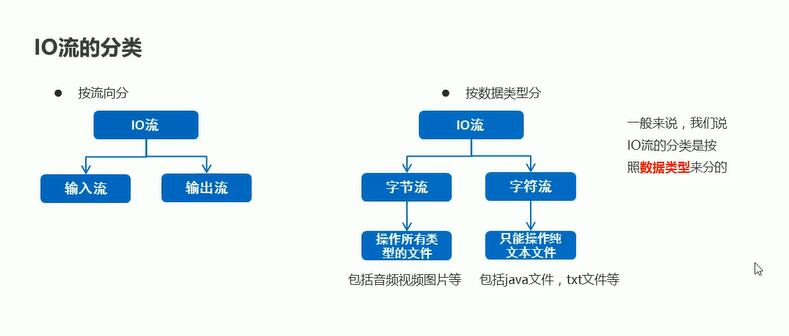
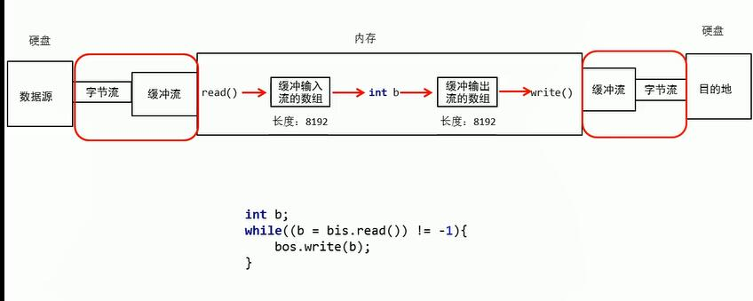

# 1.File类

## 1.1File类概述和构造方法

* File类介绍

    * 它是文件和目录路径名的抽象表示

    * 文件和目录是可以通过File封装成对象的
    
    * 对于File而言,其封装的并不是一个真正存在的文件,仅仅是一个路径名而已,它可以是存在的,也可以是不存在的,将来是要通过具体操作把这个路径的内容转换为具体存在的.

* File类的构造方法(实例代码)

```java

public class FileDemo01 {
    public static void main(String[] args) {
        //File(String pathname): 通过将给定的路径名字符串转换为抽象路径名来创建新的 File实例
        File f1 = new File("E:\\itcast\\java.txt");
        System.out.println(f1);

        //File(String parent, String child): 从父路径名字符串和子路径名字符串创建新的 File实例
        File f2 = new File("E:\\itcast","java.txt");
        System.out.println(f2);

        //File(File parent, String child): 从父抽象路径名和子路径名字符串创建新的 File实例
        File f3 = new File("E:\\itcast");
        File f4 = new File(f3,"java.txt");
        System.out.println(f4);
    }
}

```

## 1.2相对路径和绝对路径

* 1.绝对路径:就是文件在本地硬盘上真正路径即URL和物理路径

* 2.相对路径:相对于某个基准目录的路径(一般针对web目录而言,包含Web的相对路径).

* 3.其实绝对路径与相对路径的不同处，只在于描述目录路径时，所采用的参考点不同。

## 1.3File类创建功能

* 示例代码

```java

/**
 * File的创建
 * */

public class Demo03 {
    public static void main(String[] args) throws IOException {

        // public boolean createNewFile()创建一个新的空的文件
                //注意点:
                    /*1.如果文件存在,创建失败,返回值为false
                      2.如果文件不存在,创建成功,返回值为true
                      3.createNewFile方法不管调用者有没有后缀名,只能创建文件
                    * */
        //文件的创建 createNewFile()创建一个新的空的文件
        method();

        //public boolean mkdirs()创建一个多级文件夹  mkdirs可以替代mkdir
            /*
            * 1.可以创建文件夹,也可以创建多级文件夹
            * 2.无论调用者有没有后缀名,都只能创建文件夹
            * */
        method2();

        //public boolean mkdir()创建一个单级文件夹
            /*注意：1.只能创建单级文件夹
                   2.无论调用者有没有后缀名,都只能创建文件夹
             */
        method3();
    }

    private static void method3() {
        File file = new File("F:\\itheima\\aa");
        boolean result = file.mkdir();
        System.out.println(result);
    }

    private static void method2() {
        File file = new File("F:\\itheima\\a\\b\\c");
        boolean result = file.mkdirs();
        System.out.println(result);
    }

    private static void method() throws IOException {
        File file = new File("F:\\itheima\\a.txt");
        boolean flag = file.createNewFile();
        System.out.println(flag);
    }
}

```

## 1.4File类删除功能

* 示例代码(删除指定目录下的文件和父子文件夹)

```java


//删除多级文件夹

public class Demo07 {
    public static void main(String[] args) {
        //delete只能删除文件和空文件夹

        File src = new File("C:\\Users\\lpl\\Desktop\\src");
        deleteDir(src);
    }

    private static void deleteDir(File src) {
        //先删除这个文件夹里面所有的内容
        //递归 方法在方法中调用自己
        //注意 可以解决所有文件夹和递归相结合的题目
        //1.进入 --- 得到src文件夹所有的File对象
        File[] files = src.listFiles();

        //2.遍历 ---
        for (File file : files) {
            if(file.isFile()){
                //3.判断 如果遍历到的是一个File对象是一个文件,name直接删除
                file.delete();
            }else{
                //4.判断 递归
                deleteDir(file);//参数一定要是src文件夹里面的文件夹File对象
            }
        }
        src.delete();
    }
}

```

## 1.5File类判断和获取功能

* 示例代码

```java


/**
 * File判断和获取功能
 * */
public class Demo05 {
    public static void main(String[] args) {
//        public boolean isDirectory()测试此抽象路径名表示的File是否为目录
//        public boolean isFile()测试此抽象路径名表示的File是否为文件
//        public boolean exists()测试此抽象路径名表示的File是否存在
//        public string getName()返回由此抽象路径名表示的文件或目录的名称
                //调用者是文件,返回的是文件名和后缀名
                //调用者是文件夹,返回的是文件夹名

        method1();

        method2();

        method3();

        File file = new File("a.txt");
        String name = file.getName();
        System.out.println(name);

    }

    private static void method3() {
        File file = new File("a.txt");
        boolean result = file.exists();//判断当前调用者路径是否存在该文件
        System.out.println(result);
    }

    private static void method2() {
        File file = new File("F:\\itheima");
        boolean result1 = file.isFile();
        boolean result2 = file.isDirectory();
        System.out.println(result1);
        System.out.println(result2);
    }

    private static void method1() {
        File file = new File("F:\\itheima\\a.txt");
        boolean result1 = file.isFile();
        boolean result2 = file.isDirectory();
        System.out.println(result1);
        System.out.println(result2);
    }
}

```

## 1.6FIle的listFile方法

```java

//File的isFile方法

import java.io.File;

public class Demo06 {
    public static void main(String[] args) {
        //method1();
        //进入文件夹,获取这个文件夹里面所有的文件和文件夹的file对象,并把这些file对象都放在一个数组中
        /*
        * 注意事项
        * 1.当调用者是一个文件时 null
        * 2.当调用者是一个空文件夹时 0
        * 3.当调用者是一个有内容的文件夹  返回文件夹里的文件夹名称(隐藏内容也会返回)
        * 4.挡掉用着是一个有权限的才能访问的文件夹时 返回null
        * */
        //文件
        //method2();

        //空文件夹
        //method3();

        //有内容的文件夹
        method4();
    }

    private static void method4() {
        File file = new File("F:\\CodeSource");
        File[] files = file.listFiles();//返回值是一个file类型的数组
        for (File file1 : files) {
            System.out.println(file1);//报NullPointer错误
        }//进入文件夹返回文件夹里面的文件夹名称
    }

    private static void method3() {
        File file = new File("F:\\itheima");
        File[] files = file.listFiles();//返回值是一个file类型的数组
        System.out.println(files.length);
        for (File file1 : files) {
            System.out.println(file1);//报NullPointer错误
        }//得到的是一个值为0的数组
    }

    private static void method2() {
        File file = new File("F:\\stu.txt");
        File[] files = file.listFiles();//返回值是一个file类型的数组
        for (File file1 : files) {
            System.out.println(file1);//报NullPointer错误
        }
    }

    private static void method1() {
        File file = new File("F:\\");
        File[] files = file.listFiles();//返回值是一个file类型的数组
        for (File file1 : files) {
            System.out.println(file1);
        }
    }
}


```

## 1.7File类练习(统计一个文件夹中每种文件的个数并打印)

```java


import java.io.File;
import java.util.HashMap;

public class Demo08 {
    public static void main(String[] args) {
        //统计一个文件夹中,每种文件出现的次数.
        //统计 --- 定义一个变量用来统计. ---- 弊端:同时只能统计一种文件
        //利用map集合进行数据统计,键 --- 文件后缀名  值 ----  次数

        File file = new File("8.IO");
        HashMap<String, Integer> hm = new HashMap<>();
        getCount(hm, file);
        System.out.println(hm);
    }

    //1.定义一个方法,参数是HashMap集合用来统计次数和File对象要统计的文件夹
    private static void getCount(HashMap<String, Integer> hm, File file) {
        //2.遍历File对象,获取它下边的每一个文件和文件夹对象
        File[] files = file.listFiles();
        for (File f : files) {
            //3.判断当前File对象是文件还是文件夹
            if(f.isFile()){
                //如果是文件,判断这种类型文件后缀名在HashMap集合中是否出现过
                String fileName = f.getName();
                String[] fileNameArr = fileName.split("\\.");
                if(fileNameArr.length == 2){
                    String fileEndName = fileNameArr[1];
                    if(hm.containsKey(fileEndName)){
                        //出现过,获取这种类型文件的后缀名出现的次数,对其+1,在存回集合中
                        Integer count = hm.get(fileEndName);
                        //这种文件又出现了一次.
                        count++;
                        //把已经出现的次数给覆盖掉.
                        hm.put(fileEndName,count);
                    }else{
                        // 没出现过,将这种类型文件的后缀名存入集合中,次数存1
                        hm.put(fileEndName,1);
                    }
                }
            }else{
                //如果是文件夹,递归调用自己,HashMap集合就是参数集合,File对象是当前文件夹对象代码实现
                getCount(hm,f);
            }
        }
    }

}

```

# 2.字节流

## 2.1IO流概述和分类

* IO流介绍
    * IO流就是用来处理设备间数据传输问题的,常见的应用:文件复制;上传文件;文件下载.

* IO流的分类



* IO流的技术选型

    * 字符流:只能操作纯文本文件,比如java,txt文件(用windows记事本打开能看得懂的就是纯文本文件).如果操作的是纯文本文件优先使用字符流
    * 字节流:可以操作所有类型的文件.如果操作的是图片,视频,音频等二进制文件,优先使用字节流。

## 2.2字节流写数据

* 字节流抽象基类
    
    * InputStream:这个抽象类是表示输入流所有类的超类(父类).
    * OutputStream:这个抽象类是表示所有自己输出流的所有类的父类.
    * 子类名特点:子类名称都是以其父类作为子类名的后缀.

* 字节流写数据的三种方式

    * 写数据的方法分类

    | 方法名                                   | 说明                                                         |
    | ---------------------------------------- | ------------------------------------------------------------ |
    | void   write(int b)                      | 将指定的字节写入此文件输出流   一次写一个字节数据            |
    | void   write(byte[] b)                   | 将 b.length字节从指定的字节数组写入此文件输出流   一次写一个字节数组数据 |
    | void   write(byte[] b, int off, int len) | 将 len字节从指定的字节数组开始，从偏移量off开始写入此文件输出流   一次写一个字节数组的部分数据 |

    * 示例代码

```java

     //多个数据写入

import java.io.FileOutputStream;
import java.io.IOException;

public class Demo02 {
    public static void main(String[] args) throws IOException {
        FileOutputStream fos = new FileOutputStream("F:\\stu.txt");
        //单个数据分别写入,写的虽然是数字,但是文件中会以ASCII对应的字符存储
        fos.write(97);
        fos.write(97);
        fos.write(97);

        //通过字符串数组添加
        byte[] bys={97,98,99};
        fos.write(bys);

        //通过字符串数组添加,并且限制添加的个数
        byte[] bys2={97,98,99,100,101,102,103};
        //off ->从数组什么地方开始添加
        fos.write(bys2,1,4);
        fos.close();
    }
}
   

```

## 2.3字节流写数据的两个小问题

* 字节流写数据如何换行

    * windows:\r\n
    * linux:\n
    * mac:\c

* 字节流数据如何实现追加写入

    * 创建文件输出流指定的名称写入文件。如果第二个参数为true，则字节将写入文件的末尾而不是开头(默认为false).

* 示例代码

```java

public class Demo04 {
    public static void main(String[] args) throws IOException {
        //生成输入流对象时添加参数true,表示不清空原本内容的基础上添加新内容
        FileOutputStream fos = new FileOutputStream("F:\\stu.txt",true);
        //单个数据分别写入
        fos.write(97);
        //加一个换行
        fos.write("\r\n".getBytes());
        fos.write(98);
        fos.write(99);
        fos.write(100);
        
        fos.close();
    }
}

```
## 2.4字节流写数据加异常处理

* finally特点 被finally控制的语句一定会被执行除非JVM退出

```java

public class Demo05 {
    public static void main(String[] args) {
        FileOutputStream fos = null;
        try {
            System.out.println();
            fos = new FileOutputStream("F:\\stu.txt", true);
            //单个数据分别写入
            fos.write(97);
            fos.write(98);
        } catch (IOException e) {
            e.printStackTrace();
        } finally {
            //finall语句里面的代码，一定会被执行,实现关闭资源
            if(fos !=null){
                try {
                    fos.close();
                } catch (IOException e) {
                    e.printStackTrace();
                }
            }
        }

    }
}


```
## 2.7字节流复制文件

* 复制文件案例一(一次读一个字节数据)

```java

public class Demo03 {
    public static void main(String[] args) throws IOException {
        //创建字节输入,准备读数据
        FileInputStream fis = new FileInputStream("F:\\CodeSource\\a.txt");

        //创建字节输出,准备写数据
        FileOutputStream fos = new FileOutputStream("F:\\stu.txt");

        int b;
        //以字节流读文件,文件末尾返回-1
        while ((b= fis.read())!=-1){
            fos.write(b);
        }

        fis.close();
        fos.close();

    }
}


```


* 复制文件案例一(一次读一个字节数组)

```java

public class Demo04 {
    public static void main(String[] args) throws IOException {
        //创建字节输入,准备读数据
        FileInputStream fis = new FileInputStream("F:\\CodeSource\\a.txt");

        //创建字节输出,准备写数据
        FileOutputStream fos = new FileOutputStream("F:\\stu.txt");

        //提高效率的关键
        byte[] bytes = new byte[1024];
        int len;//本次督导的有效字节个数 -- 这次读了几个字节

        while ((len=fis.read(bytes))!=-1){
            fos.write(bytes,0,len);
        }

        fis.close();
        fos.close();

    }
}

```

# 3.字节缓冲流

## 3.1字节缓冲流介绍

    * BufferOutputStream：该类实现缓冲输出流.通过设置这样的输出流,应用程序可以向底层输出流写入字节,而不必为写入的每个字节导致底层系统的调用
    * BufferedInputStream：创建BufferedInputStream将创建一个内部缓冲区数组.当从流中读取或跳过字节时,内部缓冲区将根据需要从所包含的输入流中重新填充,一次很多字节
    * 字节缓冲流**仅仅提供缓冲区**,而真正读写数据还得依靠基本的及自己留对象进行操作(不能直接操作文件,需要传递字节流)

```java
public class BufferStreamDemo {
    public static void main(String[] args) throws IOException {
        //字节缓冲输出流：BufferedOutputStream(OutputStream out)
 
        BufferedOutputStream bos = new BufferedOutputStream(new 				                                       FileOutputStream("myByteStream\\bos.txt"));
        //写数据
        bos.write("hello\r\n".getBytes());
        bos.write("world\r\n".getBytes());
        //释放资源
        bos.close();
    

        //字节缓冲输入流：BufferedInputStream(InputStream in)
        BufferedInputStream bis = new BufferedInputStream(new                                                          FileInputStream("myByteStream\\bos.txt"));

        //一次读取一个字节数据
//        int by;
//        while ((by=bis.read())!=-1) {
//            System.out.print((char)by);
//        }

        //一次读取一个字节数组数据
        byte[] bys = new byte[1024];
        int len;
        while ((len=bis.read(bys))!=-1) {
            System.out.print(new String(bys,0,len));
        }

        //释放资源
        bis.close();
    }
}

```

## 3.2字节缓冲流原理

