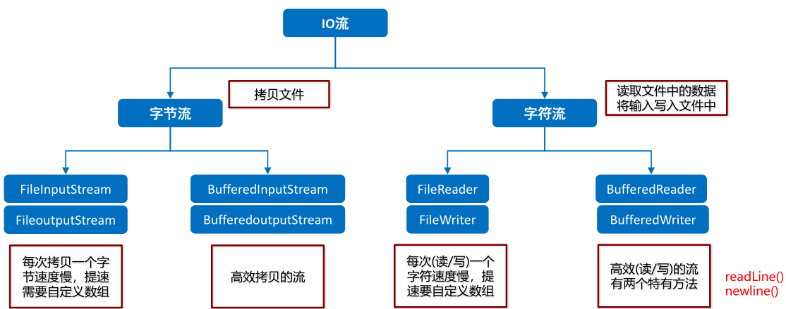
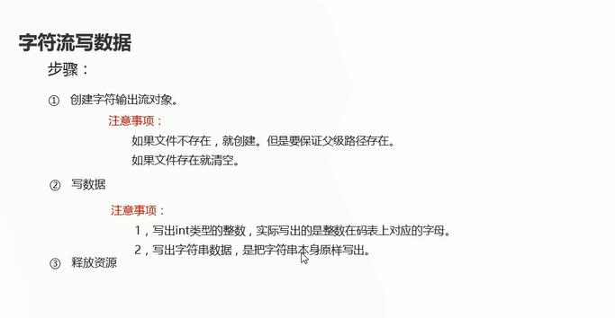
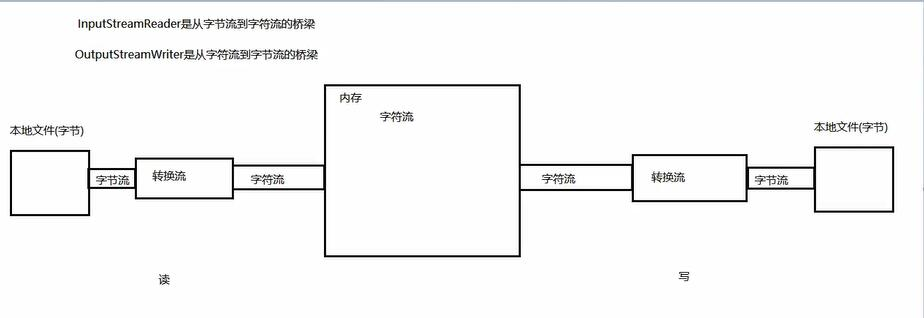

# 1.字符流

## 1.1为什么会出现的字符流

* 字符流介绍 

    由于字节流操作中文不是特别方便,所以Java就提供字符流,字符流=字节流+编码表

* 中文的字节储存方式

    * 汉字在储存的时候无论选择那种编码储存,第一个字节都是负数.
    * 字符流读取到斧术师会自动根据当前的编码格式按位读取得到中文.
    * 如果使用字节流,把文本文件中的中文读到内存中,有可能出现乱码;如果使用字节流,把中文写到文本文件中,有可能出现乱码

## 1.2编码表

- 什么是字符集

  是一个系统支持的所有字符的集合，包括各国家文字、标点符号、图形符号、数字等

  计算机要准确的存储和识别各种字符集符号，就需要进行字符编码，一套字符集必然至少有一套字符编码。常见字符集有ASCII字符集、GBXXX字符集、Unicode字符集等

- 常见的字符集

  - ASCII字符集：

    ASCII：是基于拉丁字母的一套电脑编码系统，用于显示现代英语，主要包括控制字符(回车键、退格、换行键等)和可显示字符(英文大小写字符、阿拉伯数字和西文符号) 

    基本的ASCII字符集，使用7位表示一个字符，共128字符。ASCII的扩展字符集使用8位表示一个字符，共256字符，方便支持欧洲常用字符。是一个系统支持的所有字符的集合，包括各国家文字、标点符号、图形符号、数字等

  - GBXXX字符集：

    GBK：最常用的中文码表。是在GB2312标准基础上的扩展规范，使用了**双字节编码方案**，共收录了21003个汉字，完全兼容GB2312标准，同时支持繁体汉字以及日韩汉字等

  - Unicode字符集：

    UTF-8编码：可以用来表示Unicode标准中任意字符，它是电子邮件、网页及其他存储或传送文字的应用 中，优先采用的编码。互联网工程工作小组（IETF）要求所有互联网协议都必须支持UTF-8编码。它使用一至四个字节为每个字符编码(不是码表,只是一种编码格式)

    编码规则： 

      128个US-ASCII字符，只需一个字节编码

      拉丁文等字符，需要二个字节编码

      **大部分常用字（含中文），使用三个字节编码**

      其他极少使用的Unicode辅助字符，使用四字节编码

## 1.3字符串中的编码解码问题【应用】


- 相关方法及代码演示

```java

public class Demo02 {
    public static void main(String[] args) throws UnsupportedEncodingException {
        //编码
        //byte[] getBytes():
            //使用平台的默认字符集将该string编码为一系列字节，将结果存储到新的字节数组中
        // byte[] getBytes (string charsetName) :
            //使用指定的字符集将该string编码为一系列字节，将结果存储到新的字节数组中
        method1();

        //解码
        // string (byte[ ] bytes):
        //通过使用平台的默认字符集解码指定的字节数组来构造新的 string
        // string (byte[] bytes, string charsetName):
        //通过指定的字符集解码指定的字节数组来构造新的string
        byte[] bytes={-23, -69, -111, -23, -87, -84, -25, -88, -117, -27, -70, -113, -27, -111, -104};
        byte[] bytes1={-70, -38, -62, -19, -77, -52, -48, -14, -44, -79};

        String s=new String(bytes);
        String s2=new String(bytes1,"GBK");
        System.out.println(s);
        System.out.println(s2);
    }

    private static void method1() throws UnsupportedEncodingException {
        String s="黑马程序员";
        //利用idea默认的utf-8将中文编码为一系列的字节
        byte[] bytes = s.getBytes();
        System.out.println(Arrays.toString(bytes));

        //使用GBK
        byte[] bytes1 = s.getBytes("GBK");
        System.out.println(Arrays.toString(bytes1));
    }
}

```

## 1.4字符流写数据

* 字符流写数据方法

```java

public class Demo03 {
//    void write (char[] cbuf)写出一个字符效组
//    void write (char[] cbuf,int off， int len)写出字符数组的一部分
//    void write (string str)写一个字符串
//    void write (string str, int off,int len)写一个字符串的一部分
    public static void main(String[] args) throws IOException {
        //创建字符输出流的对象
        //FileWriter fw = new FileWriter("F:\\stu.txt");
        FileWriter fw = new FileWriter("F:\\stu.txt");

        //写出数据 写一个字符
        fw.write(97);

        char[] chars={100,101,102,103};
        fw.write(chars);


        String s="hello world";
        fw.write(s);
        fw.write(s,1,4);
        //释放资源
        fw.close();
    }
}


```

* 刷新和关闭的方法 

```java

public class Demo04 {
   //flush()刷新流,刷新完毕以后还可以继续写数据
    //close()关闭流,释放资源.一旦关闭,就不能写数据
    public static void main(String[] args) throws IOException {
        //创建字符输出流的对象
        //FileWriter fw = new FileWriter("F:\\stu.txt");
        FileWriter fw = new FileWriter("F:\\stu.txt");

        //写出数据 写一个字符
        fw.write("hello world");
        //写完数据以后没有close和flush时文件不会显示写入的数据
        //fw.flush();
        fw.write("666");
        //fw.flush();
        //释放资源
        fw.close();//关闭:关闭之前会进行刷新操作
    }
}


```

在写操作之后如果没有flush或者close操作不会写入文件夹信息中显示写入的信息.

## 1.5字符流读数据

* 字符流读数据案例

```java

public class InputStreamReaderDemo {
    public static void main(String[] args) throws IOException {
   
        FileReader fr = new FileReader("myCharStream\\b.txt");

        //int read()：一次读一个字符数据
//        int ch;
//        while ((ch=fr.read())!=-1) {
//            System.out.print((char)ch);
//        }

        //int read(char[] cbuf)：一次读一个字符数组数据
        char[] chs = new char[1024];
        int len;
        while ((len = fr.read(chs)) != -1) {
            System.out.print(new String(chs, 0, len));
        }

        //释放资源
        fr.close();
    }
}

```

## 1.6字符缓冲流

* 字符缓冲介绍
    * BufferedWriter：将文本写入字符输出流，缓冲字符，以提供单个字符，数组和字符串的高效写入，可以指定缓冲区大小，或者可以接受默认大小。默认值足够大，可用于大多数用途

    * BufferedReader：从字符输入流读取文本，缓冲字符，以提供字符，数组和行的高效读取，可以指定缓冲区大小，或者可以使用默认大小。 默认值足够大，可用于大多数用途

```java

public class Demo01 {
    public static void main(String[] args) throws IOException {
        //创建一个字符缓冲输入流
        //在底层创建了一个默认长度为8192的字节数组
        BufferedReader br = new BufferedReader(new FileReader("F:\\CodeSource\\a.txt"));

        //创建一个字符缓冲输入流
        //在底层创建了一个默认长度为8192的字节数组
        BufferedWriter bw = new BufferedWriter(new FileWriter("F:\\stu.txt"));

        //读写数据
        int b;
        while(((b=br.read())!=-1)){
            bw.write(b);
        }

        //方法的底层会把字节流关闭
        br.close();
        bw.close();
    }
}

```

## 1.7字符缓冲流特有功能

* 特有功能以及案例分析

```java


//字符缓冲流的特有功能
//字符缓冲流BufferWrite:newline 跨平台的换行
//readLine(): 读一行文字,结果包含行的内容的字符串,不包括任何中支付,如果留的结尾已经到达,则为null

import java.io.*;

public class Demo02 {
    public static void main(String[] args) throws IOException {
        BufferedWriter bw = new BufferedWriter(new FileWriter("F:\\stu.txt"));
        //BufferedReader br = new BufferedReader(new FileReader("F:\\stu.txt"));

          bw.write("lpl666");
          bw.newLine();
          //br.readLine();
          bw.write("lpl666");
          //bw.flush();
          bw.close();
          //br.close();
    }
}


```

## 1.8字符缓冲流文件中数据排序案例

* 需求分析以及示例代码

```java

public class CharStreamDemo14 {
    public static void main(String[] args) throws IOException {
        //需求：读取文件中的数据，排序后再次写到本地文件
        //分析：
        //1.要把文件中的数据读取进来。
        BufferedReader br = new BufferedReader(new FileReader("charstream\\sort.txt"));
        //输出流一定不能写在这里，因为会清空文件中的内容
        //BufferedWriter bw = new BufferedWriter(new FileWriter("charstream\\sort.txt"));

        String line = br.readLine();
        System.out.println("读取到的数据为" + line);
        br.close();

        //2.按照空格进行切割
        String[] split = line.split(" ");//9 1 2 5 3 10 4 6 7 8
        //3.把字符串类型的数组变成int类型
        int [] arr = new int[split.length];
        //遍历split数组，可以进行类型转换。
        for (int i = 0; i < split.length; i++) {
            String smallStr = split[i];
            //类型转换
            int number = Integer.parseInt(smallStr);
            //把转换后的结果存入到arr中
            arr[i] = number;
        }
        //4.排序
        Arrays.sort(arr);
        System.out.println(Arrays.toString(arr));

        //5.把排序之后结果写回到本地 1 2 3 4...
        BufferedWriter bw = new BufferedWriter(new FileWriter("charstream\\sort.txt"));
        //写出
        for (int i = 0; i < arr.length; i++) {
            bw.write(arr[i] + " ");
            bw.flush();
        }
        //释放资源
        bw.close();

    }
}

```

## 1.9IO流小结

* 小结1



* 小结2




字节流:拷贝文件

字符流:读写文件(真正佛那个做的还是字节流)

缓冲流:提高效率

# 2.转换流

## 2.1字符流中和编码解码问题相关的两个类

* InputStreamReader：是从字节流到字符流的桥梁,父类是Reader

  ​	它读取字节，并使用指定的编码将其解码为字符

  ​	它使用的字符集可以由名称指定，也可以被明确指定，或者可以接受平台的默认字符集

* OutputStreamWriter：是从字符流到字节流的桥梁,父类是Writer

  ​	是从字符流到字节流的桥梁，使用指定的编码将写入的字符编码为字节

  ​	它使用的字符集可以由名称指定，也可以被明确指定，或者可以接受平台的默认字符集

* 图解


## 2.2转换流读写数据

*构造方法

| 方法名                                              | 说明                                         |
| --------------------------------------------------- | -------------------------------------------- |
| InputStreamReader(InputStream in)                   | 使用默认字符编码创建InputStreamReader对象    |
| InputStreamReader(InputStream in,String chatset)    | 使用指定的字符编码创建InputStreamReader对象  |
| OutputStreamWriter(OutputStream out)                | 使用默认字符编码创建OutputStreamWriter对象   |
| OutputStreamWriter(OutputStream out,String charset) | 使用指定的字符编码创建OutputStreamWriter对象 |

* 示例代码

```java

package convertstream;

import java.io.FileInputStream;
import java.io.FileReader;
import java.io.IOException;
import java.io.InputStreamReader;

public class Demo01 {
    public static void main(String[] args) throws IOException {
        //将aa.txt转换成GBK编码后打印出现乱码问题
        method1();

        //使用字节流指定编码格式
        method2();

        //使用字符流转换(JDK11新特性)
        //FileReader fr = new FileReader("F:\\itheima\\aa.txt",CharSet);
    }

    private static void method2() throws IOException {
        InputStreamReader isr = new InputStreamReader(new FileInputStream("F:\\itheima\\aa.txt"),"GBK");

        int b;
        while((b=isr.read())!=-1){
            System.out.println((char)b);
        }

        isr.close();
    }

    private static void method1() throws IOException {

        FileReader fr = new FileReader("F:\\itheima\\aa.txt");

        int b;
        while((b=fr.read())!=-1){
            System.out.println((char)b);
        }

        fr.close();
    }
}


```


# 3.1对象操作流

## 3.1对象序列化流
* 对象序列化介绍
    * 对象序列化:就是将对象保存到磁盘中,或者在网络传输对象
    * 这种机制就是使用了一个字节序列表示一个对象,该字节序列包含:对象的类型,对象的数据和对象储存的属性等信息,可以达到一种加密效果
    * 反之,该字节序列还可以从文件中读取回来,重构对象,对它进行反序列化

* **特点:可以把对象以字节的形式写到本地文件,直接打开文件是读不懂的,需要再次用对象操作流读到内存中.**

* 示例

```java
//User类


import java.io.Serializable;

//如果想要这个类·的对象能够被序列化,name这个类必须要实现一个接口Serializable

//Serializable 接口的意义
//称之为一个标记性接口,里面没有任何的抽象方法
//只要一个类实现了这个Serializable接口,就表明这个类的对象可以被序列化
public class User implements Serializable {
    //不想被序列化关键字 transient 但是会造成对象属性为null
    private String username;
    private String password;

    public String getUsername() {
        return username;
    }

    public void setUsername(String username) {
        this.username = username;
    }

    public String getPassword() {
        return password;
    }

    public void setPassword(String password) {
        this.password = password;
    }

    public User() {
    }

    public User(String username, String password) {
        this.username = username;
        this.password = password;
    }

    @Override
    public String toString() {
        return "User{" +
                "username='" + username + '\'' +
                ", password='" + password + '\'' +
                '}';
    }
}


//序列化读写类(包含将Bean包内的内容修改报错问题)

import java.io.*;

public class Demo03 {
    public static void main(String[] args) throws IOException, ClassNotFoundException {
        method1();
        method2();

    }
    //第一步:把User对象序列化到本地 --  4090018583855715763
    //第二步:修改了javabean类,导致 -- 341967915184943515
    //第三步:把文件中的对象读到内存 -- 本地序列号和类中的序列号不一致

    //解决
    //不让虚拟机帮我们自动计算,手动赋值，并且将public改回
    private static final long serialVersionUID=1l;

    private static void method1() throws IOException {
        User user = new User("zhangsan", "1234");

        ObjectOutputStream oos = new ObjectOutputStream(new FileOutputStream("F:\\itheima\\stu.txt"));

        oos.writeObject(user);

        oos.close();
    }

    private static void method2() throws IOException, ClassNotFoundException {
        ObjectInputStream ois = new ObjectInputStream(new FileInputStream("F:\\itheima\\stu.txt"));

        User user =(User) ois.readObject();

        System.out.println(user);

        ois.close();
    }
}


```

## 3.2储存多个对象

```java

//Student类
import java.io.Serializable;

public class Student implements Serializable {
    private String name;
    private int age;

    public String getName() {
        return name;
    }

    public void setName(String name) {
        this.name = name;
    }

    public int getAge() {
        return age;
    }

    public void setAge(int age) {
        this.age = age;
    }

    public Student() {
    }

    public Student(String name, int age) {
        this.name = name;
        this.age = age;
    }

    @Override
    public String toString() {
        return "Student{" +
                "name='" + name + '\'' +
                ", age=" + age +
                '}';
    }
}


//方法一:单个储存

package objectopration.demo;

import java.io.*;

//将多个对象储存到本地，方法一

public class Demo01 {
    public static void main(String[] args) throws IOException {
        Student s1 = new Student("lpl",20);
        Student s2 = new Student("khj",23);
        Student s3 = new Student("oywk",21);

        ObjectOutputStream oos = new ObjectOutputStream(new FileOutputStream("F:\\itheima\\stu.txt"));

        oos.writeObject(s1);
        oos.writeObject(s2);
        oos.writeObject(s3);

        oos.close();

        //使用该读写流时文件末尾不为-1或者null
        ObjectInputStream ois = new ObjectInputStream(new FileInputStream("F:\\itheima\\stu.txt"));
        Object obj;

        /*错误写法  会报文件末尾EOFException错误
        * while((obj=ois.read())!=null){
        * System.out.println(obj);
        * }
        * */
        while(true){
            try {
                Object o=ois.readObject();
                System.out.println(o);
            }catch (Exception e){
                break;
            }
        }

        ois.close();
    }
}


//将对象封装到集合中储存

public class Demo02 {
    public static void main(String[] args) throws IOException, ClassNotFoundException {
        Student s1 = new Student("lpl",20);
        Student s2 = new Student("khj",23);
        Student s3 = new Student("oywk",21);

        ObjectOutputStream oos = new ObjectOutputStream(new FileOutputStream("F:\\itheima\\sut.txt"));
        //使用容器储存,最后也只输出容器
        ArrayList<Student> stu1 = new ArrayList<>();
        stu1.add(s1);
        stu1.add(s2);
        stu1.add(s3);
        oos.writeObject(stu1);
        oos.close();

        //使用该读写流时文件末尾不为-1或者null
        ObjectInputStream ois = new ObjectInputStream(new FileInputStream("F:\\itheima\\sut.txt"));

        ArrayList<Student> stu2 = (ArrayList<Student>) ois.readObject();
        for (Student student : stu2) {
            System.out.println("姓名:"+student.getName()+",年龄:"+student.getAge());
        }
        ois.close();
    }
}
```

# 4.Properties集合

## 4.1Properties作为Map集合的使用
- Properties介绍

  - 是一个Map体系的集合类
  - Properties可以保存到流中或从流中加载
  - 属性列表中的每个键及其对应的值都是一个字符串
  - Map集合有的方法他都可以使用

- Properties基本使用
```java
public class Demo01 {
    public static void main(String[] args) {
        //Properties不用指定集合键值对类型,但是一般用来储存字符串
        Properties prop = new Properties();

        //增 put
        prop.put("张三","zhangsan");
        prop.put("李四","lisi");
        prop.put("王五","zhangsan");
        prop.put("赵六","zhangsan");

        //删 remove根据key来删除指定集合元素
        prop.remove("张三");

        //改 通过put方法指定键后修改值
        prop.put("李四","zhangsan");

        //查
        //根据键来查
        Object value = prop.get("李四");
        System.out.println(value);

        //遍历集合
        Set<Object> keys = prop.keySet();
        for (Object key : keys) {
            Object value1 = prop.get(key);
            System.out.println(key+"="+value1);
        }

        //将map集合转换成set集合
        Set<Map.Entry<Object, Object>> entries = prop.entrySet();
        for (Map.Entry<Object, Object> entry : entries) {
            Object key = entry.getKey();
            Object value2 = entry.getValue();
            System.out.println(key+"="+value2);
        }
    }
}

```

# 4.2Properties作为Map集合特有的方法

* 特有方法

| 方法名                                         | 说明                                                         |
| ---------------------------------------------- | ------------------------------------------------------------ |
| Object   setProperty(String key, String value) | 设置集合的键和值，都是String类型，底层调用   Hashtable方法 put |
| String   getProperty(String key)               | 使用此属性列表中指定的键搜索属性                             |
| Set<String>   stringPropertyNames()            | 从该属性列表中返回一个不可修改的键集，其中键及其对应的值是字符串 |

* 示例代码
```java
public class Demo02 {
    public static void main(String[] args) {
        //object setproperty (string key, string value) --- put
            //设置集合的键和值，都是string类型，底层调用Hashtable方法 put
        Properties prop = new Properties();

        prop.setProperty("zhangsan","张三");
        prop.setProperty("zhang","张三");
        prop.setProperty("lisi","张三");

        System.out.println(prop);

        //String getProperty (String key)--- get
            //使用此属性列表中指定的键搜索属性
        String property = prop.getProperty("lisi");
        System.out.println(property);

        //set<string> stringPropertyNames()  --- keys
            //从该属性列表中返回一个不可修改的键集，其中键及其对应的值是字符串
        Set<String> set = prop.stringPropertyNames();
        for (String key : set) {
            System.out.println(key+"="+prop.getProperty(key));
        }
    }
}

```

## 4.3Properties和IO流相结合的方法【应用】

- 和IO流结合的方法

  | 方法名                                       | 说明                                                         |
  | -------------------------------------------- | ------------------------------------------------------------ |
  | void   load(Reader reader)                   | 从输入字符流读取属性列表（键和元素对）                       |
  | void   store(Writer writer, String comments) | 将此属性列表（键和元素对）写入此   Properties表中，以适合使用   load(Reader)方法的格式写入输出字符流 |

- 示例代码
```java
public class Demo05 {
    public static void main(String[] args) throws IOException {
        //把集合中的数据保存到文件
        myStore();

        //把文件中的数据加载到集合
        myLoad();

    }

    private static void myLoad() throws IOException {
        Properties prop = new Properties();

        //void load(Reader reader)：
        FileReader fr = new FileReader("prop.properties");
        prop.load(fr);
        fr.close();

        System.out.println(prop);
    }

    private static void myStore() throws IOException {
        Properties prop = new Properties();

        prop.setProperty("itheima001","佟丽娅");
        prop.setProperty("itheima002","赵丽颖");
        prop.setProperty("itheima003","刘诗诗");

        //void store(Writer writer, String comments)：
        FileWriter fw = new FileWriter("prop.properties");
        prop.store(fw,null);
        fw.close();
    }
}
```

## 4.4Properties集合练习【应用】

- 案例需求

  在Properties文件中手动写上姓名和年龄,读取到集合中,将该数据封装成学生对象,写到本地文件

- 实现步骤

  - 创建Properties集合,将本地文件中的数据加载到集合中
  - 获取集合中的键值对数据,封装到学生对象中
  - 创建序列化流对象,将学生对象序列化到本地文件中

- 代码实现

  学生类
```java
public class Student implements Serializable {
    private static final long serialVersionUID = 1L;

    private String name;
    private int age;

    public Student() {
    }

    public Student(String name, int age) {
        this.name = name;
        this.age = age;
    }

    public String getName() {
        return name;
    }

    public void setName(String name) {
        this.name = name;
    }

    public int getAge() {
        return age;
    }

    public void setAge(int age) {
        this.age = age;
    }

    @Override
    public String toString() {
        return "Student{" +
                "name='" + name + '\'' +
                ", age=" + age +
                '}';
    }
}
```

测试类
```java
public class Test {

    public static void main(String[] args) throws IOException {
      	//1.创建Properties集合,将本地文件中的数据加载到集合中
        Properties prop = new Properties();
        FileReader fr = new FileReader("prop.properties");
        prop.load(fr);
        fr.close();
		//2.获取集合中的键值对数据,封装到学生对象中
        String name = prop.getProperty("name");
        int age = Integer.parseInt(prop.getProperty("age"));
        Student s = new Student(name,age);
		//3.创建序列化流对象,将学生对象序列化到本地文件中
        ObjectOutputStream oos = new ObjectOutputStream(new FileOutputStream("a.txt"));
        oos.writeObject(s);
        oos.close();
    }
}
```