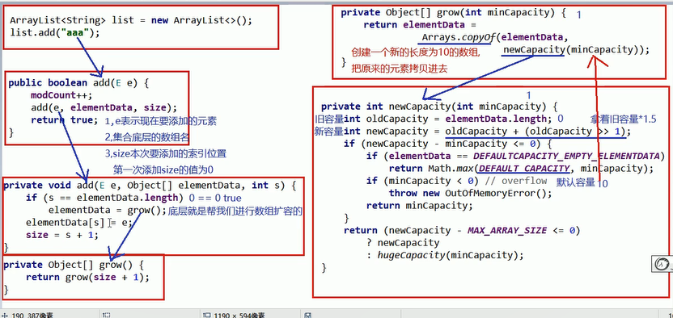
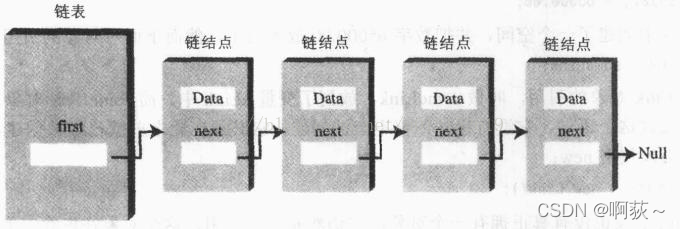
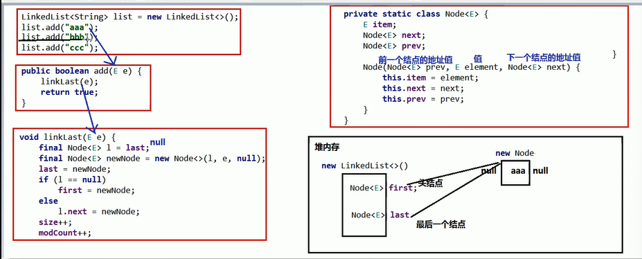
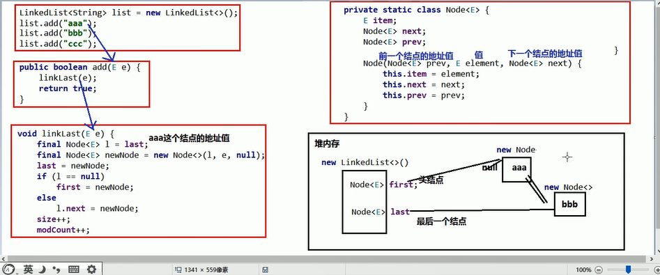
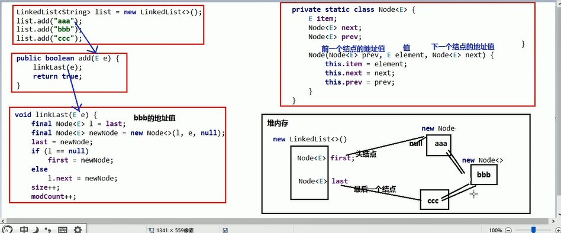

# 1.Collection集合

## 1.1数组和集合的区别

* 相同点
    都是容器,可以储存多个数据
* 不同点
    * 数组的长度是不可变的,集合的长度是可变的
    * 数组可以储存基本数据和引用类型数据
    * 集合只能储存引用类型数据,如果要储存基本类型数据,需要储存对应的包装类(如int对应的是Integer)

## 1.2集合类体系结构

* 两大派系:单列(顶层:collection),双列(顶层:map)

* 红色的实现类,蓝色的是接口


## 1.3Colleection集合概述和使用

* Collection集合概述

    * 是单列集合的顶层接口,表示一组对象,这些对象也称为Collection的元素

    * JDK不提供此接口的任何直接实现(无法直接new 出一个collection集合),它提供更具体的字节口(如Set和List)实现

* 创建Collection集合的方式

    * 多态的方式

    * 具体的实现类ArrayList

* Collection常用的方法
```java
package itheima.collection;

import java.util.ArrayList;
import java.util.Collection;

public class Demo02Collection {
    public static void main(String[] args) {
        //接口类                           实现类
        Collection<String> collection=new ArrayList<>();

//    boolean add(E e)  添加元素
        collection.add("111");
        collection.add("222");
        collection.add("333");
        collection.add("33");
        //removetest(collection);

//    boolean removeif(object o)根据条件进行删除
        //removeif唯一抽象方法为 boolean test(T t)
        //实例化后抽象方法中的参数和实例化方法参数一致m即 boolean test(String t)
        //removeif底层会遍历集合,得到每一个集合中的元素
        //s依次表示集合中的每一个元素,就会把每一个元素都到lambda表达是中去判断
        //如果返回是true则删除 false则进行下一步
        collection.removeIf(
                (String s)->{
                    //删除长度为3的的字符串
                    return s.length()==3;
                }
        );

//    void clear() 清空集合  将集合中的所有元素清除
        collection.clear();

//    boolean contains(object o) 判断集合中是否存在指定的元素
        boolean result3=collection.contains("a");
        System.out.println(result3);

//    boolean isEmpty() 判断集合是否为空 为空:true 否则为false
        boolean empty = collection.isEmpty();
        System.out.println(empty);

//    int size() 集合的长度.也就是集合中元素的个数
        System.out.println(collection.size());
        
        System.out.println(collection);
    }

    private static void removetest(Collection<String> collection) {
        //    boolean remove(object o)从集合中移除指定的元素 删除成功返回true 否则false
        boolean result1=collection.remove("111");
        boolean result2=collection.remove("112");
        System.out.println(result1);
        System.out.println(result2);
    }
}

```
## 1.4Collection集合的遍历

* 迭代器介绍
    * 迭代器,集合的专用遍历凡是
    * Iterator<E> iterator(): 返回此集合中元素的迭代器,通过集合对象的iterator()方法得到

* Iterator中的常用方法

```java
public class IteratorDemo1 {
    public static void main(String[] args) {
        //创建集合对象
        Collection<String> c = new ArrayList<>();

        //添加元素
        c.add("hello");
        c.add("world");
        c.add("java");
        c.add("javaee");

        
        //Iterator<E> iterator()：返回此集合中元素的迭代器，通过集合的iterator()方法得到
        Iterator<String> it = c.iterator();

        //用while循环改进元素的判断和获取
        while (it.hasNext()) {
            String s = it.next();
            System.out.println(s);
        }


        //使用迭代器删除当前指定的元素
        while(it.hasNext()){
            String s = it.next();
            if("b".equals(s)){
                //指向谁,那么此时就删除谁.
                it.remove();
            }
        }

        System.out.println(list);
    }
}
```

## 1.5循环遍历结合总结

* 三种循环的使用场景

    1. 如果再遍历过程中需要操作索引,使用普通for循环
    2. 如果在遍历的过程中需要删除元素,请使用迭代器
    3. 如果仅仅想遍历,那么使用增强for

# 2.List集合

## 2.1List集合的概述和特点

* List集合的概述

    * 有序集合,这里的有序指的是存取顺序
    * 用户可以精确控制列表的每个元素的插入位置,用户可以通过整数索引访问元素,并搜索列表中的元素
    * 与Set集合不同,列表通常允许重复的元素

## 2.2ArrayList底层原理




# 3.数据结构

## 3.1数据结构之栈和队列

- 栈结构

  ​	    先进后出

- 队列结构

  ​	    先进先出

## 3.2数据结构之数组和链表

- 数组结构

  ​	查询快、增删慢

- 队列结构

  ​	查询慢、增删快

- 链表
    - 定义
    链表通常由一连串节点（“链结点”）组成，每个节点包含任意的实例数据（data fields）和一或两个用来指向上一个/或下一个节点的位置的链接
    - 优缺点
    使用链表结构可以克服数组链表需要预先知道数据大小的缺点，链表结构可以充分利用计算机内存空间，实现灵活的内存动态管理。
    链表是一种插入和删除都比较快的数据结构，缺点是查找比较慢。除非需要频繁的通过下标来随机访问数据，否则在很多使用数组的地方都可以用链表代替。
    - 图解
    

# 4.List集合的实现类(LinkedList)

## 4.1List集合子类的特点

- ArrayList集合

  ​	底层是**数组**结构实现，查询快、增删慢

- LinkedList集合

  ​	底层是**链表**结构实现，查询慢、增删快

- 特有方法
```java
package itheima.LinkedList;

import java.util.LinkedList;

public class Demo02LinkedList {
    public static void main(String[] args) {
        /*
        public void addFirst (E e)在该列表开头插入指定的元素
        public void addLast (E e)将指定的元素追加到此列表的末尾
        public E getFirst () 返回此列表中的第一个元素
        public E getLast () 返回此列表中的最后一个元素
        public E removeFirst () 从此列表中删除并返回第一个元素
        public E removeLast ()从此列表中删除并返回最后一个元素
*/
        LinkedList<String> list = new LinkedList<>();
        list.add("111");
        list.add("222");
        list.add("333");
        list.add("444");
        
        //public void addFirst (E e)在该列表开头插入指定的元素
        testAddFirst(list);

        //public void addLast (E e)将指定的元素追加到此列表的末尾
        testAddLast(list);

        //public E getFirst () 返回此列表中的第一个元素
        testgetFirst(list);

        //public E getLast () 返回此列表中的最后一个元素
        testgetLast(list);

        //public E removeFirst () 从此列表中删除并返回第一个元素
        testremoveFirst(list);

        //public E removeLast ()从此列表中删除并返回最后一个元素
        testRemoveLast(list);
    }

    private static void testRemoveLast(LinkedList<String> list) {
        String Last=list.removeLast();
        System.out.println(Last);
    }

    private static void testremoveFirst(LinkedList<String> list) {
        String first =list.removeFirst();
        System.out.println(first);
    }

    private static void testgetLast(LinkedList<String> list) {
        String last=list.getLast();
        System.out.println(last);
    }

    private static void testgetFirst(LinkedList<String> list) {
        String s=list.getFirst();
        System.out.println(s);
    }

    private static void testAddLast(LinkedList<String> list) {
        list.addLast("eee");
        System.out.println(list);
    }

    private static void testAddFirst(LinkedList<String> list) {
        list.addFirst("qqq");
        System.out.println(list);
    }
}

```

## 4.2LinkList底层原理

添加第一个元素



添加第二个元素



添加第二个元素



# 5.泛型类

## 5.1泛型概述

* 泛型的好处
    1. 把运行时期的问题提前到了编译期间
    2. 避免了强制类型转换

* 泛型的定义格式
    1. <类型>:指定一种类型的格式.尖括号里面可以任意书写
    2. <类型1,类型2..>指定多种格式的类型,类型之间用逗号隔开.

## 5.2泛型方法
    * 定义格式
    修饰符 <类型> 返回值类型 方法名(类型 变量名) {  }

    * 实例代码
```java
//泛型方法

//重写多个方法时可以使用泛型
/*public class Generic {
    public void show(String s){
        System.out.println(s);
    }
    public void show(int i){
        System.out.println(i);
    }
    public void show(boolean b){
        System.out.println(b);
    }
}*/


//泛型类改进
//public class Generic<T>{
//    public  void show(T t){
//        System.out.println(t);
//    }
//}


//泛型方法改进  ==>调用方法使用的是什么类型 T就回变成什么类型,定义时也无需声明类型
public  class Generic{
    public <T> void show(T t){
        System.out.println(t);
    }
}

//测试类

public class Demo02Generic {
    public static void main(String[] args) {

          //重写方法
//        Generic g = new Generic();
//        g.show("张三");
//        g.show(30);
//        g.show(true);

          //泛型类改进
//        Generic<String> s = new Generic<>();
//        s.show("张三");
//        Generic<Integer> i = new Generic<>();
//        i.show(30);
//        Generic<Boolean> b = new Generic<>();
//        b.show(true);

          //泛型方法改进
          Generic g2=new Generic();
          g2.show("111");
          g2.show(111);
          g2.show(true);
    }
}

```

## 5.3泛型接口

* 定义格式
    修饰符 interface 接口名<类型> {  }

* 实例代码

```java
//impl
public class GenericImpl<T> implements Generic<T>{

    @Override
    public void show(T t) {
        System.out.println(t);
    }
}

//interface
public interface Generic<T>{
    void show(T t);
}

//test
public class Demo01Generic {
    public static void main(String[] args) {
        Generic<String> s = new GenericImpl<>();
        s.show("林青霞");

        Generic<Integer> g = new GenericImpl<>();
        g.show(2);
    }
}
```

## 5.4类型通配符

* 示例代码
```java


/*
- 类型通配符: <?>

  - ArrayList<?>: 表示元素类型未知的ArrayList,它的元素可以匹配任何的类型
  - 但是并不能把元素添加到ArrayList中了,获取出来的也是父类类型

    - 类型通配符上限: <? extends 类型>

  - ArrayListList <? extends Number>: 它表示的类型是Number或者其子类型

    - 类型通配符下限: <? super 类型>

  - ArrayListList <? super Number>: 它表示的类型是Number或者其父类型
*/
public class Demo01Generic {
    public static void main(String[] args) {
        //类型通配符:<?>
        List<?> list1=new ArrayList<Object>();
        List<?> list2=new ArrayList<Number>();
        List<?> list3=new ArrayList<Integer>();

        //类型通配符上限:<? extends 类型>   Number为上限
        List<? extends Number> list4= new ArrayList<Number>();
        //错误示范
        //List<? extends Number> list5= new ArrayList<Object>();

        //类型通配符下限
        //错误示范 Number为下限
        //List<? super Number> list6=new ArrayList<>(Integer);

        List<? super Number> list6=new ArrayList<Object>();
    }
}


```

