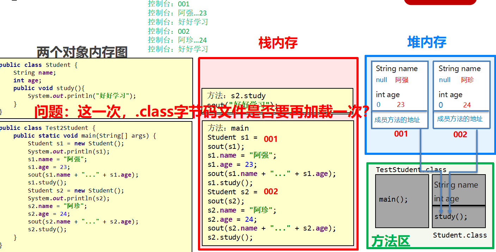

# 1.类和对象

* 面向对象和面向过程的思想对比:

    面向过程:是一种一过程为中心的编程思想,实现功能的每一步,都是自己实现的

    面向对象:是一种以对象为中心的编程思想,通过只会对象实现具体的功能

## 1.1类和对象的关系

客观存在的事物皆为对象,所以我们也常说万物皆对象
* 类

    类的理解

    * 类的理解

        * 类是对现实生活中具有共同属性的行为和事物的抽象

        * 类是对象的数据类型,类是具有相同属性和行为的一组对象的集合

        * 简单理解:类就是对现实事物的一种描述

    * 类的组成

        * 属性:指事物的特征,例如:手机事物(品牌,价格,尺寸)

        * 行为:指事物能执行的操作,例如:手机事物(打电话,发短信)

* 类和对象的关系

    * 类:类是对现实生活中一类具有共同属性和行为的事物的抽象

    * 对象:能够看得到摸得着真实存在的实体

    * 简单理解:类是事物的一种描述,对象则为具体存在的事物


# 2.对象内存图

## 2.1单个对象内存图(理解)


## 2.2多个对象的内存图(理解)



* 总结:多个对象在堆内存中,都有着不同的内存划分,成员变量存储在各自的内存区域中,成员方法多个对象共用的一份

## 2.3多个对象指向相同内存图(理解)


* 总结:当多个对象的引用指向了同一个内存空间(变量所记录的地址值是一样的)

  只要任何一个对象修改了内存中的数据,随后,无论使用拿一个对象获取数据,都是修改后的数据

# 3.成员变量和局部变量

## 3.1成员变量和局部变量的区别
* 类中的位置不同:成员变量(类中方法外) 局部变量(方法内部或方法声明上)

* 内存中的位置不同:成员变量(堆内存) 局部变量(栈内存)

* 生命周期不同:成员变量(随着对象的存在而存在,随着对象的消失而消失) 局部变量(随着方法的调用而存在,随着方法的调用完毕而消失)

* 初始化值不同:成员变量(有默认初始化值) 局部变量(没有默认初始化值,必须先定义,赋值才能使用)


# 4.封装

## 4.1private关键字

**概述:** private是一个修饰符，可以用来修饰成员（成员变量，成员方法）

​**特点:** 被private修饰的成员，只能在本类进行访问，针对private修饰的成员变量，如果需要被其他类使用，	提供相应的操作

​		提供“get变量名()”方法，用于获取成员变量的值，方法用public修饰

​		提供“set变量名(参数)”方法，用于设置成员变量的值，方法用public修饰

```java
    /*
    学生类
 */
class Student {
    //成员变量
    String name;
    private int age;

    //提供get/set方法
    public void setAge(int a) {
        if(a<0 || a>120) {
            System.out.println("你给的年龄有误");
        } else {
            age = a;
        }
    }

    public int getAge() {
        return age;
    }

    //成员方法
    public void show() {
        System.out.println(name + "," + age);
    }
}
/*
    学生测试类
 */
public class StudentDemo {
    public static void main(String[] args) {
        //创建对象
        Student s = new Student();
        //给成员变量赋值
        s.name = "林青霞";
        s.setAge(30);
        //调用show方法
        s.show();
    }
}

```


## 4.2this关键字

​**概述:** this修饰的变量用于指代成员变量,其主要作用(区分局部变量和成员变量的重名问题)

* 方法的形参如果与成员变量同名，不带this修饰的变量指的是形参，而不是成员变量

* 方法的形参没有与成员变量同名，不带this修饰的变量指的是成员变量

## 4.3this内存(理解)

**注意:** this代表当前调用方法的引用，哪个对象调用的方法，this就代表哪一个对象

**图解:**


## 4.4封装思想

1. **封装概述**

   是面向对象三大特征之一（封装，继承，多态）

   是面向对象编程语言对客观世界的模拟，客观世界里成员变量都是隐藏在对象内部的，外界是无法直接操作的

2. **封装原则**

   将类的某些信息隐藏在类内部，不允许外部程序直接访问，而是通过该类提供的方法来实现对隐藏信息的操作和访问

   成员变量private，提供对应的getXxx()/setXxx()方法

3. **封装好处**

   通过方法来控制成员变量的操作，提高了代码的安全性

   把代码用方法进行封装，提高了代码的复用性

# 5. 构造方法

## 5.1 构造方法的格式和执行时机

* **格式注意 :**

  *  方法名与类名相同，大小写也要一致

  *  没有返回值类型，连void都没有

  *  没有具体的返回值（不能由retrun带回结果数据）

* **执行时机 ：**

  * 创建对象的时候调用，每创建一次对象，就会执行一次构造方法

  * 不能手动调用构造方法

* **示例代码：**

```java
class Student {
    private String name;
    private int age;

    //构造方法
    public Student() {
        System.out.println("无参构造方法");
    }

    public void show() {
        System.out.println(name + "," + age);
    }
}
/*
    测试类
 */
public class StudentDemo {
    public static void main(String[] args) {
        //创建对象
        Student s = new Student();
        s.show();
    }
}
```

## 5.2 构造方法的作用

* 用于给对象的数据（属性）进行初始化

```java
package com.itheima.constructor;

public class Student {
    /*
        格式:

               1. 方法名需要跟类名相同, 大小写也要一致
               2. 没有返回值类型, 连void都没有
               3. 没有具体的返回值(不能由return带回具体的结果)
     */

    private String name;
    private int age;

    // 1. 如果一个类中没有编写任何构造方法, 系统将会提供一个默认的无参数构造方法
    public Student(){}

    // 2. 如果手动编写了构造方法, 系统就不会再提供默认的无参数构造方法了
    public Student(String name, int age){
        this.name = name;
        this.age = age;
        System.out.println("我是Student类的构造方法");
    }

    public void show(){
        System.out.println(name + "..." + age);
    }
}

package com.itheima.constructor;

public class TestStudent {
    public static void main(String[] args) {
        Student stu1 = new Student("张三",23);
        stu1.show();

        Student stu2 = new Student();
    }
}

```

## 5.3 构造方法的注意事项

**构造方法的创建 :** 

​	如果没有定义构造方法，系统将给出一个默认的无参数构造方法

​	如果定义了构造方法，系统将不再提供默认的构造方法

**构造方法的创建 :** 

​	如果没有定义构造方法，系统将给出一个默认的无参数构造方法如果定义了构造方法，系统将不再提供默认的构造方法

**推荐的使用方式 :** 

​	无论是否使用，都手动书写无参数构造方法，和带参数构造方法