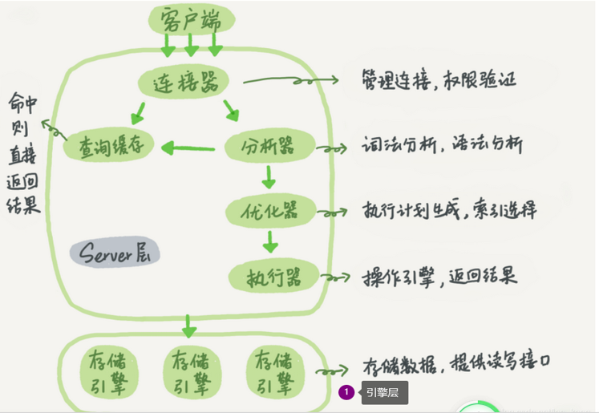

# MySql

##  安装

* mysql主流的两大版本：
  * 5.x
  * 8.x
* mysql的安装
  * window
    * 可以使用安装器安装
    * 也可以使用解压安装（推荐使用）
  * linux的安装
    * 根据不同的linux版本选择对应的安装（centos=》RPM安装）

## 表设计(数据类型)

* 创建数据库

```
create database db2205
```

* 整数类型
  * 常见的整数类型：TINYINT、SMALLINT、MEDIUMINT、INT或者BIGINT。
  * 计算机中最小的单位是bit，只有0和1，一个字节 = 8位
  * TINYINT大小：8位 或者 1个字节，范围 -128 到 127  或者 0 到 255
  * MySQL可以为整数类型指定宽度。例如，INT(11)，这对大多数应用毫无意义，对于存储和计算来说，INT(1)和INT(20)是相同的。
  * 可以使用unsigned设置为正数
  
* 实数类型
  * 实数主要是带有小数点的数字，主要有：FLOAT、DOUBLE、DECIMAL。
  * float占4个字节，double占8个字节，decimal(M,D)占M+2个字节。
  * 由于额外的空间需求和计算成本，应该尽量只在对小数进行精确计算时才使用DECIMAL。但在一些大容量的场景，可以考虑使用BIGINT代替DECIMAL，将需要存储的货币单位根据小数的位数乘以相应的倍数即可。这样可以同时避免浮点存储计算不精确和DECIMAL精确计算代价高的问题。
  * MySQL会使用DOUBLE进行浮点类型的内部计算。
  
* 字符类型
  * varchar：存储的是可变字符，用于优化数据存储的空间，需要流出1或2字节存储字符的长度
    * 范围：0-65535个字节
    * mysql8中默认使用的是utf8mb4编码，一个字符占4个字节，所以默认varchar可以写入16383
    * varchar 是可变长字符串，不预先分配存储空间，长度不要超过 5000，如果存储长 度大于此值，定义字段类型为 text，独立出来一张表，用主键来对应，避免影响其它字段索 引效率。
  * char：是不可以变字符
    * 会截取后面的空格字符
    * 范围：0-255 个字符
  * blob类型
    * 主要存储二进制文件，例如声音，图片，视频等等

* 枚举类型

  * 基本的使用

  ```sql
  create table tb_user(
          id int unsigned primary key auto_increment,
          name varchar(50),
          sex enum('男','女','未知') not null
  );
  ```

  * 插入数据(数字是从1开始)

  ```sql
  insert into tb_user values (null,'小明','男');
  insert into tb_user values (null,'小花',2);
  ```

  * 查询操作

  ```sql
  select id,name,sex+0 from tb_user;
  ```

* set类型

  * 可以存储多个成员，最多是64个

  ```sql
  create table tb_user(
          id int unsigned primary key auto_increment,
          name varchar(50),
          sex enum('男','女','未知') not null,
          hobby set('羽毛球','乒乓球','足球')
  );
  ```

  * 插入操作

  ```sql
  insert into tb_user values (null,'小明','男','羽毛球');
  insert into tb_user values (null,'小花','女','乒乓球,羽毛球');
  insert into tb_user values (null,'小美','女','保龄球'); -- 错误操作
  ```

  * 查询操作

  ```
  select id,name,sex+0,hobby+0 from tb_user;
  ```

  > 查询结果是通过二进制由低到高位存储

* 日期类型

  * 主要分为两种

    * datetime类型：日期时间类型

      * 2012-01-22 12:05:31
      * date只能存储日期

    * timestamp：时间戳类

      * 从1970-1-1开始，以毫秒进行累加
      * 预计在2038年会过期
      * 支持时区
      * timestamp 类型的存储，是以 UTC 时区来保存的，在显示时会自动将日期数据转换，如果时间的场景对应多个时区，此时选择 timestamp 比 datetime 更好。
      * 可以设置自动更新

      ```sql
      NOT NULL DEFAULT CURRENT_TIMESTAMP ON UPDATE CURRENT_TIMESTAMP
      ```

  * 日期函数

    * ADDDATE(d,n)计算起始日期 d 加上 n 天的日期

    * ADDTIME(t,n) n 是一个时间表达式，时间 t 加上时间表达式 n 单位为秒（0s-60s之间）

    * DATEDIFF(d1,d2) ：两个之间的之间的间隔

    * DATE_SUB(date,INTERVAL expr type) 函数从日期减去指定的时间间隔。

    * INTERVAL expr  type用于计算间隔的日期，以之前参数的时间作为参照

      * type可以是year，month，day

    * DATE_FORMAT(d,f) 时间格式化

      * %Y 年，4 位

        %y  年，2 位

        %M 月 英文表示 January

        %b 月 英文缩写表示 Apr

        %m 月，数值(00-12)

        %c  月，数值(0-12)

        %d 月的天，数值(00-31)

  * 案例

    * 计算2019年前三季度的营业额度
    * 计算最近6个月下单的数量
    * 计算最近6个月没有下单的用户
    * 说明三种计算时间间隔的方式

## Mysql的架构

[参考](https://blog.csdn.net/lan_kang/article/details/113933132)

* MySql主要可以分为三层

  

  * 第一层就是客户端，管理连接的权限，session的创建等等
  * 第二层是mysql的服务器层
    * 分析器
    * 优化器
    * 执行器
    * 查询缓存（5.x才有的，8.x下放到引擎层）
    * 作用总结:负责SQL语法解析、生成执行计划等，并调用存储引擎层去执行数据的存储和检索。
  * 第三层引擎层
    * 在执行sql语句的时候，会根据不同的引擎，进行不同的查询操作
    * 常用的innodb，myisam，memory
    * 引擎和最终存储的数据是无关的
    * 作用总结:执行数据的存储和检索。

* 常见的引擎

  * innodb：默认使用，支持事务，外键，redolog，undolog
  * myisam：插入速度快，不支持事务，支持索引
  * memory：基于内存的引擎，速度最快，不支持持久化
    * temporary ：临时表，在一次session生命周期中有效
    * memory：是在mysql关闭之后失效

* innodb 和 myisam

  * 1、innodb支持事务，而myisam不支持事务。

    2、innodb支持外键，而myisam不支持外键。

    3、innodb默认表锁，使用索引检索条件时是行锁，而myisam是表锁（每次更新增加删除都会锁住表）。

    4、innodb和myisam的索引都是基于b+树，但他们具体实现不一样，innodb的b+树的叶子节点是存放数据的，myisam的b+树的叶子节点是存放指针的。

    5、innodb是聚簇索引，必须要有主键，一定会基于主键查询，但是辅助索引就会查询两次，myisam是非聚簇索引，索引和数据是分离的，索引里保存的是数据地址的指针，主键索引和辅助索引是分开的。

    6、innodb不存储表的行数，所以select count( * )的时候会全表查询，而myisam会存放表的行数，select count(*）的时候会查的很快。

## Sql语句分类

1. 1)DQL(Dimensional Query Language)

   ```
   数据查询语言DQL基本结构是由SELECT子句，FROM子句，WHERE子句组成的查询块：SELECT <字段名表>FROM <表或视图名>WHERE <查询条件>
   ```

   2).DML（data manipulation language）：

             DML用来对数据库里的数据进行操作的语言;例如SELECT、UPDATE、INSERT、DELETE

​		3).DDL（data definition language）：

```
DDL主要是用在定义或改变表（TABLE）的结构，数据类型，表之间的链接和约束等初始化工作上，他们大多在建立表时使用,主要的命令有CREATE、ALTER、DROP、TRUNCATE等 
```

​		4).DCL（Data Control Language）：


           DCL是数据库控制功能。是用来设置或更改数据库用户或角色权限的语句，包括（grant,deny,revoke等）语句。在默认状态下，只有sysadmin,dbcreator,db_owner或db_securityadmin等人员才有权力执行DCL

## MySql的索引

* 索引是独立于表结构之后的结构，相当于书的目录，可以帮助快速的查询数据

* 索引的基本使用

  * 创建索引

  ```sql
  create index idx_uname on tb_user(uname);
  ```

  * 删除索引

  ```sql
  drop index idx_uname on tb_user;
  ```
  
* 联合索引

  * 可以将多个字段联合起来建立一个索引

## B树&B+树

- 叶子节点

  就是出度为0的节点,就是没有子节点的节点

- 二叉查询树

  若一个节点的左子树不为空,则他所字数上所有节点都小于该节点；若一个节点的右子树不为空,则他右子树所有的节点都大于该节点。

- B树

  1. (B是Balance的意思)在二叉查询树的基础上,增加了节点的数量,降低了树的高度,更加有效的提高了树的查询速度.
  2. B树的每个节点都存储了key和data.

- B+树

  1. B+树一个节点就为1页

  2. 在B树的基础上,使用连表将所有的叶子节点进行连接

     -B+树非叶节点只存储索引信息，不存储数据

     -B+树叶子节点最右边的指针指向下一个相邻的叶节点

     -B+树所有的叶节点组成了一个有序链表

  3. B+树的节点都存储了key,但是子节点和根节点不存储value

  

## 索引的规则

### 回表

### 索引覆盖

### 最左前缀

### 索引下推

* 聚簇索引：索引的叶子结点存储的就是这一行数据，一般而言一张表只有一个聚簇索引，即主键索引

* 辅助索引：在其他字段上创建的索引都是辅助索引，也就是非聚簇索引，索引的叶子结点存储的是主键

* 回表：即根据辅助索引查询之后，无法获取完整的数据，于是就用获取主键再去主键索引查询，这个动作就叫回表

* 索引覆盖：在根据索引列查询的时候，可以直接获取索引列的值，如果想要查询的结果索引的值，都包含了，那么则不需要回表，一般需要设置联合索引

* 最左前缀原则：在使用联合索引的时候，查询的条件的顺序最好要和索引创建的时候顺序保持一致（例如：A,B,C ->  where A , where A,B 没有问题，如果直接写Where B 那么索引会失效）

* 索引下推

  - 情景:上一段我们说到满足最左前缀原则的时候，最左前缀可以用于在索引中定位记录。这时，你可能要问，那些不符合最左前缀的部分，会怎么样呢？
  
    ```mysql
    -- Using index condition
    explain select * from emp where ename like 'yN%' and job='后勤' and mgr>0
    ```
  
  - 原理:在查询的时候，where过滤条件是在引擎层执行，而不是在server层执行的。(**索引下推(`Index Condition Pushdown`)：** 简称 ICP是mysql利用索引（二级索引）元组和筛字段在索引中的where条件从表中提取数据记录的一种优化操作。ICP的思想是：**存储引擎在访问索引的时候检查筛选字段在索引中的**where条件（pushed index condition，推送的索引条件），如果索引元组中的数据不满足推送的索引条件，那么就过滤掉该条数据记录**。ICP（优化器）尽可能的把**index condition的处理从server层下推到storage engine层。storage engine使用索引过过滤不相关的数据，仅返回符合index condition条件的数据给server层。也是说数据过滤尽可能在storage engine层进行，而不是返回所有数据给server层，然后后再根据where条件进行过滤。)
  
  [索引下推](https://www.qycn.com/xzx/article/17151.html)

## 索引的失效

1.如果条件中有or，即使其中有条件带索引也不会使用(这也是为什么尽量少用or的原因)，注意：要想使用or，又想让索引生效，只能将or条件中的每个列都加上索引

2.（最左前缀原则）对于多列索引，不是使用的第一部分(第一个)，则不会使用索引

3.like语句的.如果你对nickname字段建立了一个索引.当查询的时候的语句是 nickname like '%ABC%' 那么这个索引将不会起到作用.而nickname like 'ABC%' 那么将可以用到索引

4.如果列类型是字符串，那一定要在条件中将数据使用引号引用起来,否则不使用索引（主要是低版本）

5.索引不会包含NULL列,如果列中包含NULL值都将不会被包含在索引中,复合索引中如果有一列含有NULL值那么这个组合索引都将失效,一般需要给默认值0或者 ' '字符串

6.不要在列上进行运算,这样会使得mysql索引失效,也会进行全表扫描（主要是低版本）

## MySql的查询优化

### 关于优化

- 定位查询慢的语句
  - 开启慢日志(仅仅是在测试缓解下,生产环节中谨慎使用)
- 使用explain对执行的语句进行分析
  1. 分析索引的使用情况
     - system：一般只有一行数据,非常快,基本用不着
     - const：通过一次索引就是找到数据,一般使用的是主键索引
     - ref：使用的是普通索引,eq_ref使用的是唯一索引,查询是直接引用到一个对应的索引
     - range:查询索引的结果是一个范围,性能稍微低一些,主要是用在>，<，bewtten等操作.(与extra配合查看,最好提高到ref)。
     - index：查询了整个索引,Full index Scan，index和all区别为index类型只遍历索引树.这通常比ALL快，因为索引文件通常比数据文件小。
     - ALL：没有使用索引,对全部进行扫描。
  2. extra：额外的信息
     - Using idex：说明查询结果直接使用的索引的信息,不回表
     - Using where：查询的结果,在索引不能够完全决定,还需要到server进行进一步的过滤
     - Using index condition:将where操作下推到索引执行,效果比Using where好
     - Using where;Using index：表示查询的列被索引覆盖，且where筛选条件是索引列前导列的一个范围，或者是索引列的非前导列。 效率也比较高
     - Using filesort：在查询的排序时候，使用了文件排序(效率慢)
  3. rows：一个查询扫描了多少行,越少越好.
  4. filters：查询的结果和扫描行数的比率,最好是要100

### sql语句优化

* count：尽量使用count(*),被统计的字段不要有null值

  * 跟换引擎，mysiam会自动保存行数，所以速度快
  * 格外设计一个表将其他表的总数进行保存

* limit（重点）：导致变慢原因，就是前面的offset偏移量过大的时候会进行逐行扫描

  * 第一种优化方式，记住上一次查询结果的位置，将位置作为下一页查询的条件(最快)

    ```mysql
    -- 第一种,每次获取最大条数的数字传给后端然后使用一下语句进行查询,一开始前端设初始值为0
        select * from emp  where id >20 limit 0,20;
    
        -- 比如还是SELECT * FROM message ORDER BY id DESC，按id降序分页，每页20条，当前是第10页，当前页条目id最大的是1020，最小的是1000，如果我们只提供上一页、下一页这样的跳转（不提供到第N页的跳转），那么在处理上一页的时候SQL语句可以是：
    
        -- 在前端将当前页最大id传入后端作为参数放入pagenum位置
        -- SELECT * FROM emp WHERE id>max pagenum ORDER BY id ASC LIMIT 20; -- //下一页
        SELECT * FROM emp WHERE id>1020 ORDER BY id ASC LIMIT 20; -- //下一页
        -- 处理下一页的时候SQL语句可以是：
    
        SELECT * FROM emp WHERE id<1000 ORDER BY id DESC LIMIT 20; -- //上一页
        -- 不管翻多少页，每次查询只扫描20行。
        -- 缺点是只能提供上一页、下一页的链接形式，
    ```

    

  * 第二种优化方式，利用子查询，使用limit查询主键，然后再用连表查询自连

  ```sql
  -- 第二种嵌套子查询,同时还能实现跳转定位某一页的功能 每页多少条加第几页的乘积作为参数放到10000这个位置
   SELECT e.* FROM emp e,(select id from emp  LIMIT 10000,20 ) b where e.id=b.id;
  explain SELECT e.* FROM emp e,(select id from emp  LIMIT 10000000,20 ) b where e.id=b.id;
  ```

* union：将两个查询结果合并

  * 两个查询结果的列的数量，必须是一致的
  * 一般union查询最好使用all，如果不用all，说明union的过程中需要去重复

* join：

  * 最好使用小表连接大表
  * 查询的结果，尽量要少，可以通过where或者是子查询进行过滤
  * 还可以将buffer修改大一点，**如果你的 join 语句很慢，就把 join_buffer_size 改大**
  * 最好别用，使用分步查询

* order by：

  * 需要避免使用file sort，直接添加索引

* group by：

  * 可以通过使用临时表或者子查询进行优化

    例子:两个表将相同名字的用户的内容进行去重并且将结果相加

    可以将连个表使用union联合然后成为一个新表,然后使用group  by进行分组然后再嵌套子查询

* truncate table name：截断表,同时能解决id自增没有删除的问题

# MySql事务

## ACID原则

* 四种原则

  * 1，事务的特征原子性(Atomicity) 

    指事务中的操作，要么都完成，要么都取消。

    2，一致性(Consistency)

    指事务中的操作保证数据库中的数据不会出现逻辑上不一致的情况。

    3，隔离性(Isolation)

    指当前的事务与其他未完成的事务是隔离的。

    4，永久性(Durability)

    指对事务发出COMMIT命令后，事务的效果是永久的。

* 实现原理

  * 1，原子性：使用undo log，从而达到回滚

    2，持久性：使用redo log，从而达到故障后恢复

    3，隔离性：使用锁以及MVCC,运用的优化思想有读写分离，读读并行，读写并行

    4，一致性：通过回滚，以及恢复，和在并发环境下的隔离做到一致性。

## mysql事务的使用

* 默认情况下，mysql会自动提交事务
* 需要使用start transaction 或者 begin开头，开启事务
* rollback是回滚数据
* commit是提交数据
* SAVEPOINT identifier；SAVEPOINT允许在事务中创建一个保存点，一个事务中可以有多个SAVEPOINT

## 事务的隔离性

* 两个不同的session的事务的隔离级别

* 四种级别

  * **Read Uncommitted**（读取未提交内容）**：A事务提交的数据，还没有commit的时候，B事务可以看到A数据提交的数据。我们将这种数据称为**脏读

    ```
    set session transaction isolation level read uncommitted;
    ```

  * **Read Committed**（RC,读取提交内容): A 事务提交的数据，必须要提交的之后，B事务才可以看见。但是如果B事务在A事务提交数据之前查询了一次，然后再A事务提交数据之后，再查询的一次，这样会导致一次事务中，两次查询的结果不一致，我们将这个操作称为**不可重复读取**

  * **Repeatable Read**（RR,可重读）：mysql默认的事务隔离级别，即一次事务，多次查询的结果的数据是一致的。理论上来说，这个级别可能会出现**幻读**,但是innodb使用MVCC+行锁解决了

  * **Serializable**（可串行化） ：通过锁将两个事务进行隔离，会导致阻塞，影响性能

* MVCC主要是通过快照，为不同的事务添加对应事务版本的快照备份，达到事务的隔离。

  幻读的解决

  MVCC加Gap Lpck(间隙锁)或者MVCC加(Gap Lock+Record Lock(行锁))

### MVCC

- 概念

  MVCC全称Multi-Version Concurrency Control，多版本并发控制。指维护一个数据的多个版本，使得读写操作没有冲突;
  
- 快照读

  为MySQL实现MVCC提供了一个非阻塞读功能，MVCC的具体实现，还需要依赖于数据库记录中的三个隐式字段、undo log日志、readView.

- 当前读

  读取的是最新版本，读取时还要保证其他并发事务不能修改当前记录，会对读取的记录进行加锁。对于我们日常的操作，如select…lock in share mode(共享锁)，select … for update、update、insert、deletel(排他锁)都是一种当前读

- 

[MVCC视图产生参考](https://blog.csdn.net/qq_41361506/article/details/108538702)

[MVCC+间隙锁解决当前读幻读问题](https://blog.csdn.net/Edwin_Hu/article/details/124392174)

## 百万数据插入提高效率的方式

- 开启事务
- 开启批处理
- 先不创建索引,插入完成之后再创建

# MySql锁

## 锁的作用

- 锁是数据库用来控制共享资源并发访问的机制
- 锁用于保护正在被修改的数据
- 知道提交或者回滚事务只有,其他用户才可以更新数据

## 锁的优点

- 一致性

  一次只允许一个用户(会话session)修改数据

- 完整性

  为所有用户提供正确的数据。如果一个用户进行修改并保存,所做的修改将反应给所有用户

- 并行性

  允许多个用户访问同一数据

## 锁的分类

### 全局锁

- 作用

  能够对整个数据库实例加锁,使得数据库处于只读状态.

- 使用场景:全库的逻辑备份

  1. 在客户端异常断开后,全局锁会自动释放
  2. 全库逻辑备份,也就是把库的每个表都select出来存成文本

### 表级锁

#### 作用

每次操作锁住整张表。锁定粒度大，发生锁冲突的概率最高，并发度最低。应用在MyISAM、InnoDB、BDB等存储引擎中。

#### (分类)表锁

##### 读锁和写锁

- 读锁：当前session和其他session可以读,但是不能改
- 写锁：当前session可以读和写,其他session不能写和读
- 原则：读读可以共存,写读,写写互斥

##### 元数据锁(MDL)

MDL不需要显式使用，**在访问一个表的时候会被自动加上**。MDL的作用是，锁住表的结构,保证**读写的正确性**。你可以想象一下，如果一个查询正在遍历一个表中的数据，而执行期间另一个线程对这个**表结构做变更**，删了一列，那么查询线程拿到的结果跟表结构对不上，肯定是不行的。**为了避免** **DML** **与DDL**冲突，保证读写的正确性。

### 行级锁

#### 作用

每次操作锁住对应的行数据。锁定粒度最小，发生锁冲突的概率最低，并发度最高。

#### 分类

##### 间隙锁(自动添加)

锁定索引记录间隙（不含该记录），确保索引记录间隙不变，防止其他事务在这个间隙进行insert，产生幻读。在RR隔离级别下都支持。

##### **临键锁**(Next-Key Lock,自动添加)

行锁和间隙锁组合，同时锁住数据，并锁住数据前面的间隙Gap。在RR隔离级别下支持。

##### 行锁(无索引行锁升级为表锁)

锁定单个行记录的锁，防止其他事务对此行进行update和delete。在RC、RR隔离级别下都支持

- 两种类型的行锁

  1. 排他锁(x):当前session使用排他锁锁定一行数据之后,另一个session是不可以在同一行数据添加任意锁

     ```mysql
     BEGIN
     update tb_user set money = 100 where uid = 1;
     -- 注:要使用主键作为条件来锁定一行数据，如果不是主键（没有索引的字段），那么会锁查询扫描过的表，会将行锁升级为表锁
     ```

  2. 共享锁(s):当前session使用共享锁锁定一行数据的时候,另一个session是可以在同一行数据上添加及共享锁,但是不能添加排他锁.

     ```mysql
     begin ;
     select * from tb_account  where aid  = 1 lock in share mode;
     ```

  3. 共享锁和排他锁的共存

     - 共享锁与共享锁之间兼容
     - 共享锁与排他锁之间互斥
     - 排它锁与排他锁之间互斥

- 查看锁的语句

  ```mysql
  select object_schema,object_name,index_name,lock_type,lock_mode,lock_data from performance_schema.data_locks;
  ```

- 默认机制

  默认情况下，InnoDB在Repeatable Read事务隔离级别运行，InnoDB使用next-key锁进行搜索和索引扫描，以防止幻读。

  ```
  - 针对唯一索引进行检索时，对已存在的记录进行等值匹配时，将会自动优化为行锁。
  - InnoDB的行锁时针对索引的锁，不通过索引条件检索数据，那么InnoDB将对锁中的所有记录枷锁，此时就会升级为表锁
  ```


## 死锁

- 概念

  当并发系统中不同线程出现循环资源依赖，涉及的线程都在等待别的线程释放资源时，就会导致这几个线程都进入无限等待的状态，称为死锁。

- 解决策略

  1，一种策略是，直接进入等待，直到超时。这个超时时间可以通过参数 innodb_lock_wait_timeout 来设置(默认值是50s)。

  2，(推荐)另一种策略是，发起死锁检测，发现死锁后，主动回滚死锁链条中的某一个事务，让其他事务得以继续执行。将参数 innodb_deadlock_detect 设置为 on，表示开启这个逻辑。

## 小结

1. 表级锁(table-level locking)：开销小，加锁快;不会出现死锁;锁定粒度大，发生锁冲突的概率最高,并发度最低。
2. 行级锁(row-level locking)：开销大，加锁慢;会出现死锁;锁定粒度最小，发生锁冲突的概率最低,并发度也最高。
3. 页面锁(page-level-locking)：开销和加锁时间界于表锁和行锁之间;会出现死锁;锁定粒度界于表锁和行锁之间，并发度一般

# 其他锁

## 悲观锁

### 概念

- 指的是对数据被外界（包括本系统当前的其他事务，以及来自外部系统的事务处理）修改持保守态度，因此，在整个数据处理过程中，将数据处于锁定状态。

### 使用

- 用悲观锁，我们必须关闭mysql数据库的自动提交属性，采用手动提交事务的方式。

## 乐观锁

### 概念

- 乐观锁假设认为数据一般情况下不会造成冲突，所以在数据进行提交更新的时候，才会正式对数据的冲突与否进行检测，如果发现冲突了，则让返回用户错误的信息，让用户决定如何去做（一般是回滚事务）。

### 使用

1. 使用数据版本（Version）记录机制实现，这是乐观锁最常用的一种实现方式。
2. 乐观锁定的第二种实现方式和第一种差不多，同样是在需要乐观锁控制的table中增加一个字段，名称无所谓，字段类型使用时间戳

# 关键字

​	[参考](https://www.qycn.com/xzx/article/17472.html)

- analyze

  修复索引,ANALYZE TABLE 表名

- between

  用在where之后的时间或者数字范围查询.

  ```mysql
  SELECT * FROM USER WHERE CREATE BETWEEN '2020-11-20' AND '2020-11-30';
  ```

- distinct

  去除重复的数据

  ```mysql
  SELECT COUNT(DISTINCT name) FROM user
  ```

- distinctrow

  用于连表的去重,可以查询出主表中关联的附表数据而不包含那些与查询出的主表不相同的数据.

  ```mysql
  -- 可以查询出用户id与相关联的untitled表中的好友名称，不包含没有查询的用户的的好友
  SELECT DISTINCTROW user.id ,untitled.friend_name FROM user INNER JOIN untitled ON user.id = untitled.friend_id WHERE user.id = '1';
  ```

- explain

  用查看一个sql的执行,有没有加入索引或是有没有做全表扫描等方式

  ```mysql
  explain select * from user
  ```

- group

  用于分组操作，`GROUP BY 字段名` 分组操作后要查询的字段必须要在GROUP BY之后添加不然会报错，比较经典的用法如：

  ```mysql
  -- 查询某一类型的数据条数
  SELECT friend_name , COUNT(friend_name) FROM untitled GROUP BY friend_name
  ```

- having

  用于在聚合后对数据进行筛选，与WHERE的区别在于，WHERE是在聚合前筛选数据的无法使用聚合函数如COUNT,SUM等，HAVING是在聚合后进行筛选的可以使用聚合函数
  
  ```mysql
  SELECT friend_name , COUNT(friend_name) FROM untitled GROUP BY friend_name HAVING COUNT(friend_name) >1
  -- 查询的便是friend_name数量大于一的数据条数
  ```
  
- inner

  用于内连接查询,设定on条件之后将符合条件的数据全部显示出来;

  与左连接,右连接不同的是:inner没有侧重点,mysql会将所有符合条件的查询结果展示出来,但是小心会出现笛卡尔积

  ```mysql
  -- inner join是默认的连接仿古式
  SELECT * FROM user JOIN untitled ON user.id = untitled.friend_id
  ```

- interval

  主要用于时间的间隔,  返回的创建事件在四天前的数据,也可以将day换成秒,分钟

  ```mysql
  SELECT * FROM USER where create_time < NOW()-INTERVAL 4 DAY
  ```

# 面试题

### 1.mysql怎样防止长连接产生的OOM问题(导致mysql重启)

### 连接池配置validation-query:  SELECT 1 FROM DUAL的意义

mysql数据的特征:会关闭已经连接了8个小时的连接,该语句可以每隔一段时间连接发sql的语句给mysql，防止被挂起

### 2.B+树1000万条数据得多少层

[参考](https://blog.csdn.net/csdnlijingran/article/details/102309593)

### 3.B树和B+树各自优点

B树的优点
1.B树的每一个节点都包含key和value，因此经常访问的元素可能离根节点更近，因此访问也更迅速。

B+树的优点
所有的叶子结点使用链表相连，便于区间查找和遍历。B树则需要进行每一层的递归遍历。相邻的元素可能在内存中不相邻，所以缓存命中性没有B+树好。
b+树的中间节点不保存数据，能容纳更多节点元素。

B树和B+树的共同优点
考虑磁盘IO的影响，它相对于内存来说是很慢的。数据库索引是存储在磁盘上的，当数据量大时，就不能把整个索引全部加载到内存了，只能逐一加载每一个磁盘页（对应索引树的节点）。所以我们要减少IO次数，对于树来说，IO次数就是树的高度，而“矮胖”就是b树的特征之一，m的大小取决于磁盘页的大小。

### 4.B树和B+树的区别

- B树的每个结点都存储了key和data，B+树的data存储在叶子节点上。节点不存储data，这样一个节点就可以存储更多的key。可以使得树更矮，所以IO操作次数更少。
- 树的所有叶结点构成一个有序链表，可以按照关键码排序的次序遍历全部记录由于数据顺序排列并且相连，所以便于区间查找和搜索。而B树则需要进行每一层的递归遍历。相邻的元素可能在内存中不相邻，所以缓存命中性没有B+树好。

# 数据结构

* 基本物理结构
  * 数组：连续的内存空间，可以通过下标快速寻址
    * 在创建的之后，就需要指定数组的大小，就可能会出现锁扩容问题
  * 链表：在内存空间中不是连续，每个结点需要保存其他数据的地址
    *  链表没有锁扩容的问题，但是查询比较慢
  
* 逻辑结构
  * 栈、队列
  * 树
  * 哈希
  * 图
  
* 树结构
  * 二叉树:既有数组查询的效率，又有链表修改的性能
    * 二叉树的遍历
      * 以根结点作为参照物：先序，中序，后序
      * 遍历的方式：
        * 深度优先遍历
        * 广度优先遍历
    * 二叉查询树：左子树小于右子树
    * 二叉平衡树，通过旋转解决树不平衡的问题，旋转的条件的是左右子树的差大于1的时候，就会进行旋转。由于过多的旋转也会导致性能问题
    * 红黑树，通过达到基本平衡，减少旋转的次数
    * 堆排序
      * 主要是利用数组构造树结构(只能是完全二叉树)
        * 左子结点：2n
        * 右子结点：2n+1
      * 构造大顶堆
      * 然后将最后一个元素和大顶堆的根结点的值进行交换
  * 多路查询树：
    * b树的一个结点有多个子节点
    * b+树就在b树的基础上，让所有的叶子结点通过链表进行连接，而且之后叶子结点存储具体的数据
  
* 排序

  冒泡,堆,快速,二分查找法

