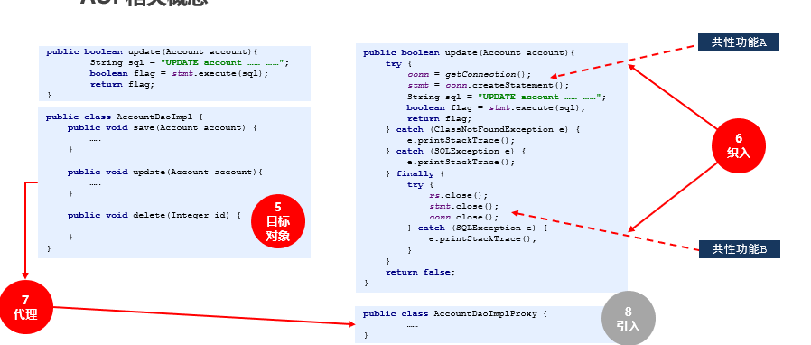

# Spring核心原理

## IOC控制反转

### 基本概念

- IOC(Inverse Of Controll,控制反转)：就是原来代码里面需要自己手动创建的对象，依赖，反转给Spring来帮忙实现。我们需要创建一个容器，同时需要一种描述来让容器知道要创建的对象与对象之间的关系。
- 在Spring中BeanFactory就是IOC容器，在Spring初始化的时候，创建容器，并将需要创建对象和对象的关系（xml，注解）通过BeanDefinitionReader加载到BeanDefinition中并保存在BeanDefinitionMap中，然后再由IOC容器创建bean对象.

两种bean的注册方式

- 方法1：通过@Bean+@Configuration的方式直接定义要创建的对象与对象的关系
- 方式2：通过@Component定义类，这种方式必须使用@ComponetScan定位Bean扫描路径

### 常用注解

#### @Component

- 定义当前类会被IOC容器接管
- @Repository：在Dao层使用
- @Service：在Service层使用
- @Controller：在Web层使用

#### @Lazy

定义的类，在IOC容器加载的时候,并不会创建bean,而是在第一次被调用的时候创建

@Scope

定义类在IOC容器的类型范围

- singleton：单实例(单例模式，默认),全局有且仅有一个实例(跟随IOC的生命周期)
- protoype：多实例(多例模式),每次获取Bean的时候会有一个新的实例(垃圾回收器负责回收)
- request：同一次请求，每一次HTTP请求都会产生一个新的bean，同时该bean仅在当前HTTP request内有效
- session：同一个会话级别，每一次HTTP请求都会产生一个新的bean，同时该bean仅在当前HTTP session内有效

#### @Bean

定义在方法上,将返回的对象放入到IOC容器中

- initMethod：属性已经注入完毕后调用
- detoryMethod：类在被销毁的时候调用

### 工厂后处理器BeanFactoryPostProcessor

- BeanFactoryPostProcessor：Bean后置工厂处理器,在BeanDefinitionMap填充完毕,Bean实例化之间执行；通过工厂后置处理器，可以达到动态注册BeanDefinition，动态修改BeanDefinition，以及动态修改Bean的作用

- 可以用于手动注册BeanDefinition

  ```java
  @Component
  public class MyRegistorFactoryBeanProcessor implements BeanDefinitionRegistryPostProcessor {
      @Override
      public void postProcessBeanDefinitionRegistry(BeanDefinitionRegistry registry) throws BeansException {
          //1,注册bean
          //创建bean定义
          BeanDefinition beanDefinition = new RootBeanDefinition();
          beanDefinition.setBeanClassName("com.java2205.mysql.entity.TbStundent");
          //注册bean定义
          registry.registerBeanDefinition("tbStu",beanDefinition);
  
      }
  
      @Override
      public void postProcessBeanFactory(ConfigurableListableBeanFactory beanFactory) throws BeansException {
          BeanDefinition beanDefinition = beanFactory.getBeanDefinition("tbStu");
          System.out.println("注册了:"+beanDefinition.getBeanClassName());
      }
  }
  ```
  
- BeanFactoryPostProcessor的基本使用

  ```java
  @Component
  public class MyBeanFactoryPostProcessor implements BeanFactoryPostProcessor {
      @Override
      public void postProcessBeanFactory(ConfigurableListableBeanFactory configurableListableBeanFactory) throws BeansException {
          System.out.println("beanDefinitionMap填充完毕");
         //获取已经加载的bean定义
          BeanDefinition beanDefinition = configurableListableBeanFactory.getBeanDefinition("tbUser");
          System.out.println(beanDefinition.getBeanClassName());
      }
  }
  ```

## DI依赖注入

### 基本概念

- DI(Dependency Injection，依赖注入)就是指对象被动接收依赖类而不自己主动去找,换句话说,就是指对象不是从容器中查找他依赖的类,而是在容器实例化对象时主动将他依赖的类注入给他
- SpringIOC容器完成了Bean定义资源的定位,载入和解析注册,IOC容器就可以管理Bean定义的相关数据了,
- 但是此时IOC容器还没有对管理的Bean进行依赖注入(DI)，依赖主要是在一下两种情况发生：
  1. 用户第一次调用getBean()方法的时候,IOC容器触发依赖注入;
  2. 当用户在配置文件Bean配置lazy-init=false属性时,或者使用@Lazy，即让容器在解析注册Bean定义进行预实例化,触发依赖注入

### 常用注解

* @Autowired：根据类型进行自动依赖注入，如果出现一个接口有多个实现，那么则无法确定自动注入的类，需要通过和@Qualifier配置指定对应的bean的名称

  1. 如果出现一个接口有多个实现，那么则无法确定自动注入的类，需要通过和@Qualifier配置指定对应的bean的名称
  2. 如果要允许null值,可以设置他的require属性为false

* @Resource：根据名字进行注入(@Resource(name = ""))

* @PostCopnstruct：在依赖注入完毕之后调用的

  - 类实现接口InitizliazingBean的afterPropertiesSet()方法也具备相同的功能

  - 在@Bean中注解中指定初始化的方法

    ```java
    @Configuration
    public class SpringConfig {
        //指定初始化的方式
        @Bean(initMethod = "init")
        public RoleService roleService(){
            return new RoleService();
        }
    }
    //以上三种是bean初始化的处理方式(@PostCopnstruct，afterPropertiesSet，@Configuration),执行先后顺序也是如此
    ```

### Bean后置处理器BeanPostProcessor

- 可以再创建完毕之后,放入到单例池中之前(初始化前后)对bean进行扩展

  ```java
  @Component
  public class MyBeanProcessor implements BeanPostProcessor {
      @Override
      public Object postProcessBeforeInitialization(Object bean, String beanName) throws BeansException {
          if(bean instanceof TbStundent){
              System.out.println(bean.getClass()+"已经被实例化，但是没有填充属性");
          }
          return BeanPostProcessor.super.postProcessBeforeInitialization(bean, beanName);
      }
      @Override
      public Object postProcessAfterInitialization(Object bean, String beanName) throws BeansException {
          //if指定只有stu才可以初始化
          if(bean instanceof TbStundent){
              System.out.println(bean.getClass()+"已经填充属性，并且init初始化完成");
          }
  
          return BeanPostProcessor.super.postProcessAfterInitialization(bean, beanName);
      }
  }
  ```

- Spring的AOP就是在其中进行实现的

## SpringBean的生命周期

### 基本概念

SpringBean的生命周期是从Bean实例化之后，即通过反射创建出对象之后，到Bean成为一个完整对象，最终存储到单例池中，这个过程被称为Spring Bean的生命周期

### Bean的生命周期总述

1. bean的实例化：spring启动后,会查找和加载需要被spring管理的Bean,并且实例化
2. bean的属性注入(bean的初始化)：bean被实例化后将Bean的引入河值注入到bean的属性中
   - 查看是否调用一些aware接口,比如BeanFactoryAware,BeanFactoryAware,ApplicationContextAware接口,分别会将Bean的名字,BeanFactory容器实例,以及Bean所在用的上下文引用传入给Bean
   - 在初始化之前,会查看是否调用了BeanPostProcessor的预初始化方法,可以对bean进行扩展
   - 调用InitializingBean的afterPropertiesSet()方法：如果Bean实现了InitializingBean接口，spring将调用他们的afterPropertiesSet()方法，类似的，如果Bean使用init-method生命了初始化方法的话，这个方法也会被调用。
   - 初始化成功之后,会查看是否调用BeanPostProcessor的初始化后的方法：如果Bean实现了BeanPostProcessor接口，spring就将调用他们的postprocessAfterInitialization()方法。可以对bean进行扩展
3. bean的正常使用：可以被应用程序正常使用了,他们将驻留在上下文中,直到应用的上下文被销毁
4. bean的销毁：调用DisposableBean的destory()方法：如果Bean实现DisposableBean接口，spring将用他的destory()方法，相同的，如果Bean使用了destory-method生命销毁方法，该方法也会被调用。(但由于bean也分为单例和多例,单例bean会随着IOC容器的销毁而销毁,多例的bean不会随着IOC容器的销毁而销毁,他是通过JVM里面的垃圾回收器负责回收)

### 初始化阶段

SpringBean的初始化过程涉及如下几个过程：

1，Bean实例的属性填充

2，Aware接口属性注入

3，BeanPostProcessor的before()方法回调

4，InitializingBean接口的初始化方法回调

5，自定义初始化方法init回调

6，BeanPostProcessor的after方法回调

### Aware接口

- 通过Aware接口可以使用IOC容器的相关引用

- 基本使用如下

  ```java
  public class UserServiceImpl implements ServletContextAware,
          ApplicationContextAware, BeanFactoryAware, BeanNameAware {
      @Override
      public void setBeanFactory(BeanFactory beanFactory) throws BeansException {
  
      }
  
      @Override
      public void setBeanName(String name) {
  
      }
  
      @Override
      public void setApplicationContext(ApplicationContext applicationContext) throws BeansException {
  
      }
  
      @Override
      public void setServletContext(ServletContext servletContext) {
  
      }
  }
  ```

### 属性注入

Sring在进行属性注入时，会分为如下几种情况：

1，注入普通属性，String、int或存储基本类型的集合时，直接通过set方法的反射设置进去；

2，注入单向对象引用属性时，从容器中getBean获取后通过set方法反射设置进去，如果容器中没有，则先创建被注入对象Bean实例（完成整个生命周期）后，在进行注入操作；

3，注入双向对象引用属性时，会涉及到循环引用（循环依赖）问题

### 循环依赖

- A的某个field或者setter依赖了B的实例对象，同时B的某个field或者setter依赖了A的实例对象”这种循环依赖的情况。

- 举例

  ```java
  /**
  A首先完成了初始化的第一步，并且将自己提前曝光到singletonFactories中，
  此时进行初始化的第二步，发现自己依赖对象B，此时就尝试去get(B)，发现B还没有被create，所以走create流程
  B在初始化第一步的时候发现自己依赖了对象A，于是尝试get(A)，尝试一级缓存singletonObjects(肯定没有，因为A还没初始化完全)，尝试二级缓存earlySingletonObjects（也没有），尝试三级缓存singletonFactories，由于A通过ObjectFactory将自己提前曝光了，所以B能够通过ObjectFactory.getObject拿到A对象(虽然A还没有初始化完全，但是总比没有好呀)，
  B拿到A对象后顺利完成了初始化阶段1、2、3，完全初始化之后将自己放入到一级缓存singletonObjects中。此时返回A中，A此时能拿到B的对象顺利完成自己的初始化阶段2、3，最终A也完成了初始化，长大成人，进去了一级缓存singletonObjects中，而且更加幸运的是，由于B拿到了A的对象引用，所以B现在hold住的A对象/
  ```

- 为什么需要三级缓存而不是二级缓存

  如果出现循环依赖+aop时，多个地方注入这个动态代理对象需要保证都是同一个对象，而三级缓存中的取出来的动态代理对象(通过ObjectFactory的getObejct()方法)每次都是新对象，地址值不一样。

  [参考](https://blog.csdn.net/ywl470812087/article/details/128494079)

### 三级缓存

Spring提供了三级缓存存储完成Bean实例和半成品Bean实例，用于解决循环引用问题，在DefaultListableBeanFactory的父类DefaultSingletonBeanRegistry中提供了如下三个Map

```java
//1，最终存储单例Bean成品的容器，即实例化和初始化都完成的Bean，称之为"一级缓存"
	private final Map<String, Object> singletonObjects = new ConcurrentHashMap<String, Object>(256);
	
//2，早期Bean单例池，缓存半成品对象，且当前对象已经被其他对象引用，称之为"二级缓存"
	private final Map<String, Object> earlySingletonObjects = new HashMap<String, Object>(16);
//3，单例Bean的工厂池，缓存半成品对象，对象未被引用，使用时在通过工厂创建Bean，称之为"三级缓存"。
	private final Map<String, ObjectFactory<?>> singletonFactories = new HashMap<String, ObjectFactory<?>>(16);
/*
分析getSingleton的整个过程，Spring首先从singletonObjects（一级缓存）中尝试获取，如果获取不到并且对象在创建中，则尝试从earlySingletonObjects(二级缓存)中获取，如果还是获取不到并且允许从singletonFactories通过getObject获取，则通过singletonFactory.getObject()(三级缓存)获取。
*/
```

## SpringAop

### 基本概念

AOP：即面向切面编程，通过预编译方式和运行期间动态代理实现程序功能的统一维护的技术，一般用于实现权限控制，事务控制，动态切入(日志)，可以使得业务逻辑各部分之间的耦合度降低，提高程序的可重用性，同时提高开发效率。

### 基本术语




- Joinpoint(连接点)：就是方法

- Pointcut(切入点)：就是挖掉共性功能的方法

- Advice(通知)：就是共性功能，最终以一个方法的形式呈现

- Aspect(切面)：就是共性功能与挖的位置的对应关系

- Target(目标对象)：就是挖掉功能的方法对应的类产生的对象，这种对象是无法直接完成最终工作的

- Weaving(织入)：就是将挖掉的功能回填的动态过程

- Proxy(代理)：目标对象无法直接完成工作，需要对其进行功能回填，通过创建原始对象的代理对象实现

- Introduction(引入/引介) ：就是对原始对象无中生有的添加成员变量或成员方法
### 代码实例

  - 切面类的定义
  ```java
  @Aspect
  @Component
  public class MyTran {
  
      //切点
      @Pointcut("@annotation(com.example.spring.annotation.MyTransaction)")
      public void point(){
  
      }
  
  
      //参数是连接点
      @Around("point()")
      public void doTran(ProceedingJoinPoint joinPoint) throws Throwable {
          //1.开启事务
          System.out.println("关闭事务");
          //2.执行连接点方法
          joinPoint.proceed();
          //3.关闭事务
          System.out.println("结束事务");
      }
  }
  ```

  - 切点注解的声明

  ```java
  //自定义注解
  @Target(ElementType.METHOD)//可以选择是在类上面使用还是方法
  @Retention(RetentionPolicy.RUNTIME)//执行时间
  public @interface MyTransaction {
  }
  ```
  - 增强注解的使用
  ```java
  @Service("TbServiceImpl2")
  public class TbServiceImpl2 implements TbStuService {
  
      //使用增强注解的(连接点)
      @MyTransaction
      public void save(){
          System.out.println("保存");
      }
  
      public void query(){
          System.out.println("查询");
      }
  }
  ```

### 实现原理

- 作用：解耦，提高代码可用性

- 主要通过动态代理模式进行实现,有两种方式

  - jdk反射实现(使用接口)
  - cglib通过asm(java字节码操作框架)操作字节码(class文件)实现的

- 在spring中的实现

  - JDK实现动态代理：主要是在BeanPostProcessor中实现的

    - 实现接口

      ```java
      //接口类
      public interface TbStuService {
          //void save();
          void save2();
          //void query();
          void query2();
      }
      
      
      //实现类
      @Service("TbServiceImpl2")
      public class TbServiceImpl2 implements TbStuService {
      
          //使用增强注解的
      
      //    @MyTransaction
      //    public void save(){
      //        System.out.println("保存");
      //    }
      //
      //    public void query(){
      //        System.out.println("查询");
      //    }
          
          @Override
          public void save2() {
              System.out.println("保存2");
          }
      
          @Override
          public void query2() {
              System.out.println("查询2");
          }
      }
      
      ```
      
     - BeanPostProcessor
    
       ```java
       @Component
       public class MyBeanPostProcessor implements BeanPostProcessor {
           @Override
           public Object postProcessBeforeInitialization(Object bean, String beanName) throws BeansException {
               if(bean instanceof TbStu){
                   System.out.println(bean.getClass()+"已经被实例化，但是没有填充属性");
               }
               return BeanPostProcessor.super.postProcessBeforeInitialization(bean, beanName);
           }
           @Override
           public Object postProcessAfterInitialization(Object bean, String beanName) throws BeansException {
               //if判断的条件是指定bean进行填充
               if(bean instanceof TbStu){
                   System.out.println(bean.getClass()+"已经填充属性，并且init初始化完成");
               }
               //核心代码
               if(bean instanceof TbServiceImpl2){
                   //为TbServiceImpl2创建代理
                   System.out.println("为TbServiceImpl2创建代理对象");
                   //创建代理对象流程 jdk是通过jvm加载class文件的时候的类加载器获得
                   Object proxyObject = Proxy.newProxyInstance(
                           bean.getClass().getClassLoader(),//类加载器
                           bean.getClass().getInterfaces(),//获得当前类的所有
                           (proxy, method, args) -> {
                               System.out.println("自定义事务开启");
                               //执行被代理的连接点的方法
                               Object result = method.invoke(bean, args);
                               System.out.println("自定义的事务结束");
                               return result;
                           }
                   );
                   return proxyObject;
               }
               return BeanPostProcessor.super.postProcessAfterInitialization(bean, beanName);
           }
       }
       ```
    
     - 测试代码
    
       ```java
       @Test
           void testAop2(){
               userService.save2();
               System.out.println("----------");
               userService.query2();
           }
       //结果
       /*
       自定义事务开启
       保存2
       自定义的事务结束
       ----------
       自定义事务开启
       查询2
       自定义的事务结束
       */
       ```
    
  - Cglib动态代理
  
    JDK的动态代理依靠接口实现，如果有些类并没有实现接口，则不能使用JDK代理，这就要使用cglib动态代理了。cglib是针对类来实现代理的，他的原理是对指定的目标类生成一个子类，并覆盖其中方法实现增强，但因为采用的是继承，所以不能对final修饰的类进行代理。
  
    ```java
    public class TestCglib {
    	public static class Thing{
    		public void dothing(){
    			System.out.println("做点事情");
    		}
    	}
    	public static class CglibProxy implements MethodInterceptor {  
    		private Enhancer enhancer = new Enhancer();  
    	    /** 
    	     * 创建代理对象 
    	     */  
    	    public Object getInstance(Class clazz) {  
    	    	//设置需要创建子类的类  
    	    	  enhancer.setSuperclass(clazz);  
    	    	  enhancer.setCallback(this);  
    	    	  //通过字节码技术动态创建子类实例  
    	    	  return enhancer.create();  
    	    }  
    	    // 回调方法  
    	    public Object intercept(Object obj, Method method, Object[] args,  
    	            MethodProxy proxy) throws Throwable {  
    	        System.out.println("事务开始");  
    	        proxy.invokeSuper(obj, args);  
    	        System.out.println("事务结束");  
    	        return null;  
    	    }  
    	}  
    	public static void main(String[] args) {
    		//创建代理
    		CglibProxy proxy = new CglibProxy();
    		//根据代理获取目标
    		Thing thing = (Thing) proxy.getInstance(Thing.class);
    		//目标执行方法
    		thing.dothing();
    	}
    }
    ```

### JDK动态代理和Cglib代理的区别

- JDK动态代理

  \- 利用拦截器(拦截器必须实现InvocationHanlder)加上反射机制生成一个实现代理接口的匿名类，在调用具体方法前调用InvokeHandler来处理。

  \- **JDK动态代理只能对实现了接口的类生成代理，而不能针对类。**

- CGLIB动态代理

  \- 利用ASM开源包，对代理对象类的class文件加载进来，通过修改其字节码生成子类来处理。

  \- **CGLIB是针对类实现代理，主要是对指定的类生成一个子类，覆盖其中的方法，并覆盖其中方法实现增强，但是因为采用的是继承，所以该类或方法最好不要声明成final，对于final类或方法，是无法继承的。**

## Spring的事务操作

### Transactional注解的使用

* 在spring中直接Transactional注解即可使用事务,遇到异常事务会回滚

* 相关属性

  * rollbackFor ：用于指定能够触发事务回滚的异常类型，可以指定多个异常类型。默认是RuntimeException();

  * propagation：用于处理事务的传播性（事务在出现嵌套的情况下，如果执行）

    * Propagation.REQUIRED:默认场景。单独使用支持事务（如果当前存在事务,则加入该事务，如果当前不存在事务，则创建一个新的事务）如果有父类方法的事务，和父类方法的事务合并成一个事务。

      ```java
      //此种情形下,即使B没有事务注解,只要是A有事务注解,那么B出现异常的时候或者在A中调用B完毕后出现异常都会回滚
      @Transactional
          @Override
          public void A() {
              TbStu tbStu = new TbStu();
              tbStu.setName("A");
              tbStuDao.insert(tbStu);
              B();
          }
      @Transactional
          @Override
          public void B() {
              TbStu tbStu = new TbStu();
              tbStu.setName("B");
              tbStuDao.insert(tbStu);
              int 1=1/0;
          }
      ```

    * Propagation.SUPPORTS：单独使用，或者调用这个事务的父类方法没有事务，那么则不执行事务。如果父类方法有事务，则加入到父类方法的事务中(当做被调用的一方时,如果调用者没有事务,发生异常不会回滚)。

    * Propagation.MANDATORY：不能单独使用（会抛出异常），必须在有事务的父类方法中进行调用

    * Propagation.REQUIRES_NEW：当前类的方法 会创建一个新的事务，和父类调用的方法的事务，并不是同一个事务。如果当前类的事务提交成功了，父类方法的事务回滚了，并不会影响当前类的方法(强调两个类之间的事务)

    * Propagation.NOT_SUPPORTED：当前方法不支持事务，即便父类方法调用事务，当前方法也不会调用事务。

    * Propagation.NEVER：不使用事务，如果父类方法使用了事务，那么则直接抛出异常，导致父类事务回滚，但是当前方法没有执行事务

  * isolation：设置事务隔离级别

    * \- Isolation.DEFAULT：使用底层数据库默认的隔离级别。

      \- Isolation.READ_UNCOMMITTED

      \- Isolation.READ_COMMITTED

      \- Isolation.REPEATABLE_READ

      \- Isolation.SERIALIZABLE

### Transactional失效的场景

* 抛出的异常不是RuntimeException

  - RuntimeException(举例)
    1. NullPointerException
    2. IndexOutOfBoundsException
    3. ArrayListOutOfBoundsException
    4. ArithmeticException(算数异常)
  - 检查异常
    1. NoSuchMethodException
    2. IOException
    3. FileNotFoundException
    4. SQlException

* 修饰事务的关键字是private(修饰的关键字是public)

* 类内部访问：类内部非直接访问带注解标记的方法 B，而是通过类普通方法 A，然后由 A 调用 B。

  ```java
  @Service
  public class Demo {
    public void A() {
      ......
      B();
    }
    @Transactional(rollbackFor = Exception.class)
    public void B() {
       ......
    }
  }
  ```

* 数据库不支持事务，MySQL中，MyISAM引擎不支持事务，InnoDB 支持事务

* 传播属性设置问题，@Transactional默认的事务传播机制是：REQUIRED，若指定成了NOT_SUPPORTED、NEVER事务传播机制，则事务不生效

* 捕获异常未抛出

* Bean没有纳入Spring容器管理

* 事务方法内启动新线程进行异步操作

### 编程式事务的使用

- 创建事务类操作事务

  ```java
  @Component
  public class TransactionUtils {
  
      ThreadLocal<TransactionStatus> transactionStatusThreadLocal = new ThreadLocal<>();
      @Resource
      private DataSourceTransactionManager transactionManager;
  
      //开启事务,传入隔离级别
      public TransactionStatus begin(int isolationLevel) {
          DefaultTransactionDefinition def = new DefaultTransactionDefinition();
          // 事物隔离级别，开启新事务 TransactionDefinition.ISOLATION_READ_COMMITTED
          def.setIsolationLevel(isolationLevel);
          // 事务传播行为
          def.setPropagationBehavior(TransactionDefinition.PROPAGATION_REQUIRED);
          //默认事务
          TransactionStatus transaction = transactionManager.getTransaction(def);
          //将拿到的事务返回进去，才能提交。
          transactionStatusThreadLocal.set(transaction);
          return transaction;
      }
      //获取当前线程,保证事务调用之前是同一个线程保存的事务传播行为
      public TransactionStatus getCurrentTransaction(){
          return transactionStatusThreadLocal.get();
      }
      //提交事务
      public void commit(TransactionStatus transaction) {
          //提交事务
          transactionManager.commit(transaction);
      }
  
      //回滚事务
      public void rollback(TransactionStatus transaction) {
          transactionManager.rollback(transaction);
      }
  
  }
  ```

- @Transactional是通过TransactionStatus+ AOP + Try/Catch + Threadlocal实现的

  ```java
  public void c(){
          //开启事务
          TransactionStatus transaction = transactionUtils.begin(Isolation.DEFAULT.value());
          try {
  
          TbStu stu=new TbStu();
          stu.setName("bc");
          tbStuDao.insert(stu);
          transactionUtils.commit(transaction);
          }catch (Exception e){
  
          //执行回滚
          transactionUtils.rollback(transactionUtils.getCurrentTransaction());
          }
      }
  ```

- 处理多线程异步的事务问题

  ```java
     @Autowired
      TransactionUtils transactionUtils;
      public void c(int i){
          //开启事务
          TransactionStatus transaction = transactionUtils.begin(Isolation.DEFAULT.value());
  
          new Thread(){
              @Override
              public void run() {
                  super.run();
                  transactionUtils.rollback(transaction);
              }
          }.start();
  
          new Thread(){
              @Override
              public void run() {
                  super.run();
                  transactionUtils.rollback(transaction);
              }
          }.start();
  ```

## Spring中常见的设计模式

1. 工厂模式：Spring使用工厂模式，通过BeanFactory和ApplicationContext来创建对象

2. 单例模式：Bean默认为单例模式

3. 策略模式：例如Resource的实现类，针对不同的资源文件，实现了不同方式的资源获取策略

4. 代理模式：Spring的AOP功能用到了JDK的动态代理和CGLIB字节码生成技术

5. 模板方法：可以将相同部分的代码放在父类中，而将不同的代码放入不同的子类中，用来解决代码重复的问题。比如RestTemplate, JmsTemplate, JpaTemplate

6. 适配器模式：Spring AOP的增强或通知（Advice）使用到了适配器模式，Spring MVC中也是用到了适配器模式适配Controller

7. 观察者模式：Spring事件驱动模型就是观察者模式的一个经典应用。

8. 桥接模式：可以根据客户的需求能够动态切换不同的数据源。比如我们的项目需要连接多个数据库，客户在每次访问中根据需要会去访问不同的数据库

# SpringMvc

## MVC的概念

- web技术的发展历程

  - 直接使用servlet，对于页面渲染不友好
  - 出现了jsp，可以通过模板页面编写html页面和java代码
  - 三层架构（视图，逻辑，数据分离）

    - 业务逻辑代码写在servlet中
    - 将操作的对象传递到jsp中
    - 在jsp利用el+c标签进行页面渲染
   - MVC架构的出现
     - 为了减少servlet的使用
     - 统一处理请求url和参数
     - 统一处理返回结果
   - SpringMvc框架
- MVC的核心逻辑：在三层架构的基础上,所有的请求都进入到核心控制器中，由核心控制器进行统一分发，统一请求参数和返回结果。 

## SpringMvc的请求流程

- 核心控制器(DispatcherServlet)：用户首先发送请求到核心(前端)控制器,核心控制器收到请求后自己不进行处理,而是委托给其他的解析器进行处理，作为统一访问点，进行全局的流程控制；
- 映射处理器(HandlerMapping)：HandlerMapping将会把请求映射为HandlerExecutionChain对象（包含一个Handler处理器(页面控制器)对象，多个HandlerInterceptor拦截器）对象，通过这种策略模式，可以添加新的映射策略；
- 处理适配器(HandlerAdapter)：HandlerAdapter将会把处理器包装为适配器，从而支持多种类型的处理器，及适配器设计模式的应用，从而很容器支持很多类型的处理器；
- 处理器(Handler)：处理其功能处理方法的调用，HandlerAdapter将会根据适配的结果调用真正的处理器的功能处理方法，完成功能处理；并且返回一个Modal and View对象(包含模型数据,逻辑视图名)
- 视图解析器(ViewResolver)：ViewResolver将把逻辑视图名解析为具体的View，通过这种策略模式，很容器更换其他的视图技术；View会根据渲染进来的Model模型数据进行渲染，此处的Model实际是一个Map数据结构.因此很容放弃支持其他视图技术,返回控制权给核心控制器，由其返回响应给用户.
  - 佳航Model 和 View转存成对的字符创是输入到前端
  - json，xml，string，image，Excel，pdf，word等
- 拦截器(InterecptorHandler)
- 多媒体解析处理器

## SpringMvc的常用注解

### @RequestParam

- 常用于处理简单类型的绑定，主要接收表单类型：key=value的类型

  ```java
  @RestController
  public class RequestParamDemo {
  
      @RequestMapping("/t1")
      public void t1(@RequestParam(name = "username",defaultValue = "")String username,
                     @RequestParam(name = "password",defaultValue = "")String password
      ){
          System.out.println(username);
          System.out.println(password);
      }
  }
  
  ```

- 虽然@RequestMapping可以省略,但是还是建议一定要写上,并且还要指定name名称

  1. 如果不写,SpringMvc无法通过反射直接获取参数的名称,而是要通过字节码操作才可以获取,影响性能
  2. 在微服务下,通过OpenFegin调用的时候,如果不指定参数名称，会报错

- 在axios中使用params参数提交

### @RequestBody

- 可以直接接收一个对象类型(xml或者json)

  ```java
  public class UserVo {
      String username;
      String password;
  }
  
  
  @RestController
  public class RequestBodyDemo {
  
      @PostMapping("/t2")
      public void t2(@RequestBody UserVo userVo){
          System.out.println(userVo.toString());
      }
  }
  /*
  需要在SpringMvc中配置json转换器
  <dependency>
              <groupId>com.alibaba</groupId>
              <artifactId>fastjson</artifactId>
              <version>1.2.24</version>
  </dependency>
  */
  ```

### @Controller 和 @RestController

- 共同点

  都是用来表示Spring的某个类是否可以接收http请求

- 不同点

  -  @Controller
    1. 标识一个Spring类是Spring MVC controller处理器
    2. @Controller类中的方法可以直接通过返回String跳转到jsp、ftl、html等模版页面。在方法上加@ResponseBody注解，也可以返回实体对象。

  -  @RestController
    1. @RestController是@Controller和@ResponseBody的结合体，两个标注合并起来的作用。
    2. @RestController类中的所有方法只能返回String、Object、Json等实体对象，不能跳转到模版页面。

  

### @Param 和 @RequestParam的区别

- @RequestParam：

  1.用于controller层，用来解决前后端参数不一致的问题，在参数上加上@RequestParam，那么前端的参数必须和后端的参数一致，否则回报错。当只有一个参数的时候，@RequestParam和@Param可以互用，等价于request.getParam。

  2.可设置value：指定参数名 default：指定变量初始值 require（true默认/false）:指定参数是否为必传

- @Param：
  用户dao层，用来给参数命名，在Mybatis的mapper中加上该注解，传递的参数与Sql中的字段名一致

### @PathVariable 映射URL绑定的占位符

- 可以从url路径中获取参数

- 一般要和webService配合使用

  ```java
  @RestController
  public class PathVariableDemo {
  
      @DeleteMapping("id")
      public String t1(@PathVariable("id") int id
      ){
          return id+"删除成功";
      }
  }
  ```

### @RequestHeader

- 可以获取http协议头部的内容

  ```java
  @GetMapping("info")
      public void info(@RequestHeader(name="token",required = false)String token){
         if (token==null){
             System.out.println("登录失效");
         }
  }
  ```

### @DateTimeFormat

当前提交的数据需要转换成Date日期类型的时候，可以使用@DateTimeFormate注解

### @JsonFormat

可以时间自定义格式,如2200年1月1日

### @TableField(exist = false)

可以将一些不属于本对象的属性填充进来，方便前端使用

# SpringBoot

- 核心作用：减少spring项目的配置工作，加入spi机制实现自动化配置

## SPI机制

- 概念：

  Service Provider Interface(SPI) 是一种服务发现机制。SPI 的本质是将接口实现类的全限定名配置在文件中，并由服务加载器读取配置文件，加载实现类。这样可以在运行时，动态为接口替换实现类。正因此特性，我们可以很容易的通过 SPI 机制为我们的程序提供拓展功能。

- 场景

  1. Java SPI
     - 在项目中META-INF/service 目录下创建需要扩展的配置文件
  2. Springboot SPI
     - 在sring 项目的META-INF/spring.factories文件配置需要扩展的类
  3. Duboo SPI
     - 在项目的META-INF/dubbo/internal接口全限定名,配置需要扩展的类

- SpringBoot自定义starter

  - 以前没有starter的情况下,导入其他的框架，需要程序员手动配置将其他框架由spring接管

  - 有了starter之后，可以将框架注入到IOC容器的配置写在starter中，这样的话，在创建项目的时候，直接导入starter就可以做到0配置

    - 原理：

      在SpringBoot的入口类中提供了@EnableAutoConfiguration这个类，可以通过SPI机制扫描starter需要扩展的类并且加入到IOC容器中

    - 实现(mydataSource)

      1. 创建一个Jdbc配置类

         ```java
         //springboot会从yaml文件中找到对应的prefix,读取下述的四个属性值
         @ConfigurationProperties(prefix = "spring.datasource.myds")
         public class JdbcProperties {
             private String driver;
             private String url;
             private String user;
             private String password;
         
             public String getDriver() {
                 return driver;
             }
         
             public void setDriver(String driver) {
                 this.driver = driver;
             }
         
             public String getUrl() {
                 return url;
             }
         
             public void setUrl(String url) {
                 this.url = url;
             }
         
             public String getUser() {
                 return user;
             }
         
             public void setUser(String user) {
                 this.user = user;
             }
         
             public String getPassword() {
                 return password;
             }
         
             public void setPassword(String password) {
                 this.password = password;
             }
         }
         ```

      2. 实现DataSource(实现想实现自定义starter的接口)

         ```java
         public class MyDataSource implements DataSource {
         
             private final String url;
         
             private final String user;
         
             private final String password;
         
             public MyDataSource(String driver, String url, String user, String password) {
                 //注册驱动
                 try {
                     Class.forName(driver);
                 } catch (ClassNotFoundException e) {
                     e.printStackTrace();
                     throw  new RuntimeException(e);
                 }
         
                 this.url=url;
                 this.user=user;
                 this.password=password;
             }
         //    @Autowired
         //    MyDataSource myDataSource;
         
             //1.注册数据库的驱动
             //2.使用url username password创建连接
             //3.
         
         
             public Connection getConnection() throws SQLException {
                 return DriverManager.getConnection(url, user, password);
             }
         
             public Connection getConnection(String username, String password) throws SQLException {
                 return null;
             }
         
             public <T> T unwrap(Class<T> iface) throws SQLException {
                 return null;
             }
         
             public boolean isWrapperFor(Class<?> iface) throws SQLException {
                 return false;
             }
         
             public PrintWriter getLogWriter() throws SQLException {
                 return null;
             }
         
             public void setLogWriter(PrintWriter out) throws SQLException {
         
             }
         
             public void setLoginTimeout(int seconds) throws SQLException {
         
             }
         
             public int getLoginTimeout() throws SQLException {
                 return 0;
             }
         
             public Logger getParentLogger() throws SQLFeatureNotSupportedException {
                 return null;
             }
         }
         
         ```

      3. 创建一个自动配置类

         ```java
         @Configuration
         //声明一个用来管理配置信息得类
         @EnableConfigurationProperties(JdbcProperties.class)
         public class MyDataSourceAutoConfiguration {
         
             @Autowired
             JdbcProperties props;//该属性会被springboot初始化(他会自动读取yml文件的信息)
         
             //创建一个数据源,然后交给spring管理
         
             //@Bean(name = "myDataSource")不写name会自动使用方法名
             @Bean
             public DataSource dataSource(){
         
                 return new MyDataSource(
                         props.getDriver(),
                         props.getUrl(),
                         props.getUser(),
                         props.getPassword()
                 );
             }
         }
         ```

      4. 在resources文件夹下创建一个文件夹名为META-INF，创建一个文件名为spring.factories

         ```java
         org.springframework.boot.autoconfigure.EnableAutoConfiguration=\
         //此处为自动配置类的包名路径
         com.example.MyDataSourceAutoConfiguration 
         ```

      5. 在pom文件中添加依赖,之后install到本地即可使用

         ```xml
         <dependency>
                     <groupId>org.springframework.boot</groupId>
                     <artifactId>spring-boot-autoconfigure</artifactId>
                 </dependency>
         ```

         

