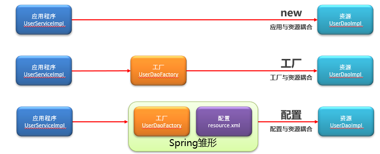

## 1.JavaSE

### 1.try(){ }catch()的用法

主要是针对进行流操作时，经常忘记关闭流，造成[内存](https://so.csdn.net/so/search?q=内存&spm=1001.2101.3001.7020)溢出的问题而进行的优化。

前提:try(变量)变量从类型上需要实现Closeable,否无法使用。

传统写法

```java
public class Main {
    public static void main(String[] args) {
        InputStream inputStream=null;
        try{
            inputStream=new FileInputStream("aa");
            //对流进行操作
        }catch (Exception e){
            e.printStackTrace();
        }finally {//关闭流
            if(inputStream!=null){
                try {
                    inputStream.close();
                }catch (IOException e){
                    e.printStackTrace();
                }
            }

        }
    }
}

```

JDK1.8新写法

```java
public class Main {
    public static void main(String[] args) {
        //括号里可以声明对象，声明的对象必须实现autoCloseable接口，可以声明多个变量。
        //在括号里声明的对象，无需手动关闭，用完后会自动关闭
        try(InputStream inputStream=new FileInputStream("aa");){
            inputStream.read();//try方法块里可以直接使用括号内定义的变量
        }catch (Exception e){

            e.printStackTrace();
        }
    }
}

```


## 2.MySQL

### 1.数据储存的三个地方

硬盘,内存,cpu寄存器

### 2.MySQL的存储过程(MySQL高级)

- 存储过程

  将能够完成特定功能的SQL指令进行封装(SQL指令集),编译之后存储在数据库服务器上,并且为之去一个名字,客户端可以通过名字直接调用这个SQL指令集,获取执行结果

- 存储过程的基本格式语句

  ```mysql
  1、创建存储过程
  create procedure 存储过程名称(in/out/inout 参数名 参数类型(长度))
  begin
       SQL语句;
       /*
       举例
       -- DECLARE声明 用来声明变量的
  		DECLARE de_name VARCHAR(10) DEFAULT '';
  		
  		SET de_name = "jim";
  		
  		-- 测试输出语句（不同的数据库，测试语句都不太一样。
  		SELECT de_name;
       */
  end;
   
   
  说明：
  in：该类型参数作为输入，也就是需要调用时传入值
  out：该类型参数作为输出，也就是该参数可以作为返回值
  inout：既可以作为输入参数，也可以作为输出参数
  参数类型长度：不指定长度时mysql会默认一个长度，如int会默认int(11)，为什么是11，因为int的有符号类型的最大长度就是-2147483648，是11位的。
   
   
  2、查看存储过程
  select * from information_schema.routines where routine_schema = 'xxx'; --查看指定数据库的存储过程及状态信息
   
  show create procedure 存储过程名字 ; --查看某个存储过程的定义sql语句
   
   
  3、删除
   
  drop procedure [if exists] 存储过程名字;
  ```

-  存储过程中的语句必须包含在BEGIN和END之间。

- DECLARE中用来声明变量，变量默认赋值使用的DEFAULT，语句块中改变变量值，使用SET 变量=值

详细内容:

MySQL高级.pdf

[MySQL存储过程](https://blog.csdn.net/weixin_45970271/article/details/124180709)

### 3.DB中的BOLB字段使用

- 一般用于保存一些二进制字段的保密信息
- 原子操作

### 4.隔离级别

- 脏读:允许读取未提交信息

  原因:Read uncommitted

  解决方案:(表级读锁)

- 不可重复读:读取过程中单个数据发生了变化

  解决方案:Repeatable read(行级写锁)

- 幻读:读取过程中数据条目发生了变化

  解决方案:Serializable(表级写锁)

  

## 3.MyBatis

### 1.MyBtis的前身

MyBtis的前身为iBatis,所以在编译器实用mybatis导包过程中我们可以看到有时候到的包名为ibatis.

### 2.MyBatis面试题(关键字ORM)

- 要点
  - mybatis是什么
  - mybatis的功能实现以及技术体系
- 

### 3.注解开发

#### 3.1@Mapper

@Mapper注解，目的就是为了不再写mapper映射文件，是注解开发时用的。

```java
@Mapper
public interface Inter {
    @Insert("insert into sysuser values('e212te','2','jjj','pwd','ljk','男',1)")
    int addUser();
}
```

#### 3.2@Param

1，使用@Param注解

```mysql
当以下面的方式进行写SQL语句时：

  @Select("select column from table where userid = #{userid} ")
   public int selectColumn(int userid);

当你使用了使用@Param注解来声明参数时，如果使用 #{} 或 ${} 的方式都可以。

  @Select("select column from table where userid = ${userid} ")
   public int selectColumn(@Param("userid") int userid);

当你不使用@Param注解来声明参数时，必须使用使用 #{}方式。如果使用 ${} 的方式，会报错。

  @Select("select column from table where userid = ${userid} ")
   public int selectColumn(@Param("userid") int userid);
```

2，不使用@Param注解

不使用@Param注解时，参数只能有一个，并且是Javabean。在SQL语句里可以引用JavaBean的属性，而且只能引用JavaBean的属性。

### 4.MyBatis通配符 (#{ }和${ })

#{}写法：

```mysql
select * from Student where SID = #{id}

打印的日志内容底层显示：
Preparing: select * from Student where SID = ?
Parameters: 1
#{}写法是在SQL上通过？占位占位，将参数和sql分别传递给数据库，相当于JDBC编程PreateStatement
```

${}写法：

```mysql

select * from Student where SID = ${id}
打印日志问题：
Preparing: select * from Student where SID = 1
Parameters:
${}写法直接将参数拼接到sql语句上，相当于jdbc中的Statement操作
```

使用：
${}会有SQL注入的问题，#{}采用预编译机制先对sql编译，无误后传递给数据库
一般推荐使用#{}写法

### 5.mybatis的dao会自动代理生成

Java黑马mybatis6-6代理方式实现dao层

### 6.动态代理

[动态代理的简单介绍](https://blog.csdn.net/qq_46494427/article/details/124173617)

##### 6.1什么是动态代理

- 动态代理能在运行时才能够确定执行对象是谁。代理可以看作是对最终调用目标的一个封装，**我们能够通过操作代理对象来调用目标类，这样就可以实现调用者和目标对象的解耦合**。

##### 6.2动态代理的应用场景

AOP 的实现、RPC 远程调用、Java 注解对象获取、日志框架、全局性异常处理、事务处理等。

##### 6.3动态代理的实现方式

[动态代理的实现](https://m.php.cn/article/487165.html)

- JDK动态代理，利用反射机制生成一个实现代理接口的匿名类，在调用具体方法前调用InvokeHandler来处理；
- CGLIB动态代理，利用asm开源包，对代理对象类的class文件加载进来，通过修改其字节码生成子类来处理。


## 4.Spring

### 1.跨域问题

在对应的需要跨域的contrcontroller层加上@CrossOrigin

### 2.耦合和内聚

- 耦合:代码书写过程中所使用的的技术的结合紧密程度,用于衡量软件各个模块之间的互联程度
- 内聚:代码书写过程中单个模块内部各组成部分间的联系,用于衡量软件中各个功能模块内部的功能联系\
- 代码书写目标:高内聚,低耦合
  - 就是同一模块之前的各个元素之间要高度紧密,但是各个模块之间的相互依存度却不要那么紧密

3.工厂模式发展史和Spring发展历程的关联

- Spring由工厂模式逐渐繁衍而来

  - 工厂模式发展历程

    

    

    

  - spring发展历程

    

### 3.IoC

- 控制反转,Spring反向控制应用程序所使用的外部资源(主动变被动)
- Spring控制的资源全部凡在Spring容器中,该容器成为IoC容器

### 4.Spring框架的简单介绍

简单介绍springframework(简称为spring,core核心),spring的技术包含以及好处(五分钟)

- Spring是分层的JavaSE/EE应用的full-stack轻量级开源框架,以IoC和AOP为内核

  - 核心

  1. IoC:(Inverse of Control，控制反转).

     使用对象时,由主动new产生对象转换为由外部提供对象,此过程中对象创建控制权有程序转到外部,此思想为控制反转

  2. DI:（Dependency Injection）依赖注入.

     应用程序运行依赖的资源由Spring为其提供，资源进入应用程序的方式称为注入(应用程序依赖资源,Spring为其注入资源)

  3. AOP:(Aspect Oriented Programming，面向切面编程).

     在面向对象编程（oop）思想中，我们将事物纵向抽成一个个的对象。而在面向切面编程中，我们将一个个的对象某些类似的方面横向抽成一个切面，对这个切面进行一些如权限控制、事物管理，记录日志等公用操作处理的过程就是面向切面编程的思想。AOP 底层是动态代理，如果是接口采用 JDK 动态代理，如果是类采用CGLIB 方式实现动态代理。

- 优势

  1）方便解耦，简化开发
  Spring 就是一个大工厂，可以将所有对象的创建和依赖关系的维护交给 Spring 管理。
  2）方便集成各种优秀框架
  Spring 不排斥各种优秀的开源框架，其内部提供了对各种优秀框架（如 Struts2、Hibernate、MyBatis 等）的直接支持。
  3）降低 Java EE API 的使用难度
  Spring 对 Java EE 开发中非常难用的一些 API（JDBC、JavaMail、远程调用等）都提供了封装，使这些 API 应用的难度大大降低。
  4）方便程序的测试
  Spring 支持 JUnit4，可以通过注解方便地测试 Spring 程序。
  5）AOP 编程的支持
  通过 Spring的 AOP 功能，方便进行面向切面编程，许多不容易用传统 OOP 实现的功能可以通过 AOP 轻松实现。
  6）声明式事务的支持
  只需要通过配置就可以完成对事务的管理，而无须手动编程。

  

  

  

### 5.补充性内容

#### 5.1p命名空间

- 格式

  ```xml
  <bean p:propertyName="propertyValue" p:propertyName-ref="beanId"/>
  ```

- 注意：使用p命令空间需要先开启spring对p命令空间的的支持，在beans标签中添加对应空间支持\

  ```xml
  <beans xmlns="http://www.springframework.org/schema/beans"    xmlns:xsi="http://www.w3.org/2001/XMLSchema-instance"    xmlns:p="http://www.springframework.org/schema/p"       xsi:schemaLocation="http://www.springframework.org/schema/beans     https://www.springframework.org/schema/beans/spring-beans.xsd">
  ```

- 案例

  ```xml
   <bean
         id="userService"
         class="com.itheima.service.impl.UserServiceImpl"
         p:userDao-ref="userDao"
         p:bookDao-ref="bookDao"
         />
  ```

#### 5.2SpEL(在value配置中使用EL表达式)

```xml
<bean id="userService" class="com.itheima.service.impl.UserServiceImpl">
     <property name="userDao" value="#{userDao}"/>
     <property name="bookDao" value="#{bookDao}"/>
     <property name="num" value="#{666666666}"/>
     <property name="version" value="#{'itcast'}"/>
</bean>
```

#### 5.3Springor容器中的bean定义冲突问题

- 同id的bean,后定义的覆盖先定义的
- 导入配置文件可以理解为将导入的配置文件复制到对应的位置
- 导入配置是文件的顺序与位置不同可能回到值最终须运行结果不同

#### 5.4ApplicationContext功能接口


#### 5.5Spring整合mybatis


#### 5.6 resultType和resultMap

resultmap与resulttype的区别为：对象不同、描述不同、类型适用不同

一、对象不同

1、resultmap：resultMap如果查询出来的列名和pojo的属性名不一致，通过定义一个resultMap对列名和pojo属性名之间作一个映射关系。

2、resultType：resultType使用resultType进行输出映射，只有查询出来的列名和pojo中的属性名一致，该列才可以映射成功。

二、描述不同

1、resultmap：resultMap对于一对一表连接的处理方式通常为在主表的pojo中添加嵌套另一个表的pojo，然后在mapper.xml中采用association节点元素进行对另一个表的连接处理。

2、resulTtype：resultType无法查询结果映射到pojo对象的pojo属性中，根据对结构集查询遍历的需要选择使用resultType还是resultMap。适用于单表查询。

三、类型适用不同

1、resultmap：mybatis中在查询进行select映射的时候，返回类型可以用resultType，也可以用resultMap。

2、resulttype：resultType是直接表示返回类型的,而resultMap则是对外部ResultMap的引用，但是resultType跟resultMap不能同时存在。

```xml
<!--自定义映射关系-->
    <resultMap id="officeMap" type="Office">
<!--主键为id,其他的为result-->
        <id property="officeId" column="office_id"/>
        <result property="address" column="city"/>
        <result property="city" column="city"/>
        <result property="state" column="state"/>
    </resultMap>

<!--声明返回类型结果-->
    <select id="findById" resultMap="officeMap">
        select * from offices where office_id=#{officeId}
    </select>
```

5.7Spring整合Junit

1.Spring接管Junit的运行权，使用Spring专用的Junit类加载器

2.为Junit测试用例设定对应的spring容器：

- 从Spring5.0以后，要求Junit的版本必须是4.12及以上

- Junit仅用于单元测试，不能将Junit的测试类配置成spring的bean，否则该配置将会被打包进入工程中 

导入Spring整合坐标

```xml
<dependency>
    <groupId>junit</groupId>
    <artifactId>junit</artifactId>
    <version>4.12</version>
</dependency>
<dependency>
    <groupId>org.springframework</groupId>
    <artifactId>spring-test</artifactId>
    <version>5.1.9.RELEASE</version>
</dependency>
```

Spring整合Junit测试用例(注解)

```java
@RunWith(SpringJUnit4ClassRunner.class)
//设定加载的spring上下文对应的配置
@ContextConfiguration(classes = SpringConfig.class)
public class AccountServiceTest {
    @Autowired
    private AccountService accountService;
//    public void setAccountService(AccountService accountService) {
//        this.accountService = accountService;
//    }
    @Test
    public void testFindById(){
        Account ac = accountService.findById(3);
//        System.out.println(ac);
        Assert.assertEquals("Jock1",ac.getName());
    }
    @Test
    public void testFindAll(){
        List<Account> list = accountService.findAll();
        Assert.assertEquals(3,list.size());
    }
}
```

#### 5.7Spring提供的事务基本上都是业务层的事务

#### 5.8 Controller的业务方法的参数名要和请求参数的name一致,参数值会自动映射匹配

#### 5.9Spring Context

1. context是什么

   通常被理解为容器,上下文等等。

   例子:

   在计算机系统中，进程执行时有进程上下文，如果进程在执行的过程中遇到了中断，CPU 会从用户态切换为内核态（当然这个过程用户进程是感知不到的，由硬件来实现的），此时进程处于的进程上下文会被切换到中断上下文中，从而可以根据中断号去执行相应的中断程序。

   通过上面这个例子我们可以发现，进程在执行程序（不管是用户程序，还是内核中的中断程序）时，都会依赖一个上下文，这个上下文由多种数据结构组成，可以提供我们运行时需要的一些数据和保存运行时的一些数据。那其实 context 就可以理解对一个程序运行时所需要的一些数据结构的抽象表达.

2. spring context 是什么

   spring的IoC容器也是程序,那他的执行也肯定需要一个上下文.

   那 spring context 既然是 spring 的上下文，按照我们上面的说法上下文会对应数据结构，那 spring context 的数据结构是什么呢？换句话说，spring context 究竟包括什么？

3. spring context包括什么

   主要包括：

   - DefaultListableBeanFactory
     这就是大家常说的 ioc 容器，它里面有很多 map、list。spring 帮我们创建的 singleton 类型的 bean 就存放在其中一个 map 中。我们定义的监听器（ApplicationListener）也被放到一个 Set 集合中。
   - BeanDefinitionRegistry
     把一个 BeanDefinition 放到 beanDefinitionMap。
   - AnnotatedBeanDefinitionReader
     针对 AnnotationConfigApplicationContext 而言。一个 BeanDefinition 读取器。
   - 扩展点集合
     存放 spring 扩展点（主要是 BeanFactoryPostProcessor、BeanPostProcessor）接口的 list 集合。

4. spring context的声明周期

   ```java
    public static void main(String[] args) {
        // 初始化和启动
        AnnotationConfigApplicationContext acaContext = new AnnotationConfigApplicationContext(AppConfig.class);
        // 运行
        acaContext.getBean(ServiceA.class);
        // 关闭/销毁
        acaContext.close();
    }
   ```

   

### 6.IoC底层原理

### 7.AOP底层核心原理

## 5.编程思想

### 1.编程方法论

网易公开课cs106

### 2.设计模式

1. 观察者模式

## 6.推荐项目

### 1.黑马医疗系统

微信支付接口的实现

2.Redis

黑马点评(1-95集,初学者)
