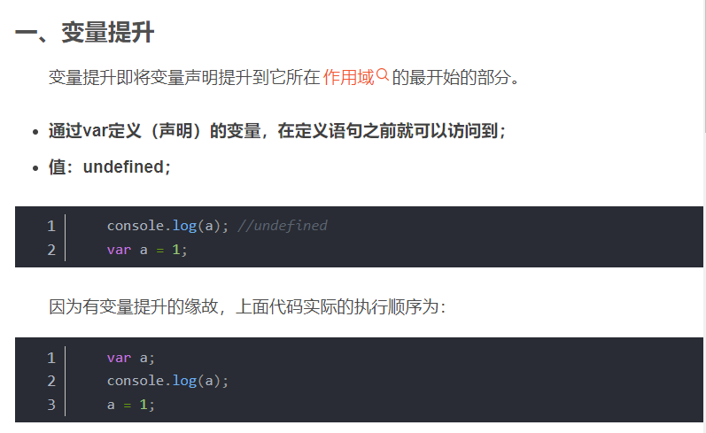
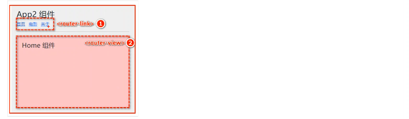
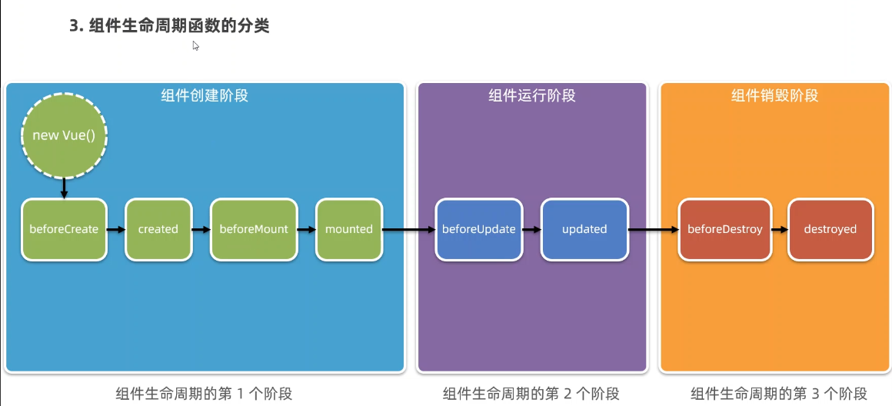

## 1.JavaScript

### 1.  JS调用方法的名称使用

​	1. JS 中的方法的名称就是一个JS对象,调用时可以直接使用名称而不需要添加括号\

​	2. 带括号:只要是调用函数进行执行的，都带括号。返回的结果是返回值或者执行结果。当然，有些没有返回值，但已经执行了函数体内的行为，就是说，加括号的，就代表将会执行函数体代码

​	2. 不带括号:不加括号的，都是把函数名称作为函数的指针，一个函数的名称就是这个函数的指针，此时不是得到函数的结果，因为不会运行函数体代码。它只是传递了函数体所在的地址位置，在需要的时候好找到函数体去执行。

```html
<!DOCTYPE html>
<html lang="en">
<head>
    <meta charset="UTF-8">
    <meta http-equiv="X-UA-Compatible" content="IE=edge">
    <meta name="viewport" content="width=device-width, initial-scale=1.0">
    <title>Document</title>
</head>
<body>
    <button onclick="sayHello">案例一</button>
    <button onclick="sayHello()">案例二</button>
</body>
<script>
    function sayHello(){
        alert('猪年大吉')
    }
    // function sayHello(){
    //     alert("湖南大学")
    // }
    console.log(sayHello());
    //第一个按钮无法识别为一个函数,但是弹窗会自动加载,因为页面根据函数名字找到了相关的函数执行
    //第二个只要点击按钮就会调用
</script>
</html>
```

### 2.前端基于session的函数SessionStorage

1. 特点
   1) 同源策略限制。若想在不同页面之间对同一个sessionStorage进行操作，这些页面必须在同一协议、同一主机名和同一端口下。(IE 8和9存储数据仅基于同一主机名，忽略协议（HTTP和HTTPS）和端口号的要求)

   2) 单标签页限制。sessionStorage操作限制在单个标签页中，在此标签页进行同源页面访问都可以共享sessionStorage数据。

   3) 只在本地存储。seesionStorage的数据不会跟随HTTP请求一起发送到服务器，只会在本地生效，并在关闭标签页后清除数据。(若使用Chrome的恢复标签页功能，seesionStorage的数据也会恢复)。

   4) 存储方式。seesionStorage的存储方式采用key、value的方式。value的值必须为字符串类型(传入非字符串，也会在存储时转换为字符串。true值会转换为"true")。
2. web-project案例:如何在用户主页面显示用户姓名

```javascript
let checkLogin = () => {
    // 获取用户名和密码
    const username = $("#username").val();
    const password = $("#password").val();

    $.post(
        // 参数1：请求路径
        "/user",
        // 提交的数据
        { method: "checkLogin", username, password },
        // 成功的callback
        (data) => {
            if (data === "SUCCESS") {
                // console.log(">>>" + data);
                // 把登录用户的信息存储在sessionStorage
                sessionStorage.setItem("userInSession", username);

                location.href = "/adminlte/site/index.html";
            } else {
                //提示用户名密码错误
                $("#tips").text("用户名或密码错误");
            }
        }
    );
};

let loadUserInSession = () => {
    let name = sessionStorage.getItem("userInSession");
    $("#loginUser").text(name);
};

loadUserInSession();
```

3.语法

```javascript
// 保存数据到 sessionStorage
sessionStorage.setItem('key', 'value');

// 从 sessionStorage 获取数据
let data = sessionStorage.getItem('key');

// 从 sessionStorage 删除保存的数据
sessionStorage.removeItem('key');

// 从 sessionStorage 删除所有保存的数据
sessionStorage.clear();

```

### 3.箭头函数和普通函数

1. 写法不一样

   ```javascript
   //普通函数
   function greeting(){
       console.log("hello  world");
   }
   //箭头函数
   let greetin_1 = () =>{
       console.log("hello world");
   }
   ```

2. 普通函数存在变量提升的现象

   变量提升

   

   ```javascript
   //普通函数
   greeting();
   function greeting(){
       console.log("hello  world");
   }
   //箭头函数
   //greeting_1();控制台会声明错误greeting_1不是一个函数
   let greetin_1 = () =>{
       console.log("hello world");
   }
   ```

3. 箭头函数不能作为构造函数使用

   ```javascript
   //普通函数
   function CreateRobot(name,color){
       this.name=name;
       this.color=color;
   }
   let robot=new CreateRobot("kite","pink");
   cosole.log("====>",robot.name);//kite
   //箭头函数
   let Createobj = (age) => {
       this.age=age;
   }
   let obj=new Createobf(18);
   cosole.log("====>",obj.age);//undefined
   ```

4. 两者的this的指向不同

   普通函数的this指向的是谁调用该函数就指向谁

   箭头函数的this指向是你在书写代码的是时候上下文环境的this,如果没有上下文环境对象(总是指向其最近的外层**函数作用域**的 this 所指对象可以理解为父类),那么就指向最外层对象window

   ```javascript
   const obj = {
       func1() {
           setTimeout(function() {
               console.log(this);
           })
       },
       func2() {
           setTimeout(() => {
               console.log(this);
           })
       }
   }
   obj.func1(); // 打印出 Window
   obj.func2(); // 打印出 当前对象obj
   
   ```

   

5. 

## 2.  Vue

### 1.前端项目部署到server相对路径无法生效时则使用绝对路径

### 2.Vue中可以将js函数绑定作为参数传递给子组件

```vue
<!--CategoryList.vue  -->
<button class="btn btn-sm btn-primary" @click="editCategory">click</button>
<Category 
        v-for="category in categoryList" 
        :category="category"
        :editCategory="editCategory"
        :key="category.cid" 
        />
<!--Category.vue  -->
export default {
    name:'Category',
    //父组件向子组件传值,直接挂在vc根路径下的
    //editCategory函数是一个特殊的对象也是可以传递的
    props:["category","editCategory"],
}
```

### 3.注册一个Vue实例

vue实例里的方法的this,其实指代的就是vue实例这个对象

### 4.axios跨域问题

[axios配置](http://www.qb5200.com/article/476127.html)

### 5.胡子语法&羊肉串语法

胡子语法:{{}},插值语法

羊肉串语法:my-table-primary,中间使用-连接

### 6.路由

#### 1.路由:对应关系

#### 2.<router-link>和<router-view>的渲染关系




### 7.生命周期

#### 1.组件生命周期函数的分类



运行·阶段:组件和用户的交互

#### 2.组件生命周期函数

##### 1.beforeCreated

不常用.(this方法无效);

##### 2.created

 经常使用

模板结构尚未生成,使用dom操作无法获取到相关元素(<template>标签未生效)

可以使用this.methods里面的方法进行拿数据，并且把请求到的数据转存到data,供template模板渲染的时候使用

##### 3.beforeMount

不常用

将要把内存中编译好的HTML结构悬案到浏览器中.此时浏览器中还没有当前组建的DOM结构.

##### 4.mounted

*如果要操作当前组件的 DOM，最早，只能在 mounted 阶段执行*

已经把内存中的HTML结构成功渲染到了浏览器之中.此时浏览器中已然包含了当前组件的DOM结构.

##### 5.beforeUpdate

不常用

数据时最新的,但是其中的DOM元素不是最新的

##### 6.update

数据和DOM元素都是最新的


## 3.虚拟数据网站

### 1.Json数据网站

jsonplaceholder.typicode.com
