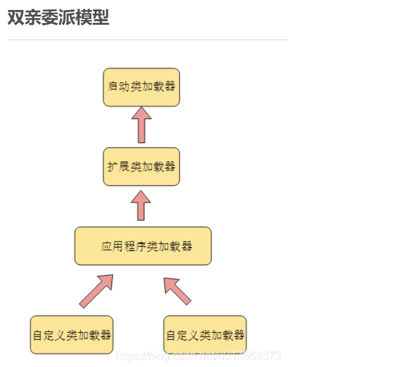

## 重点:集合,多线程,背的出,能理解

## 第一章:Java基础

### 1.1 面向对象的三个基本特征

- 面向对象的三个基本特征是:封装,继承,多态.

- 继承

  让某个类型的对象获得另一个类型的对象的属性和方法.

  继承就是子类继承父类的特征和行为,使得子类对象(实例)具有父类的实例域和方法,或子类从父类继承方法,是的子类继承父类相同的行为.、

  子类可以通过super获取父类私有的属性和方法.

- 封装

  把数据和操作数据的方法打包到一个单元或对象中.

  隐藏部分对象的属性和实现细节,对数据的访问只能通过公开的接口。通过这种方式,对象对内部数据提供了不同级别的保护,以防止程序中无关的部分意外地改变和错误的使用了对象的私有部分.

- 多态

  对于同一个行为,不同的子类对象具有不同的表现形式.多态存在的三个条件: 1)继承；2)重写; 3)父类引用指向子类对象.

  同一个事件发生在不同对象上会产生不同的结果.
  
  

### 1.2 修饰符


### 1.3类型转换问题

#### 1.3.1 精度丢失

```java
//代码块1
short s1=1;s1=s1+1;
//代码块2
short s2=1;s2+=1;
```

结果: 

代码块1编译报错,错误的原因是:不兼容的类型,从int转换到short可能会有损失.

代码块2正常运行.


#### 1.3.3 类型区间越界

```java
public static void main(String args[]){
    Integer a=128,b=128,c=127,d=127;
    System.out.println(a==b);
    System.out.println(c==d);
}

//结果为 false true


```

执行interger a=128，相当于执行:Interger a= Integer.valueOf(128)，基本类型自动转换为包装类型的过程成为自动装箱(autoboxing).

在Integer中引入了IntegerIntegerCache来缓存一定范围的值,IntegerCache默认情况下范围为-128-127。


### 1.4 位运算符

高效计算2*8

答:2<<3.（左移相当于乘以2的几次幂n<<m相当于n乘以2的m次幂）

解释:通常情况下,可以认为位运算是性能最高的.


### 1.5 &&和&

- &&:逻辑运算符.当运算符两边同时为true才返回true.同时具有短路性,如果第一个表达式为false，则直接返回false。

- **生活例子**:**串联**

- &:逻辑与运算符,按位与运算符

- 例:**用于二进制的计算**,只有对应的两个二进位均为1结果才为1,否则为0

- 区别:

  &在用于逻辑与时只有对应的两个二进位均为1时,结果才为1,否则都为0.

  &&:&和&&区别在于,&不具有短路性.


### 1.6 基本数据类型(四类八种)

- 四类八种：整数类（byte、short、int、long）、浮点类（float、double）、字符类（char）、布尔型（boolean）；

  除此之外即为引用类数据类型。

  


### 1.7 String,StringBuffer和StringBuilder的区别

#### 1.7.1 简介

String:字符串类,适用于少量的字符串操作

StringBuilder:字符串缓冲类,适用于单线程下在字符缓冲流进行大量操作,使用synchronized保证线程安全

StringBuffer:字符串缓冲类,适用于多线程下在字符串缓冲流进行大量操作,没有使用synchronized,具有更高的性能,推荐优先使用

#### 1.7.2 区别

1. String是final类不能被继承且为字符串常量，当进行字符串操作时地址即发生改变

   而StringBuilder和StringBuffer均为字符串变量.当使用append()操作时,内存地址不发生变化

2. 在String类中使用 "+" 作为数据的连接操作,而在StringBuffer类中使用append()方法.

3. String类和StringBuilder、StringBuffer类的转换。

   - String类通过apend()方法转换成StringBuilder和StringBuffer类。
   - StringBuffer类和StringBuilder类通过to.String()方法转换成String类型


### 1.8 String s =new String("xyz")创建了几个字符串对象？

一个或者两个。如果字符串常量池已经有“xyz”,则是一个,否则两个


### 1.9 ==和equals的区别

- ==  :运算符,用于比较基础类型和引用类型变量

  - 对于基础类型的变量,比较的变量保存的值是否相同,类型不一定要相同
  - 对于引用类型变量,比较的是两个的地址是否相同

  ```java
  short s1=1;long s2=1;
  sout(s1==s2);//结果为true,类型不同,但是值相同
  ```

  

- equals :Object类中定义的方法,通常用于比较两个对象的值是否相等

  ```java
  Integer i1=new Integer(1);
  Integer i2=new Integer(1);
  System.out.println(i1.equals(i2));
  //结果:true 两个不同的对象,但是具有相同的值
  ```

  


### 1.10 hashCode()和equals()

- hashCode():哈希码并不是完全唯一的，它是一种[算法](https://links.jianshu.com/go?to=http%3A%2F%2Flib.csdn.net%2Fbase%2Fdatastructure)，让**同一个类的对象**按照自己不同的特征尽量的有不同的哈希码，但不表示不同的对象哈希码完全不同。也有相同的情况，看程序员如何写哈希码的算法。

- equals是Object类提供的方法之一。每一个Java类都集成自Object类，所以每一个对象都具有equals这个方法。Object类中定义的equals(Object)方法的情况下，equals(Object)与“==”运算符一样，比较的是引用.

  equals(Object)方法的特殊之处就在于它可以被覆盖，所以可以通过覆盖的方法让它不是比较引用而是比较数据内容，例如String类的equals方法是用于比较两个独立对象的内容是否相同，即堆中的内容是否相同。

  ```java
      String s1 = new String("Hello");
      String s2 = new String("Hello");
  
  /*两条new语句创建了两个对象，然后用s1、s2这两个变量分别指向一个对象，这是两个不同的对象，它们的首地址是不同的，即s1和s2中存储的数值是不相同的，所以，表达式s1==s2将返回false，而这两个对象中的内容是相同的，所以，表达式s1.equals(s2)将返回true。*/
  
  
  ```

- 1.equal()相等的两个对象他们的hashCode()肯定相等，也就是用equal()对比是绝对可靠的。
   2.hashCode()相等的两个对象他们的equal()不一定相等，也就是hashCode()不是绝对可靠的。

- 结论

   两个对象的hasCode()相同,则equals()也不一定为true。


### 1.11 反射

- 反射

  反射是指在运行状态中，对于任意一个类都能知道这个所有的属性和方法,并且对任意一个对象,都能调用他的任意一个方法;这种动态获取信息以及动态调用对象方法的功能成为反射机制.

  反射涉及到四个核心类

  - java.lang.**Class.java**：类对象；
  - java.lang.reflect.**Constructor.java**：类的构造器对象；
  - java.lang.reflect.**Method.java**：类的方法对象；
  - java.lang.reflect.**Field.java**：类的属性对象；

- 作用

  - 操作因访问权限限制的属性和方法;
  - 实现自定义注解;
  - 动态加载第三方jar包;
  - 按需加载类,节省编译和初始化APK时间.

- 工作原理

  当我们编写完一个Java项目之后，每个java文件都会被编译成一个.class文件，这些Class对象承载了这个类的所有信息，包括父类、接口、构造函数、方法、属性等，这些class文件在程序运行时会被ClassLoader加载到虚拟机中。当一个类被加载以后，Java虚拟机就会在内存中自动产生一个Class对象。我们通过new的形式创建对象实际上就是通过这些Class来创建，只是这个过程对于我们是不透明的而已。
  
  反射的工作原理就是借助Class.java、Constructor.java、Method.java、Field.java这四个类在程序运行时动态访问和修改任何类的行为和状态。

### 1.12 深拷贝和浅拷贝区别

- 数据分为基本数据类型和引用数据类型.

  - 基本数据类型:数据直接存储在栈中.

  - 引用数据类型:存储在栈中的是对象的引用地址,真实的对象数据存放在堆内存里

- 浅拷贝:

  对于基础数据类型:直接复制数据值;

  对于引用类型数据:只是复制了对象的引用地址,新旧对象指向同一个内存地址,修改其中一个对象的值,另一个值随之改变.

- 深拷贝:

  对于基础类型数据:直接复制数据值

  对于引用类型数据:开辟新的空间,在新的内存空间里赋值一个一模一样的对象,新老对象不共享内存,修改其中一个对象的值,不会影响另一个对象

- 深拷贝相比于浅拷贝速度较慢并且花销较大

- 举个例子:好比如两兄弟大家买衣服可以一人一套,然后房子大家住在一套房子里(浅拷贝),当两人成家立业了,房子分开了一人一套互不影响(深拷贝).


### 1.13 并行和并发的区别

- 并发:两个或者多个事件在同一时间间隔发生(在同一时刻,有多个指令在多个cpu上交替执行)
- 并行:两个或者多个事件在同一时刻发生(在同一时刻,有多个指令在**多个cpu上同时**运行)
- 区别
  - 并行是真正意义上,同一时刻做很多件事情,而并发在同一时刻会做一件事件,只是可以将时间切碎,交替做多件事情
  - **并行在多处理器系统中存在,而并发可以在单处理器和多处理器系统都存在;**并且能够在单处理器系统中存在是因为并发是并行的假象,并行要求程序能够同时执行多个操作,而并发只是要求程序假装同时执行多个操作(每个小时间片执行一个操作,多个操作快速切换执行).
  - 当系统有一个以上的CPU时,则线程的操作有可能非并发.当一个CPU执行一个线程时,另一个CPU可以执行另一个线程,两个线程互不抢占CPU资源,可以同时进行，这种方式我们称之为并行
  - 并发编程的目标是充分的利用处理器的每一个核,以达到最高的处理性能


### 1.14 对象作为参数传递时,此方法改变属性后返回的结果是值传递还是引用传递？

值传递.Java中只有值传递,对于对象参数,值的内容是对象的引用.


### 1.15 重载(overload)和重写(override)的区别

- 方法的重载和重写都是实现多态的方式,区别在于前者是编译时的多态性,而后者实现的运行时的多态性.
- 重载:一个类中有多个同名的方法,但是具有不同的参数列表(参数类型不同,参数个数不同,或者二者都不同和访问修饰符和返回值类型可以相同可以不同).比如同一个类中重写的构造函数初始化不同的参数.
- 重写:发生在子类与父类之间,子类对父类的方法进行重写,方法名,参数都不能改变,返回值类型可以不相同,但是必须是父类返回值的派生类.即外壳不变,核心重写.重写的好处在于子类可以根据需要,定义自己的特定行为.


### 1.16 构造器是否可被重写

Constructor不能被override(重写),但是可以overload(重载),所以你可以看到一个类中有许多个构造函数.


### 1.17 为什么不能根据返回类型来区分重载

```java
float max(int t,int b);
int max(int t,int b);
```

- 调用方法时,可以指返回定类型或者可以不指定
- 方法的返回值只是作为方法运行后的一个状态，它是保持方法的调用者和被调用者进行通信的一个纽带，但并不能作为某个方法的‘标识’


### 1.18 Java静态成员和成员变量的区别

- 储存的位置:

  成员变量存在于堆内存中.静态成员存在于方法区中.

- 生命周期

  成员变量与对象共存亡,随着对象的创建而存在,随着对象的被回收而释放.

  静态变量与类共存亡,随着类的加载而存在,随着类的消失而消失.

- 所属:

  成员变量所属于对象,所以也称为实例变量.

  静态变量所属于类,所以也成为了类变量.

- 作用域

  成员变量法只能被对象调用.静态变量可以被对象调用,也可以被类名调用.


### 1.19 静态方法内部是否可以直接调用非静态方法

区分两种情况,发出调用时是否创建了对象实例

#### 1.19.1 没有创建对象实例

- 不可以发起调用,非静态方法只能被对象调用,静态方法可以通过对象调用,也可以通过了类名调用,所以静态方法被调用时,可能还没有创建任何实例.因此通过静态内部发出非静态方法的调用,此时可能无法知道静态方法属于那个对象.

  ```java
  public class demo{
      public static void staticmethod{
          //直接调用非静态方法,编译报错
          instancemethod();
      }
      
      pbulic void intancementhod(){
          System.out.println("非静态方法");
      }
  }
  ```

#### 1.19.2 显示创建对象实例

- 可以发起调用,在静态方法中显示到的创建对象实例,则可以正常的调用.

  ```java
  public class demo{
      public static void staticmethod{
          demo demo1=new demo();
          demo1.instancemethod();
      }
      
      pbulic void intancementhod(){
          System.out.println("非静态方法");
      }
  }
  ```


### 1.20 初始化考察(父类&子类)

```java
public class InitiaTest{
    pbulic static void main(String[] args){
        A ab=new B();
        ab=new B();
    }
}

class A{
    static{//父类静态代码块
        System.out.println("A");
    }
    public A(){//父类构造器
        System.out.println("a");
    }
}

class B extends A{
    static{//子类静态代码块
        System.out.println("B");
    }
    public B(){//子类构造器
        System.out.println("b");
    }
}
```

执行结果:ABabab

考察点:

1. 静态变量只会初始化一次
2. 当有父类时,完成的初始化顺序为:父类静态变量(静态代码块)->子类静态变量(静态代码块)->父类非静态变量(非静态代码块)->父类构造器->子类非静态变量(非静态代码块)->子类构造器


### 1.21 抽象类(abstract class)和接口(interface)有什么区别

#### 1.21.1 设计思想的区别

- 接口是自上而下的抽象过程,接口规范了某些行为,是对某一行为的抽象.我需要这个行为,我就去实现某个接口,但是具体这个行为怎么实现,完全由自己决定.

  接口就像是一个类，但是里面一般只定义方法，而且这个方法没有任何实现细节。换句话说，接口只定义它应该做什么。

- 抽象类是自下而上的抽象过程,抽象类提供了通用实现,是对某一类事物的抽象.我们在写实现类的时候,发现某些实现类具有几乎相同的实现,因此我们讲这些相同的实现抽出来成为实现类,然后如果有一些差一点,则可以提供抽象方法支持自定义实现.

  抽象类，是在我们不想或不能实例化这个类的实例的时候封装的。

- 形象的比喻

  - 普通类像父亲,他有啥都是你的.
  - 抽象类像叔伯,有一部分会给你,还能指导你做事的方法
  - 接口像干爹,可以给你指引方法,但是做成啥样得你自己努力实现

#### 1.21.2 定义以及使用区别

- 抽象类只能单继承,接口可以多实现

- 抽象类可以有构造方法,接口中不能有构造方法

- 抽象类中可以有成员变量,接口中没有成员变量,只能有常量(默认就是 public static final)

- 抽象类中可以包含非抽象方法,在java 7之前接口的所有方法都是抽象的,在Java 8之后,接口支持非抽象方法:defalut方法,静态方法等.Java 9支持私有方法,私有静态方法

- 抽象案例

  ```java
  //动物
  public abstract class Animal {
      public void drink(){
          System.out.println("喝水");
      }
  
      public Animal(){
  
      }
  
      public abstract void eat();
  }
  //猫
  public class Cat extends Animal {
      @Override
      public void eat() {
          System.out.println("猫吃鱼");
      }
  }
  //狗
  public class Dog extends Animal {
      @Override
      public void eat() {
          System.out.println("狗吃肉");
      }
  }
  //测试
  public static void main(String[] args) {
          Dog d = new Dog();
          d.eat();
          d.drink();
  
          Cat c = new Cat();
          c.drink();
          c.eat();
  		//错误用法,使用abstract修饰的类不能new对象
          //Animal a = new Animal();
          //a.eat();
      }
  ```

- 接口案例

  ```JAVA
  public interface Inter {
      public static final int num=10;
  
      public abstract void show();
  }
  
  public class InterImpl implements Inter{
  
      public void method(){
          //num=20;无法修改
          System.out.println(num);
      }
  
      @Override
      public void show() {
  
      }
  }
  
  public class TestInterface {
      /*
          成员变量: 只能是常量 系统会默认加入三个关键字
                      public static final
          构造方法: 没有
          成员方法: 只能是抽象方法, 系统会默认加入两个关键字
                      public abstract
       */
      public static void main(String[] args) {
          System.out.println(Inter.num);
      }
  }
  ```


### 1.22 Java中的关键字final有哪些用法

- 修饰类:该类不能派生出新的子类,不能作为父类被继承.因此一个类不能同时被声明为abstract和final.

- 修饰方法:该方法不能被子类重写

- 修饰变量:该变量必须在声明时给定初值,而在以后只能读取,不可修改.如果变量是对象,则指的是引用不可修改,诞生地对象的属性还是可以修改的

  ```java
  public class FinalDemo {
  //不可再修改该变量的值
  public static final int FINAL_ VARIABLE = 0;
  //不可再修改该变量的引用，但是可以直接修改属性值
  public static final User USER = new User() ;
  public static void main(String[] args) {
  //输出: User(id=0， name=null, age=0)
  System. out. println(USER) ;
  //直接修改属性值
  USER. setName ("test");
  //输出: User(id=0，name=test, age=0)
  System. out . println(USER) ;
  }
  
  ```


### 1.23 阐述final,finally,finalize的区别

- final:

  修饰类:该类不能派生出新的子类,不能作为父类被继承.因此一个类不能同时被声明为abstract和final.

  修饰方法:该方法不能被子类重写

  修饰变量:该变量必须在声明时给定初值,而在以后只能读取,不可修改.如果变量是对象,则值得使用用不可修改,诞生地对象的属性还是可以修改的

- finally:finally是对java异常处理机制的最佳补充,通常配合try,catch使用,用于存放那些无论是否出现异常都一定会执行的代码.在实际使用中通常用于释放锁,数据库连接等资源,把资源释放方法放到finally中,可以大大降低程序出错概率.

- finalize:Object中的方法,在垃圾收集器将对象从内存中清除出去之前做必要的清理工作.


### 1.24  try,catch,finally考察

```java
public class TryDemo {
	public static void main(String[] args) {
		System. out . println(test();
	}
	public static int test() {
	try {
		return 1;
		} catch (Exception e) {
		return 2;
		} finally {
			System. out. print("3");
		}
	}
}

```

执行结果：31

return前会先执行finally语句块,所以是先输出3,再输出1.


```java
public class TryDemo {
public static void main(String[] args) {
	System. out . println(test1());
	}
public static int test1() {
	try {
		return 2;
		} finally {
		return 3;
		}
	}
}

```

执行结果:3

执行finally时直接return，静态代码块结束,则try不执行


```java
public class TryDemo {
public static void main(String[] args) {
	System. out . println(test1());
}
public static int test1() {
int i=0;
try {
	i =2;
	return i;
} finally {
	i =3;
	}
}

```

执行结果:2

这边的根本原因是，在执行finally之前，JVM会先将i的结果暂存起来，然后finally执行完毕后，会返回之前暂存的结果，而不是返回i，所以即使这边i已经被修改为3，最终返回的还是之前暂存起
来的结果2。


### 1.25 Error和Exception的区别

- Error和Exception都是Throwable的子类,用于表示程序出现了不正常的情况。
- 区别
  - Error表示系统级的错误以及程序无需处理的异常,是恢复不是不可能但很困难的情况下的一种问题,比如内存溢出.程序无法处理这种情况
  - Exception表示需要捕捉或者需要程序进行处理的异常,是一种设计或实现问题,也就是说,他表示如果程序运行正常,从不会发生的情况.


### 1.26 JDK1.8新特性

- 接口默认方法:在JDK8之前，接口不能定义任何实现，这意味着之前所有的JAVA版本中，接口制定的方法是抽象的，不包含方法体。**从JKD8开始，添加了一种新功能-默认方法。默认方法允许接口方法定义默认实现，而所有子类都将拥有该方法及实现。**

  ```java
  public inter face IMathOperation {
  /**
  *定义接口默认方法支持方法形参*/
  default void print(){
  System. out. printIn("这是数值运算基本接口。。。");
  /**
  *定义静态默认方法*/
  static void version(){
  System. out . println("这是1.0版简易计算器");
  }
  
  public class MathOperationImpl implements IMathoperation {
  @Override
  public int add(int a, int b) {
  	//子类中可以直接调用父类接口默认方法
  	IMathOperation. super .print() ;
  	//调用父类静态默认方法
  	IMathOperation. version() ;
  	return a+b;
  	}
  }
  
  ```

- Lambda表达式和函数接口:Lambda表达式本质上是一段匿名内部类,也就是一段可以传递的代码.Lambda允许把函数作为一个方法的参数(函数作为参数传递到方法中).

  - 匿名内部类

    ```java
    public void test1(){
    Comparator<Integer> com = new Comparator<Integer>() {
    @0verride
    public int compare(Integer 01，Integer o2) {
    	return Integer . compare(01, 02) ;
    	}
    };
    	TreeSet<Integer> treeSet = new TreeSet<> (com) ;
    }
    
    ```

  - Lambda表达式

    ```java
    Comparator<Integer> com=(x,y) ->Integer.compare(x,y);
    ```

- 函数式接口

  Lamnda表达式需要函数式接口的支持,所以我们有必要来说说什么是函数式接口.只包含一个抽象方法的接口就是函数式接口.

  ```java
  package lambda;
  
  import java.util.Arrays;
  import java.util.Collections;
  import java.util.List;
  
  public class Main {
      public static void main(String[] args) {
          List<Employee> list = Arrays.asList(
                  new Employee("张三", "上海", 5000, 22),
                  new Employee("李四", "北京", 4000, 23),
                  new Employee("c五", "日本", 6000, 50),
                  new Employee("b七", "香港", 7000, 50),
                  new Employee("赵六", "纽约", 1000, 8)
          );
  
  
          /**
           *需求1：lambda表达式的使用:
           * 调用COllections.sort方法，通过定制排序比较两个Employee（先按年龄比较，年龄相同按姓名比），使用
           * Lambda作为参数传递。
           */
          Collections.sort(list,(x, y)->{
              if(x.getAge()!=y.getAge())
                  return Integer.compare(x.getAge(),y.getAge());
              else
                  return x.getName().compareTo(y.getName());
  
          });
  
          for (Employee employee : list) {
              System.out.println(employee);
          }
      }
  }
  
  ```

  详细lambda解释:

  https://blog.csdn.net/qq_43842093/article/details/120443845

- Stream API:用函数编程方式在集合类上进行复杂操作的工具,配合lambda表达式可以方便对集合进行处理.Java 8处理集合关键抽象概念,他可以指定你希望对集合进行的操作,可以执行非常复杂的查找,过滤和映射操作.

  ```java
  public class Main {
      public static void main(String[] args) {
          List<Teacher> teacherList = new ArrayList<>() ;
          teacherList. add (new Teacher("张磊" ,22,"zl"));
          teacherList. add (new Teacher("李鹏",36,"lp"));
          teacherList. add (new Teacher("刘敏",50,"Lm"));
          teacherList . add(new Teacher ("宋亚楠",62 ,"syn"));
          teacherList. add (new Teacher("彩彬" ,18,"cb"));
  
          //filter过滤
          List<Teacher> list = teacherList.stream().filter(x -> x.getAge() > 30).collect(Collectors.toList());
          //joining拼接 所有老师姓名拼接成字符串
          String nameJoin = teacherList.stream().map(Teacher::getName).collect(Collectors.joining(","));
  
          //排序
          List<Teacher> teachers = teacherList.stream().sorted(Comparator.comparing(Teacher::getAge).reversed()).collect(Collectors.toList());
  
          System.out.println(nameJoin);
          System.out.println(list);
          System.out.println("按年龄排序"+teachers);
      }
  }
  //输出结果
  张磊,李鹏,刘敏,宋亚楠,彩彬
  [Teacher{name='李鹏', age=36, Initials='lp'}, Teacher{name='刘敏', age=50, Initials='Lm'}, Teacher{name='宋亚楠', age=62, Initials='syn'}]
  按年龄排序[Teacher{name='宋亚楠', age=62, Initials='syn'}, Teacher{name='刘敏', age=50, Initials='Lm'}, Teacher{name='李鹏', age=36, Initials='lp'}, Teacher{name='张磊', age=22, Initials='zl'}, Teacher{name='彩彬', age=18, Initials='cb'}]
  
  ```

- 方法引用:方法引用提供了非常有用的语法,可直接引用有的Java类和对象(实例)的方法或构造器.与lambda联合使用,方法引用可以使语言的狗仔更加紧凑简介,减少冗余代码.

  方法引用就是使用操作符 "::" 将方法名和对象或类

  如下三种使用情况:

  - 对象::实例方法
  - 类::静态方法
  - 类::实例方法

- 日期时间API

- Optional类:著名的NullPointerException拾音器系统失败最常见的原因.

- 新工具:新的编译工具,如Nashorn引擎jjs,类依赖分析器jdeps


### 1.27 Java的多态表现在哪里

多态要有动态绑定,否则就不是多态,方法重载也不是多态(因为方法重载是编译器决定好的,没有后期也就是运行期的动态绑定)

```java
1、父类引用引用子类对象

2、通过父类引用调用父类和子类的同名覆盖方法

class X{
    public void eat(){
        System.out.print("父类吃");
    }
}
class Y extends X {
    public void eat(){
        System.out.print("子类吃");
    }
}
public class dd {

    public static void main(String[] args) {
        X x=new Y();
        x.eat();
    }
}
结果:子类吃
```

满足这三个条件:

1. 继承.
2. 有重写.
3. 要有子类引用指向父类.

### 1.28 接口的作用

- 重要性:abstract class和interface是支持抽象类定义的两种机制,赋予了java强大的面向对象能力
- 简单,规范性:如果一个项目比较庞大,定义的主要的接口可以告诉开发人员需要实现的业务,也将命名规范限制住了.
- 维护,拓展性:将所需要的功能放在接口中,然后定义类来实现这个接口,当需求不满足时,只需要更换引用的类,无需考虑修改或舍弃原实现接口的类.
- 安全,严密性:接口是实现如那件松耦合的重要手段,他描述了对外的所有服务,而不涉及任何具体的实现细节.

### 1.29 http,https协议

### 1.30 tcp/ip协议簇

### 1.31 tcp,udp区别

### 1.32 用过哪些加密算法:对称加密,非对称加密

- 对称加密是最快速,最简单的一种加密方式,加密(encryption)与解密(decryption)用的是同样的密钥(secret key).对称加密有很多种算法:因效率高而被广泛使用.常见的对称加密算法DES算法,3DES算法,TDEA算法,Blowfish算法,RC5算法.IDEA算法
- 特点
  - 密钥越大,加密越强,一般小于256bit，但是加密与解密的过程就越慢。
  - 密钥的大小既要照顾到安全性,也要照顾到效率,是一个trade-off.
- 非对称加密为数据的加密与解密提供了一个非常安全的算法,他使用了一对密钥,公钥(public key)和私钥(private key),私钥只能有一方安全保管,不能外泄,而公钥可以发给任何请求他的人.非福成加密使用这对密钥其中一个进行加密,解密则需要另外一个密钥.
  - 比如:你向银行请求公钥,银行将公钥发给你,你使用公钥对消息加密,name只有私钥的持有人--银行才能对你的消息解密.与对称加密不同的是,银行不需要通过网络将私钥发送出去,因此安全性大大提高
- 目前最常用的非对称加密算法是:RSA算法Elgamal,背包算法,Rabin,HD,ECC(椭圆曲线加密算法)


## 第二章:JVM

## 第三章:集合

### 3.1 ArrayList的介绍以及作用

Arrylist是数组列表，用来存储数据的，当我们存储的是基本数据类型时我们存储的是他们的包装类,它的底层实现是Object[] elementData. 

与ArrayList相似的有LinkList,他们两相比:

- ArrayList:查找和访问元素的速度较快,新增,删除的速度较慢.线程不安全,使用频率高
- LinkList:查找和访问元素的速度慢,新增,删除的速度快.

### 3.2 ArrayList线程不安全,为什么还要去用？

实际开发有以下几种场景:

- 频繁增删:使用LinkedList,但是涉及到频繁的增删的场景不多;
- 追求线程安全:使用Vector
- 普通的用来查询:使用ArrayList,只能在相互之间做取舍.

根据数据结构特性,三者难以全包含,只能在相互之间作取舍

### 3.3  ArrayList底层是数组,那是怎么实现不断扩容的

- 使用无参构造创建ArrayList
  - 使用ArrayList空参的构造器创建集合时,数组并没有被创建.当集合中添加第一个元素时,数组被创建,初始化容量为10
- 使用有参构造创建ArrayList
  - 有参构造创建时,如果制定了容量的大小,则会创建除指定容量大小的数组.如果指定容量为0,则和无参构造一样.

### 3.4 ArrayList(int inittialCapacity)会不会初始化数组大小

会初始化数组大小,但通过ArrayList的size方法的进行判定结果个依旧为0时,只有再添加元素时,数组才会进行size++


### 3.5  ArrayList底层是用数组实现的,但数组的长度是有限的,如何实现扩容?

当新增元素时,ArrayList放不下该元素的时候,触发扩容，分为两部分

- 第一,会确定新容量,源码中扩容的容量会是将会是原容量的1/2.(使用后右移一位的运算符).
- 第二,执行扩容,使用系统类System的数组复制方法arraycopy()进行扩容.

### 3.6  ArrayList1.7和1.7级以后的区别

1.7之前ArrayList在初始化的时候直接调用的this(10),初始化容量为10的数组.在1.7及以后,只有第一次执行add方法像集合中添加元素的时候才会创建容量为10的数组.

### 3.7 为什么ArrayList增删比较慢,增删是如何做的?

增删分为两种情况

- 未指定index位置

  直接添加到最后,但是如果容量不够则需要扩容.

- 指定index位置 

  - 插入位置之后的所有数据都要往后挪位置,为新数据腾出空间后方可添加成功,并且腾位置的时候后面的数据是一个个往后移.
  - 删除同理,删除后,后面的数据自动向前移位,耗费的时间随着挪动的数据增多耗时更多.

### 3.8 ArrayList插入数据和删除数据一定慢么？

不一定,取决于插入或者删除的数据离数组末端有多远,如果离末端比较近,则性能不一定差

## 整理版

## 一.Java基础

### 1.final关键字的作用

- 被final修饰的类不可以被继承,被final修饰的方法不可以被重写,被final修饰的变量不可以被改变

- 如果修饰引用,那么表示引用不可变,引用指向的内容可变.

  ```java
  package finaltest;
  
  public class finaltest1 {
      public static final String a="abc";
      public static final int[] arr = {1,2,3};
      public static void main(String[] args) {
          //a="inj";错误写法
          a[0]=3;//正确写法,因为arr的指向不变
      }
  }
  
  ```

- 被final修饰的方法,JVM会尝试将其内联,以提高运行效率

- 被final修饰的常量,在编译阶段会存入常量池中


### 2.abstract class和interface有什么区别

1.本质上来看

- 抽象类是对类本质的抽象，表达的是 is a 的关系，比如：`BMW` is a `Car`。抽象类包含并实现子类的通用特性，将子类存在差异化的特性进行抽象，交由子类去实现。
- 而接口是对行为的抽象，表达的是 like a 的关系。比如：`Bote-Royce` like a `Aircraft`（像飞行器一样可以飞），但其本质上 is a `Car`。接口的核心是定义行为，即实现类可以做什么，至于实现类主体是谁、是如何实现的，接口并不关心。

2.具体的使用细节

- abstract class
  - 声明方法的存在而不去实现它的类被叫做抽象类(abstract class),它用于要创建一个体现某些基本行为的类,并为该类声明方法,但是不能在该类中实现该类的的情况.
  - 不能创建abstract 类的实例.然而可以创建一个变量,其类型是一个抽象类,并让它指向具体子类的一个实例.
  - 不能有抽象构造函数或抽象静态方法，Abstract类的子类为他们父类中的所有抽象方法提供实现,否则他们也是抽象类.取而代之,在子类中实现该方法.知道其行为的其他类可以再类中实现这些方法.
- 接口是抽象类的变体.
  - 在接口中,所有方法都是抽象的.多级成型可通过实现这样的接口而获得.接口中的所有方法都是抽象的,没有一个程序实体.
  - 接口中所有的方法都是抽象的,没有一个程序实体.接口只可以定义statix final成员变量
  - 接口的实现与子类相似,除了该实现类不能从接口定义中继承行为.当类实现特殊接口时,它定义所有这种接口的方法.然后他可以在实现了该接口的类任何对象上调用接口的方法.
  - 由于有抽象类,他允许使用接口名字作为引用变量的类型.

### 3.Java集合类: list, set, queue, map, stack 的特点和用法

- Map

  1. Map是键值对,键key是唯一不能重复的,一个键对应一个值,值可以重复
  2. TreeMap可以保证顺序,HashMap不保证顺序,即为无序的,Map中可以将Key和Value单独抽取出来,其中KeySet()方法可以将所有的keys抽取成Set,而Values()方法可以将map中的所有values抽取成一个集合

- Set

  不包含重复元素的集合,set中最多包含一个null元素,只能用Iterator实现单向遍历,Set中没有同步方法

- List

  有序的可重复集合,可以再任意位置添加删除元素,用Iterator实现单向遍历,也可以用ListIterator实现双向遍历

- Queue

  Queue遵从先进先出的原则,使用时尽量避免add()和remove()方法,而是使用offer来添加元素,使用poll()来移除元素,他的优点是可以通过返回值来判断是否成功,LinkedList实现了Queue接口,Queue通常不允许插入null元素

- Stack

  Stack遵从后进先出原则,Stack继承自Vector,他通过五个操作对类Vector进行扩展,允许将向量视为堆栈,他提供了通常的push和pop操作,以及取堆栈顶点的peek()方法,测试堆栈是否为空的empty方法等.

- 用法

  - 涉及堆栈,队列等操作,建议使用List
  - 对于快速插入和删除元素的,建议使用LinkedList
  - 如果需要快速随机访问元素的,建议使用ArrayList.

### 4.说出ArrayList,Vector,LinkedList的储存性能和特性

- ArrayList 和 Vector：底层原理都是用数组来实现的,对于此数组来说当数组元素数大于实际储存的数据时方便数据的插入和增加,他们都允许通过索引来查找元素,但是插入元素要设计元素移动等内存操作,所以他们的特点为索引数据快而插入数据慢.

- LinkedList : 底层原理使用双链表实现,按序号索引数据需要向前或者向后查找遍历,因此速度较慢,但是插入数据时只需要记录本项的前后项即可，所以插入速度较快。

  ```java
  //显示链表（遍历）
      public void show() {
          //判断链表是否为空
          if (head.next == null) {
              System.out.println("链表为空");
              return;
          }
          //因为head节点不能动，因此需要新建一个辅助变量temp
          HeroNode temp = head.next;
          while (true) {
              //判断是否到链表最后
              if (temp == null) {
                  break;
              }
              //输出节点信息
              System.out.println(temp);
              //将temp后移
              temp = temp.next;
          }
      }
      //主程序
       public static void main(String[] args) {
          HeroNode hero1 = new HeroNode(1, "宋江", "及时雨");
          HeroNode hero2 = new HeroNode(2,"卢俊义","玉麒麟");
          HeroNode hero3 = new HeroNode(3,"吴用","智多星");
          HeroNode hero4 = new HeroNode(4,"林冲","豹子头");
          DoubleSingleLikedList singleLikedList = new DoubleSingleLikedList();
          singleLikedList.addLast(hero1);
          singleLikedList.addLast(hero2);
          singleLikedList.addLast(hero3);
          singleLikedList.addLast(hero4);
          System.out.println("====遍历链表信息====");
          singleLikedList.show();
      }
  
  ```

### 5.内存泄露和内存溢出

1. 内存泄露:是指应用程序在申请内存后,无法释放已经申请的内存空间,一次内存泄露危害可以忽略,但是如果任其发展最终会导致内存溢出.
   - 如读取文件后流要进行及时的关闭以及数据库连接的释放.
   - 指你向系统申请分配内存进行使用(new)，可是使用完了以后却不归还(delete)，结果你申请到的那块内存你自己也不能再访问（也许你把它的地址给弄丢了），而系统也不能再次将它分配给需要的程序。一个盘子用尽各种方法只能装4个果子，你装了5个，结果掉倒地上不能吃了。
2. 内存溢出:是指程序在申请内存时,没有足够的内存空间供其使用.
   - 如程序申请了一个int类型大小的空间,但是储存了需要long类型空间大小才能存储的数,那就是内存溢出.

### 6.反射中 Class.forName() 和 ClassLoader.loadClass() 的区别

对于class.forName和classloader来说针对的就是加载过程。不过这俩虽然有一定的相似性，但是区别还是挺大的。

在java中Class.forName()和ClassLoader都可以对类进行加载。

- Class.forName() 

  1. class.forName()前者除了将类的.class文件加载到jvm中之外，还会对类进行解释，执行类中的static块。注意这里的静态块指的是在类初始化时的一些数据，但是classloader却没有。

  2. Class.forName()方法实际上也是调用的CLassLoader来实现的。 内部实际调用的方法是 Class.forName(className, true, classloader)

     - className：表示我们要加载的类名

     - true：指Class被加载后是不是必须被初始化。 不初始化就是不执行static的代码即静态代码，在这里默认为true，也就是默认实现类的初始化。

     - ClassLoader.getClassLoader(caller)表示类加载器，到这你会发现forNanme其实也是使用的ClassLoader类加载器加载的。
     - caller：指定类加载器。

- ClassLoader

  - ClassLoader是遵循双亲委派模型最终调用启动类加载器的类加载器，内部实际调用的方法是 ClassLoader.loadClass(className, false)。
  - 先判断class是否已经被加载，如果被加载了那就重新加载，如果没有加载那就使用双亲委派原则加载。false表示对象是否进行链接,false表示不链接。

- 总结
  class.forName()除了将类的.class文件加载到jvm中之外，还会对类进行解释，执行类中的static块。当然还可以指定是否执行静态块。

  classLoader将.class文件加载到jvm中，不会执行static中的内容，只有在newInstance才会去执行static块。

### 7. Int和Integer有什么区别

Integer是int类型的包装类型,在拆箱和装箱类型中,二者自动转换,int是基本类型,直接存数值;

而Integer是对象,用一个引用指向这个对象

由于Integer是一个对象,在JVM中对象需要一定的数据接口进行描述,相比int而言,其占用的内存更大一些.

### 8.String , StringBuiler, StringBuffer区别

| 名称         | 类别       | 值     | 线程安全   | 字符拼接方式                     |
| ------------ | ---------- | ------ | ---------- | -------------------------------- |
| String       | 字符串常量 | 不可变 |            | 使用字符串拼接时是不同的两个空间 |
| StringBuffer | 字符串变量 | 可变   | 线程安全   | 字符串拼接直接在字符串后追加     |
| StringBuiler | 字符串变量 | 可变   | 非线程安全 | 字符串拼接直接在字符串后追加     |

1. StringBuilder执行效率高于StringBuffer高于String
2. String 是一个常量,是不可变的,所以对于每一次+=赋值都会创建一个新的对象,Stringbuffer和StringBuilder都是可变的,当进行字符创拼接时采用append方法,在原来的基础上进行追加,所以性能比String高,又因为StringBuffer是线程安全的而StringBuilder是非线程安全的,所以StringBuilder的效率高于StringBuffer
3. 对于大数据量的字符串拼接,采用StringBuffer，StringBuilder.

### 9.HashTable和HashMap的区别

1. HashTable线程安全,HashMap非线程安全
2. HashTable不允许null值(key和value都不可以),HashMap允许null值
3. 两者的遍历方式大同小异,Hashtable仅仅比HaspMap多了一个element方法

### 10.说几个常见的编译时异常

SQLExceptin 提供有关数据访问错误或其他错误的信息的异常

IOException 表示发生了某种I/O异常的信号.一般由于失败或者终端I/O操作产生的一般异常类

FileNotFoundException 试图打开指定路径名表示的文件失败时，抛出此异常

ClassNotFOundException 找不到具有指定名称的类的定义

EOFException 当输入过程中以外到达文件或流的末尾时,抛出此异常.

### 11.方法重载的规则

方法名一致,参数列表中参数的顺序,类型,个数不同.

重载与方法的返回值无关,存在于父类和子类,同类中.

可以抛出不同的异常,可以有不同的修饰符.

### 12.方法重写的规则

参数列表,方法名,返回类型必须完全一致,构造方法不能被重写;

声明为final的方法不能被重写,声明static的方法不存在重写(重写和多态联合才有意义)

访问权限不能比父类更低,重写之后的方法不能抛出更宽泛的异常

#### 注:方法的重载和重写都是实现多态的方式,区别在于前者是编译时的多态性,而后者实现的运行时的多态性.

### 13. throw 和 throws的区别

- throw:

  throw语句用在方法体内,表示抛出异常,由方法体内的语句处理。throw视具体向外抛出异常的动作,所以他抛出的是一个异常实例,执行throw一定抛出了某种异常.

- throws:

  throws语句使用在方法声明后面,表示如果抛出异常,由该方法的调用者来进行异常的处理.throws主要是声明这个方法会抛出某种类型的异常,让他的使用者要知道需要捕获的异常类型.throws表示异常的一种可能性,并不一定会发生这种异常.

### 14.抽象类和接口的区别

1. 接口中所有的方法隐含的都是抽象的.而抽象类可以包含抽象方法和非抽象方法
2. 类可以实现很多个接口,但是只能继承一个类
3. 类如果要实现一个接口,他必须要实现接口声明的方法.但是抽象类继承抽象类时可以不实现继承的的抽象类的方法
4. 抽象类可以再不提供接口方法实现的情况下实现接口(即抽象类实现接口的时候可以不实现其中的方法)
5. Java接口中生命的变量都是final的.抽象类可以包含非final的变量
6. Java接口中的成员函数默认是public的.抽象类的成员函数可以使private,protected或者是public
7. 接口是绝对抽象的,不可以被实例化.抽象类也不可以被实例化,但是他如果包含mian方法的话是可以被调用的

### 15. Java的基础类型和字节大小

| 布尔型(boolean) | 8位  |
| --------------- | ---- |
| 字节型(byte)    | 8位  |
| 字符型(char)    | 16位 |
| 短整型(short)   | 16位 |
| 整形(int)       | 32位 |
| 长整型(long)    | 64位 |
| 浮点型(float)   | 32位 |
| 双精度(double)  | 64位 |

### 16. 四个访问修饰符和访问级别

| 修饰符    | 同包 | 同类 | 其他包 | 子类 |
| --------- | ---- | ---- | ------ | ---- |
| protected | √    | √    |        | √    |
| public    | √    | √    | √      | √    |
| private   | ×    | √    | ×      | ×    |
| default   | √    | √    | ×1     | ×    |

### 17. String和StringBuffer的区别

String和StringBufffer的主要区别是性能：

- String是不可变对象每次对String类型进行操作都等于产生了一个新的String对象,然后指向新的String对象,所以尽量不要对String进行大量的拼接操作,否则会产生很多临时对象,导致GC开始工作,影响系统性能
- StringBuffer是对象本身从挨揍,而不是产生新的对象，因此在有大量拼接的情况下,我们建议使用StringBuffer

### 18.  HashSet的底层实现是什么

HashSet的实现是依赖于HashMap的,HashSet的值都是纯在HashMap中的.

在HashSet的构造方法中会初始化一个HashMap对象,HashSet不允许重复.

因此,HashSet的值是作为HashMap的key储存在HashMap中的,当储存的值已经存在时返回false。

### 19.  抽象类的意义是什么

1. 为其他子类体提供一个公共的类型.
2. 封装子类中重复定义的内容.
3. 定义抽象方法,子类虽然有不同的实现,但是定义时是一致的.

### 20. 你为什么重写equals时必须重写hashCode方法

hashCode()的作用是获取哈希码,也称为散列码;它实际上是返回一个int整数.这个hash码的作用是确定该对象在hash表中的索引位置.

- 如果两个对象相等,则hash码一定也是相同的
- 如果两个对象相等,则两个对象分别调用equals方法都返回true
- 如果两个对象的hascode()的值相等,它们也不一定相等

因此,equals方法被覆盖过,hascode也必须要被覆盖.

hashcode的默认行为是对堆上的对象产生独特值，如果没有重写hashcode,则该class的两个对象无论如何都不会相等(即使这两个对象指向相同的数据)

### 21. HashTree和TreeSet有什么区别

HashSet是由一个hash表来实现的,因此,它的元素是无序的。add(),remove(),contains()方法的时间复杂度为O(1).TreeSet是由一个树形的结构来实现的,它里面的元素是有序的.因此,add(),remove(),contains()的时间复杂度为O(log n).

### 22. 强引用,软引用和弱引用以及虚引用

1. 强引用

   最普遍的一种引用方式,如String s="abc"，变量s就是字符串"abc"得强引用,只要存在强引用,则垃圾回收器就不会回收这个对象。

2. 软引用(SoftReference)

   用于描述还有用但是非必需的对象,如果内存足够,不回收,内存不够则回收.一般用于实现内存敏感的高速缓存,软引用可以和引用队列联合使用,如果软引用的对象被垃圾回收,JVM就会把这个软引用加入到与之相关联的引用队列中.

3. 弱引用(WeakReference)

   弱引用和软引用大致相同,弱引用与软引用的区别在于L只具有弱引用的对象拥有更短暂的声明周期.在垃圾回收器线程扫描他所管辖的内存区域的过程中,一旦发现了只具有弱引用的对象,不管当前内存空间是否足够,都会回收他的内存.

4. 虚引用(PhantomReference)

   就是形同虚设,与其他引用不同的是,虚引用不会决定对象的生命周期.如果一个对象仅持有虚引用,那么他就和没有引用一样,在任何时候都有可能被垃圾回收期回收,虚引用主要用来跟踪对象被垃圾回收期回收的活动.

   虚引用与软引用和托引用的一个区别在于:

   虚引用必须和引用队列联合使用.当垃圾回收器准备回收一个对象时,如果发现他还有虚引用,就会在回收对象的内存之前,把这个虚引用加入到与之相关联的引用队列中.

5. **引用队列**：用于保存被回收后的对象引用。由`ReferenceQueue`类表示。

### 23. 数组在内存中的分配

当一个对象使用new关键字创建的时候,会在堆上分配内存空间,然后才会返回到对象的引用.这对数组来说也是一样的,因为数组也是一个对象,简单的值类型的数组,每个数组的成员是一个引用(指针)引用到栈上的空间. 

### 24. 如何创建一个不可变的对象

1. 对象的状态在构造函数之后都不能被修改,任何修改应该通过创建一个新对象来实现
2. 所有的对象属性都应该设置为final
3. 对象创建要正确,例如:对的应用不能在构造函数中被泄露出去
4. 对象要设置为final,确保不要继承的class修改immutability(不可变)特性

[创建一个不可变的对象](https://www.jb51.net/article/228811.htm)

### 25.  Java中的++是线程安全的么？

不是线程安全的操作.它涉及到多个命令,如读取变量,增加,然后储存回内存,这个过程可能会出现多个线程交叉

### 26. new一个对象的过程和clone一个对象的过程

1. new 操作符的本意是分配内存.程序执行到new操作符时,首先去看new操作符后面的类型,因为知道了类型,才能知道要分配多大的内存空间.分配完内存之后,在调用构造函数,填充对象的各个域,这一步就叫做初始化,构造方法返回之后,一个对象创建完毕,可以把他的引用发布到外部,就可以在外部使用这个引用操作这个对象.
2. clone在第一部是和new相似的,都是分配内存,调用clone方法时,分配的内存和原对象相同,然后在使用原对象中的对应的各个域,填充新对象的域,填充完成之后,clone方法返回,一个新的相同的对象被创建,同样可以把这个新对象的引用发送到外部.

### 27. Java中 == 和 equals() 的区别

使用== 比较原生类型如:boolean,int,char等等,使用equals()比较对象.(比较的类型不同,比较的方式不同,比较的内容不同)

1. ==判断两个变量或者实例是不是指向同一个内存空间.equals是判断两个变量或实例所指向的内存空间的值是否相同
2. ==是指对内存地址进行比较,equals()是对字符创的内容进行比较
3. ==指引用是否相同,equals()指的是值是否相同

### 28. fianl ,  finalize , 和finally的不同之处在哪

1. final 用于声明属性,方法和类,分别表示属性不可变,方法不可覆盖,类不可继承
2. finally是一场处理语句结构的一部分,表示总是执行
3. finalize 是object类的一个方法,在垃圾回收期执行的时候会调用被回收对象的此方法,可以覆盖此方法提供垃圾收集时的其他资源回收,例如文件关闭等

### 29. Java的多态表现在哪里

1. 多态:允许不同的类的对象对同一消息做出响应.所谓多态就是程序中定义的引用变量所指向的具体的类型通过该引用变量发出的方法调用在编程时并不确定,而是在运行期间才能确定
2. 表现:多态要有动态绑定,否则就不是多态,方法重载也不是多态(因为方法重载是在编译期决定好的,没有后期也就是运行期的动态绑定),当满足这三个条件:
   1. 有继承
   2. 有重写
   3. 要有父类对象指向子类
3. [多态的实现](https://blog.csdn.net/qq_45896330/article/details/113593675)

## 拓展

### 1.数据结构的特性

1、数组：

优点：插入快，如果知道下标，可以快速存取；

缺点：查找慢，删除慢，大小固定。

2、有序数组：

比无序的数组查找快；

缺点：删除和插入慢，大小固定。

3、栈：

优点：提供后进先出的方式存取；

缺点：存取其他项很慢。

4、队列：

优点：提供先进先出的方式存取；

缺点：存取其他项很慢。

5、链表：

优点：插入快，删除快；

缺点：查找慢。

6、二叉树：

优点：查找、插入、删除都快。（如果树保持平衡）；

缺点：删除算法复杂。

7、红-黑树：

优点：查找、插入、删除都快 。树总是平衡的；

缺点：算法复杂。

8、2-3-4树：

优点：查找、插入、删除都快。树总是平衡的。类似的树对磁盘储存有用；

缺点：算法复杂。

9、哈希表：

优点：如果关键字已知则存取极快。插入快；

缺点：删除慢，如果不知道关键字则存取很慢，对存储空间使用不充分。

10、堆：

优点：插入、删除快，堆最大数据项的存取很快；

缺点：对其他数据项存取慢。

11、图

优点：对现实世界建模；

缺点：有些算法慢且复杂。

小结

1、数据结构是指数据在计算机内存空间或磁盘中的组织形式；

2、正确选择数据结构会使程序的效率大大提高；

3、数据结构的例子有数组、栈、链表；

4、算法是完成特定任务的过程；

5、在java中，算法经常通过类的方法实现；

6、一些数据结构的用途是作为程序员的工具：帮助执行算法；

7、其他数据结构可以模拟现实世界中情况，例如城市之间的电话线网；

8、数据库是指由许多类似的记录组成的数据储存的集合；

### 2.集合的同步和不同步

在Java的集合里比如ArrayList，LinkedList等都会说线程不安全，不同步的状况。
这里的不同步指的是。当使用线程和web的时候，对这个集合对象进行操作，那么不同的线程，和不同的web客户端所获取的这个集合对象是不同的。所以是说不同步，且不安全的。

比如说现在A线程 和B线程，要拿到这个集合对象，现在集合对象里有 [1,2,3]。那么A在集合对象里添加了一些数字[1,2,3,4,5]。那么这个时候B线程取拿这个集合对象的时候，还是[1,2,3]而不是A已经修改过的集合[1,2,3,4,5]。所以说这里的集合不同步。

### 3.类加载的过程

类加载
类加载大致分为5个阶段：

加载：java类运行时候会生成一个class字节码文件，加载的过程就是去我们的操作系统寻找这个class文件。
链接：这个过程就是把class文件加载到java虚拟机，完成验证、准备、解析。
初始化：在虚拟机中根据class文件进行初始化。
使用：这个过程大家都明白。
卸载：使用完了，java虚拟机进行清理。

### 4.双亲委派模型

要求除了顶层的启动类加载器外,其余的类加载器都应该有自己的父类加载器.



### 5.为什么接口的成员变量默认都是public static final

public：使接口的实现类可以用这个变量。
[static](https://so.csdn.net/so/search?q=static&spm=1001.2101.3001.7020)：static修饰就表示它属于类的，随的类的加载而存在的，如果是非static的话，就表示属于对象的，只有建立对象时才有它，而接口是不能建立对象的，所以接口的常量必须定义为static.
final：final修饰就是保证接口定义的常量不能被实现类去修改，如果没有final的话，由[子类](https://so.csdn.net/so/search?q=子类&spm=1001.2101.3001.7020)随意去修改的话，接口建立这个常量就没有意义了

### 6.堆和栈中存放内容

栈
栈存放的是基本数据类型 + 引用变量名

int a = 1;
这里的a和1都存放在栈中

String b = “abc”;
这里只有b存放在栈中，而"abc"则存放在堆中

堆
堆存放的是new出来的对象

上述的String b = "abc"中，其实b是引用类型，指向"abc"这个字符串对象，b存放在栈中，而"abc"这个字符串对象是存储在堆中的。

int c = new int[3];
这里同理，c作为引用类型的变量存放在栈中，而长度为3这个数组则存放在堆中，他们之间通过地址联系，c其实存储的是这个长的为3的数组的地址。
