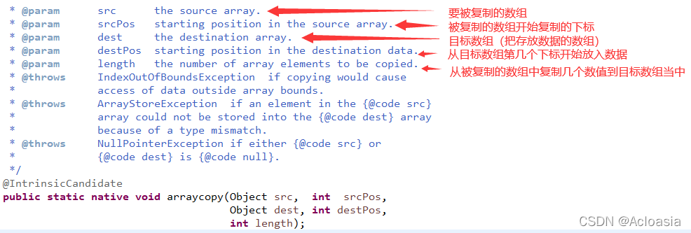

### 1.ArrayCopy

1.arraycopy底层源码



2.arraycopy的使用

第一个参数:源数组

第二个参数:在源数组中,被复制的数字开始赋值的下标

第三个参数:目标数组

第四个参数:从目标数组中,从第几个下标开始放入复制的数据

第五个参数:从源数组中,一共那几个数值放到目标数组中

3.使用案例

```java
package Openlab;
import java.util.Arrays;
/**
 * Arraycopy 用法讲解
 * str = {"1","2","3","4","5"}
 * result = {"A","B","C","D","E"}
 * 实现 {"1","2","3","A","B"}
 * @author Lenovo
 *
 */
public class Arraycopy {
 
		
	public static void main(String[] args) {
		
		String [] str = {"1","2","3","4","5"};
		String [] result = {"A","B","C","D","E"};
 
		System.arraycopy(result,0,str,3,result.length-3);
		System.out.println(Arrays.toString(str));	
		
	}
}
```

